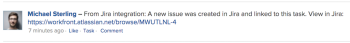

# Vincular itens entre [!DNL Adobe Workfront] e [!DNL Jira]

Você pode vincular [!DNL Jira] problemas para [!DNL Adobe Workfront] tarefas ou problemas automática ou manualmente.

Somente um item em [!DNL Workfront] pode ser vinculado a um item em [!DNL Jira]. Você nunca pode vincular um [!DNL Workfront] item para múltiplo [!DNL Jira] problemas, nem um [!DNL Jira] problema para vários [!DNL Workfront] itens.

## Requisitos de acesso

Você deve ter o seguinte:

<table style="table-layout:auto"> 
 <col> 
 <col> 
 <tbody> 
  <tr> 
   <td role="rowheader"><a href="https://www.workfront.com/plans" target="_blank">[!DNL [!DNL Adobe Workfront] plano]</a>*</td> 
   <td> 
[!UICONTROL Pro] ou superior
 </td> 
  </tr> 
  <tr> 
   <td role="rowheader"><a href="../../administration-and-setup/add-users/access-levels-and-object-permissions/wf-licenses.md" class="MCXref xref">Adobe [!DNL Workfront] visão geral das licenças</a>*</td> 
   <td> 
Plano
 </td> 
  </tr> 
  <tr> 
   <td role="rowheader">Acesso à Jira</td> 
   <td> 
Acesso do administrador do sistema
 
<b>IMPORTANTE</b>

Recomendamos que você crie contas de administrador de sistema separadas em [!DNL Jira] e [!DNL Workfront] dedicar-se a essa integração, em vez de usar as existentes que podem ser vinculadas aos usuários.
 </td>
</tr> 
  <tr> 
   <td role="rowheader">Configurações de nível de acesso*</td> 
   <td> 
Você deve ser um [!DNL Workfront] administrador. Para obter informações sobre [!DNL Workfront] administradores, consulte <a href="../../administration-and-setup/add-users/configure-and-grant-access/grant-a-user-full-administrative-access.md" class="MCXref xref">Conceder ao usuário acesso administrativo total</a>.
 
<b>Nota</b>

Se ainda não tiver acesso, pergunte ao seu [!DNL Workfront] administrador se eles definirem restrições adicionais em seu nível de acesso. Para obter informações sobre como uma [!DNL Workfront] administrador pode modificar seu nível de acesso, consulte <a href="../../administration-and-setup/add-users/configure-and-grant-access/create-modify-access-levels.md" class="MCXref xref">Criar ou modificar níveis de acesso personalizados</a>.
 </td>
</tr> 
 </tbody> 
</table>

&#42;Para descobrir qual plano, tipo de licença ou acesso você tem, entre em contato com seu [!DNL Workfront] administrador.

## Pré-requisitos

Antes de vincular itens entre [!DNL Workfront] e [!DNL Jira], você deve

* Instalar [!DNL Workfront] para [!DNL Jira]

   Para obter instruções sobre como instalar o Workfront para Jira, consulte [Instalar o Adobe Workfront para Jira](../../workfront-integrations-and-apps/use-workfront-with-jira/install-workfront-for-jira.md).

* Configurar [!DNL Workfront] para Jira

   Para obter instruções sobre como configurar o Workfront para Jira, consulte [Configurar Adobe Workfront para Jira](../../workfront-integrations-and-apps/use-workfront-with-jira/configure-workfront-for-jira.md).

## Vincular automaticamente [!DNL Workfront] itens para [!DNL Jira] problemas

Como um [!DNL Workfront] administrador, você pode definir acionadores que podem criar automaticamente um problema em [!DNL Jira] sempre que determinadas condições forem atendidas em uma tarefa ou em um problema em [!DNL Workfront]. A Workfront e [!DNL Jira] os itens ficam vinculados.

Após concluir a configuração de [!DNL Workfront] para Jira, quando um item é criado ou atualizado em [!DNL Workfront] para corresponder aos acionadores, um novo item é criado automaticamente em [!DNL Jira].\
Os usuários do Workfront que criam e atualizam itens do Workfront não precisam de um [!DNL Jira] licença para acionar a criação de itens em [!DNL Jira].

Para obter mais informações sobre como definir acionadores para criar problemas de Jira automaticamente, consulte  [Configurar [!DNL Adobe Workfront] para Jira](../../workfront-integrations-and-apps/use-workfront-with-jira/configure-workfront-for-jira.md).

>[!NOTE]
>
>Você pode criar [!DNL Jira] itens automaticamente ao anexar um modelo a um projeto. Se o modelo contiver tarefas com atribuições que atendam ao [!DNL Jira] , as novas tarefas geram novos [!DNL Jira] problemas.

Vincular automaticamente uma [!DNL Workfront] emissão para um [!DNL Jira] é idêntico ao vínculo automático de um [!DNL Workfront] tarefa a [!DNL Jira] problema.

Para vincular automaticamente uma [!DNL Workfront] tarefa a [!DNL Jira] problema:

1. Certifique-se de que [!DNL Jira] o administrador do sistema configurou acionadores para a criação automática [!DNL Jira] problemas quando [!DNL Workfront] são atribuídos, em seguida, fazem logon em [!DNL Workfront] com um nível de acesso que permite criar uma tarefa.

   Para obter mais informações sobre o acesso a tarefas, consulte [Conceder acesso a tarefas](../../administration-and-setup/add-users/configure-and-grant-access/grant-access-tasks.md).

1. Acesse um projeto e selecione **[!UICONTROL Tarefas]**  no painel esquerdo.

1. Clique em **[!UICONTROL Nova tarefa]**

   Ou

   Selecione uma tarefa existente e clique em **Editar**.

1. Especifique ou atualize qualquer um dos campos disponíveis para a tarefa.
1. Clique em **[!UICONTROL Atribuições]** e atribuir a tarefa a um usuário, função ou equipe que esteja especificado como um acionador na [!DNL Jira] integração.

1. Clique em **Salvar alterações**.

   Uma nova tarefa é criada no Workfront.

   No **[!UICONTROL Atualizações]** da nova tarefa, há um comentário para indicar que um novo problema também foi criado em [!DNL Jira].

   

1. (Opcional) Clique no link para o problema Jira para abri-lo em Jira.

   Ou

   Clique no botão **[!UICONTROL Ir para Jira]** no **[!UICONTROL Integrações]** área do **[!UICONTROL Detalhes]** para abrir a seção ou o cabeçalho da tarefa ou do problema [!DNL Jira] problema.

   O administrador do sistema ou do grupo deve adicionar a variável [!UICONTROL Integrações] para o modelo de layout para exibi-lo no cabeçalho da tarefa ou do problema. Para obter mais informações, consulte [Personalizar cabeçalhos de objetos usando um modelo de layout](../../administration-and-setup/customize-workfront/use-layout-templates/customize-object-headers.md).

   Qualquer [!DNL Jira] o usuário pode começar a trabalhar imediatamente em itens criados automaticamente a partir de [!DNL Workfront] e suas atualizações serão transferidas para [!DNL Workfront] sem precisar de uma licença para [!DNL Workfront] para fazer isso.

   Somente os campos que você deseja [!DNL Workfront] administrador configurado durante a configuração do [!DNL Workfront] os complementos são atualizados.

   Para obter mais informações sobre a sincronização de campos entre o Workfront e Jira, consulte o [Configurar Workfront para Jira](../../workfront-integrations-and-apps/use-workfront-with-jira/configure-workfront-for-jira.md#configuring-the-add-on-for-jira) seção em  [Configurar Adobe Workfront para Jira](../../workfront-integrations-and-apps/use-workfront-with-jira/configure-workfront-for-jira.md).

   >[!NOTE]
   >
   >O [!DNL Jira] O problema não é atribuído a ninguém em [!DNL Jira] quando ele é criado automaticamente a partir do Workfront.

## Vincular manualmente [!DNL Jira] problemas para [!DNL Workfront] items

Depois que os itens tiverem sido criados em [!DNL Jira] e [!DNL Workfront], independentemente um do outro, é possível vincular manualmente uma [!DNL Jira] problema a um [!DNL Workfront] tarefa ou problema.\
Não é possível vincular manualmente uma [!DNL Workfront] item de [!DNL Workfront] para um [!DNL Jira] item.

>[!NOTE]
>
>Se a variável [!DNL Jira] O problema não está em um projeto que não é identificado como um acionador na variável [!DNL Workfront] A integração não pode vinculá-la manualmente a um item do Workfront ao usar a integração com [!DNL Jira] No local.\
>Para obter mais informações sobre como configurar acionadores para o fluxo de trabalho Workfront para Jira, consulte [Vincular automaticamente itens do Workfront a problemas do Jira](#automatically-link-workfront-items-to-jira-issues).

When [!DNL Workfront] e [!DNL Jira] Se os itens estiverem vinculados, determinados campos de um item poderão ser atualizados automaticamente no outro.\
Para obter mais informações sobre a atualização de itens vinculados, consulte [Atualizar itens vinculados entre Jira e Adobe Workfront](../../workfront-integrations-and-apps/use-workfront-with-jira/update-linked-items-between-jira-wf.md).

Para vincular manualmente [!DNL Jira] problemas para [!DNL Workfront] itens:

1. (Condicional) Faça logon em [!DNL Workfront] e encontre um problema ou uma tarefa à qual deseja vincular [!DNL Jira] problema.
1. (Condicional) Na barra de endereços do item, copie a variável **URL** do item no Workfront.

   Ou

   No [!UICONTROL Detalhes] area , copie o **[!UICONTROL Número de referência]** do item no Workfront.

   >[!NOTE]
   >
   >Você deve ter um [!DNL Workfront] licença para fazer logon no [!DNL Workfront]. Caso contrário, uma [!DNL Workfront] O usuário deve fornecer essas informações para você.

1. Em [!DNL Jira], navegue até um problema que você deseja vincular manualmente ao [!DNL Workfront] item.
1. No [!DNL Workfront] painel direito, cole o **URL** ou **[!UICONTROL Número de referência]** do [!DNL Workfront] item ao qual você deseja vincular.\
   

1. Clique em **[!UICONTROL Link]**.

   Os dois itens ficam vinculados e a variável [!DNL Workfront] o painel direito é preenchido com informações do [!DNL Workfront] item.

   O seguinte [!DNL Workfront] são visíveis em [!DNL Jira], por padrão, no [!DNL Workfront] painel direito:

   * O **[!UICONTROL Nome]** da rubrica: Você pode acessar o [!DNL Workfront] clicando no nome no painel.
   * **[!UICONTROL Nome do Projeto]**
   * O **[!UICONTROL Status]** do item
   * O **[!UICONTROL Prioridade]** do item
   * A data em que foi criada em [!DNL Workfront]
   * O **[!UICONTROL Horas Planejadas]** do item
   * O **[!UICONTROL Número de referência]**: Você pode acessar o [!DNL Workfront] clicando no [!UICONTROL Número de referência] no painel .

Para obter mais informações sobre como permitir a exibição de campos adicionais no painel direito, consulte [Configurar a sincronização de campos entre [!DNL Jira] e [!DNL Workfront] Itens](../../workfront-integrations-and-apps/use-workfront-with-jira/configure-workfront-for-jira.md#setting-up-field-synchronization) seção em [Configurar [!DNL Adobe Workfront for Jira]](../../workfront-integrations-and-apps/use-workfront-with-jira/configure-workfront-for-jira.md). Um comentário da [!DNL Workfront] o administrador associado à integração é postado no **[!DNL Workfront]** da guia [!DNL Jira] para confirmar que um novo [!DNL Jira] item foi criado. O comentário contém um link para a [!DNL Jira] problema.

## Desvincular itens entre [!DNL Jira] e [!DNL Workfront]

Itens vinculados entre [!DNL Jira] e [!DNL Workfront] pode ser desvinculado manualmente do [!DNL Jira].\
Não é possível desvincular um [!DNL Workfront] item de seus [!DNL Jira] contrapartida em [!DNL Workfront].

Você precisa do seguinte acesso para desvincular o item vinculado manualmente:

* Você é o usuário que vinculou manualmente os itens
* Você é o [!DNL Jira] administrador do sistema

Somente um [!DNL Workfront] o administrador pode desvincular itens que foram vinculados automaticamente.

Para desvincular um [!DNL Jira] problema de um [!DNL Workfront] item:

1. Em [!DNL Jira], navegue até um problema vinculado a um [!DNL Workfront] tarefa ou problema.
1. Vá para o [!DNL Workfront] painel direito e clique no botão **[!UICONTROL Desvincular]** ícone e, em seguida, clique em **[!UICONTROL Desvincular]**.\
   \
   O vinculado anteriormente [!DNL Jira] e [!DNL Workfront] agora os itens estão desvinculados. Os campos, comentários ou documentos que possam ser atualizados individualmente no futuro não são atualizados na contraparte anterior no outro aplicativo.
