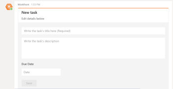

# Criar [!DNL Adobe Workfront] tarefas de [!DNL Microsoft Teams]

>[!NOTE]
>
>Atualmente, o Adobe Workfront para integração do Microsoft Teams é compatível apenas com a experiência clássica do Microsoft Teams.

## Requisitos de acesso

Você deve ter o seguinte acesso para executar as etapas deste artigo:

<table style="table-layout:auto"> 
 <col> 
 <col> 
 <tbody> 
  <tr> 
   <td role="rowheader">[!DNL Adobe Workfront] plano*</td> 
   <td> 
Qualquer
 </td> 
  </tr> 
  <tr> 
   <td role="rowheader">[!DNL Adobe Workfront] licença*</td> 
   <td> 
[!UICONTROL Trabalho], [!UICONTROL Plano]
 </td> 
  </tr>
 </tbody> 
</table>

&#42;Para descobrir que plano, tipo de licença ou acesso você tem, entre em contato com o [!DNL Workfront] administrador.

## Pré-requisitos

Você pode criar tarefas pessoais em [!DNL Adobe Workfront] de [!DNL Microsoft Teams] se as seguintes condições forem atendidas:

* Um proprietário de equipe instalou e configurou o [!DNL Workfront for Microsoft Teams] para a sua equipe.
* Você está conectado [!DNL Workfront] de [!DNL Microsoft Teams].

>[!NOTE]
>
>[!DNL Microsoft Teams] não oferece mais suporte [!DNL Internet Explorer]. Para usar o [!DNL Adobe Workfront for Microsoft Teams] integração, você deve usar um navegador da Web diferente do [!DNL Internet Explorer].

Para obter informações sobre a instalação [!DNL Workfront for Microsoft Teams] e fazendo logon no [!UICONTROL Workfront] de [!DNL Microsoft Teams], consulte [Instalar [!DNL Adobe Workfront for Microsoft Teams]](../../workfront-integrations-and-apps/using-workfront-with-microsoft-teams/install-workfront-ms-teams.md).

## Criar tarefas pessoais de [!DNL Microsoft Teams]

1. Efetue logon no [!DNL Workfront] de [!DNL Microsoft Teams].

   Para obter informações sobre como fazer logon no [!DNL Workfront], consulte [Instalar [!DNL Adobe Workfront for Microsoft Teams]](../../workfront-integrations-and-apps/using-workfront-with-microsoft-teams/install-workfront-ms-teams.md).

1. Para abrir uma **[!UICONTROL Nova tarefa]** cartão:

   * Se você estiver na [!DNL Workfront] canal de bate-papo do bot, tipo **[!UICONTROL Nova tarefa]** no [!UICONTROL conversa] para criar uma nova tarefa.
   * Se você estiver em um canal de chat diferente do [!DNL Workfront] canal de chat do bot:

      * Comece a digitar **[!DNL @workfront]** no [!UICONTROL conversa] e selecione o [!DNL Workfront] canal de bot desejado.
      * Continue a digitar **[!UICONTROL Nova tarefa]** no [!UICONTROL conversa] para criar uma nova tarefa.

        A variável [!UICONTROL Nova tarefa] O cartão é exibido no [!DNL Workfront] canal de bot.

        

1. No [!UICONTROL Workfront] canal de bot, especifique as seguintes informações no [!UICONTROL Nova tarefa] cartão:

   * Nome da tarefa no **[!UICONTROL Escrever o título da tarefa]** campo.
   * Descrição da tarefa no **[!UICONTROL Escrever a descrição das tarefas]** campo.
   * A data em que a tarefa deve ser concluída, no campo **[!UICONTROL Prazo]** campo.

1. Clique em **[!UICONTROL Salvar].**

   A nova tarefa pessoal é criada em [!DNL Workfront]. A [!UICONTROL Número de referência] está atribuído a ele e visível no [!UICONTROL nova tarefa] cartão.

   Para obter informações sobre números de referência, consulte [[!UICONTROL Números de referência] de objetos](../../workfront-basics/navigate-workfront/workfront-navigation/understand-objects.md#understanding-reference-numbers-of-objects) na seção [Entender objetos no [!DNL Adobe Workfront]](../../workfront-basics/navigate-workfront/workfront-navigation/understand-objects.md) artigo.

1. (Opcional) Clique em **[!UICONTROL Editar]** para editar as informações da tarefa mais detalhadamente.
1. (Opcional) Clique em **[!UICONTROL Exibir em[!DNL Workfront]]** para abrir a tarefa em uma nova guia no [!DNL Workfront] e editar a tarefa, movê-la para um projeto ou atribuí-la a outra pessoa.
