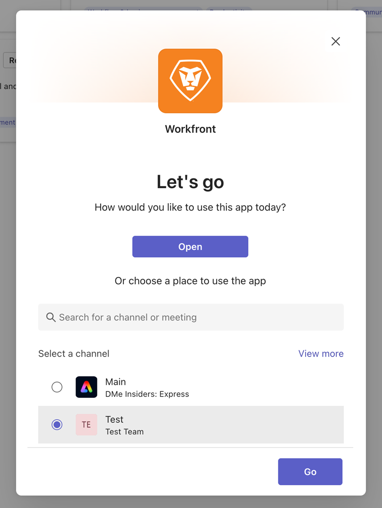

# Instalar o [!DNL Adobe Workfront] for Microsoft Teams

<!-- Audited: 1/2024 -->

>[!IMPORTANT]
>
>À medida que o Microsoft faz a transição para o novo cliente Teams, o cliente Teams clássico não estará mais disponível após 1º de julho de 2025. Em preparação, estamos desenvolvendo uma nova versão da integração do Microsoft Teams que será totalmente compatível com o cliente Novas equipes e estará disponível antes de 1º de julho para garantir uma transição suave.
>
>As instruções sobre como baixar e instalar a integração no novo cliente do Teams aparecerão aqui após a integração estar disponível.

O aplicativo [!DNL Adobe Workfront for Microsoft Teams] permite executar ações básicas no [!DNL Workfront] sem sair dos canais de chat do [!DNL Microsoft Teams].

>[!NOTE]
>
>[!DNL Microsoft Teams] não dá mais suporte a [!DNL Internet Explorer]. Para usar o [!DNL Adobe Workfront for Microsoft Teams integration], você deve usar um navegador da Web diferente do [!DNL Internet Explorer].

## Requisitos de acesso

+++ Expanda para visualizar os requisitos de acesso para a funcionalidade neste artigo.

Você deve ter o seguinte acesso para executar as etapas deste artigo:

<table style="table-layout:auto"> 
 <col> 
 <col> 
 <tbody> 
  <tr> 
   <td role="rowheader">[!DNL Adobe Workfront] plano</td> 
   <td> 
Qualquer
 </td> 
  </tr> 
  <tr> 
   <td role="rowheader">[!DNL Adobe Workfront] licença</td> 
   <td>
Novo: Padrão

    
Atual: [!UICONTROL Trabalho], [!UICONTROL Plano]
 </td> 
  </tr> 
 </tbody> 
</table>

Para obter mais detalhes sobre as informações nesta tabela, consulte [Requisitos de acesso na documentação do Workfront](/help/quicksilver/administration-and-setup/add-users/access-levels-and-object-permissions/access-level-requirements-in-documentation.md).

+++

## Pré-requisitos

Você deve ser um proprietário de equipe no [!DNL Microsoft Teams] para instalar o [!DNL Workfront] para [!DNL Microsoft Teams].

## Instalar [!DNL Workfront for Microsoft Teams]

Como proprietário de equipe no [!DNL Microsoft Teams], você pode instalar o aplicativo [!DNL Workfront for Microsoft Teams] para cada equipe da Loja [!DNL Microsoft] ou de um arquivo fornecido pelo [!DNL Workfront].

### Instalar [!DNL Workfront for Microsoft Teams] do Repositório [!DNL Microsoft]

1. Faça logon em [!DNL Microsoft Teams] como proprietário de equipe.
1. Selecione a equipe para a qual você deseja instalar o aplicativo [!DNL Workfront for Microsoft Teams].
1. Clique no ícone **[!UICONTROL Mais]** da equipe para a qual você deseja instalar o Workfront para integração com o Microsoft Teams
1. Clique na guia **[!UICONTROL Aplicativos]**.
1. Na caixa **[!UICONTROL Pesquisar aplicativos e muito mais]**, digite *[!DNL Workfront]*.
1. Clique em **Adicionar**.
1. Clique em **Adicionar** na caixa de diálogo que será aberta.
1. Na seção Selecione um canal, selecione a equipe à qual deseja adicionar o aplicativo Workfront e clique em **Ir**.

   
1. Clique em **Fazer logon** no Workfront para acessar o Workfront for Microsoft Teams.

   Para obter informações sobre como fazer logon no [!DNL Workfront], consulte a seção [Fazer logon no Workfront pela Microsoft Teams](#log-in-to-workfront-from-microsoft-teams) neste artigo.

### Instalar [!DNL Workfront for Microsoft Teams] de um arquivo particular

Se sua organização restringir o acesso ao download de aplicativos da Loja [!DNL Microsoft], você deverá contatar nossa Equipe de Suporte e solicitar um arquivo privado do aplicativo [!DNL Workfront for Microsoft Teams] para instalar o aplicativo.

Para obter informações sobre como entrar em contato com a Equipe de Suporte, consulte [Entrar em contato com o Suporte ao Cliente](../../workfront-basics/tips-tricks-and-troubleshooting/contact-customer-support.md).

Para instalar [!DNL Workfront for Microsoft Teams] de um arquivo particular:

1. Salve o arquivo particular que você recebeu de [!DNL Workfront] em seu computador.
1. Faça logon em [!DNL Microsoft Teams] como proprietário de equipe [!DNL Microsoft].
1. Clique no ícone **[!UICONTROL Mais]** da equipe para a qual você deseja instalar o [!DNL Workfront for Microsoft Teams].

1. Clique em **[!UICONTROL Gerenciar Equipe]**.
1. Selecione a guia Aplicativos e clique em Fazer upload de um aplicativo no canto superior esquerdo da tela.
1. Procure o arquivo particular que você salvou no computador e siga as etapas de instalação para instalar o [!DNL Workfront for Microsoft Teams].
1. Quando a instalação for concluída, aparecerá uma notificação de que a instalação foi bem-sucedida no canal General (Geral) da equipe selecionada. Todos os membros da equipe podem ver essa notificação.

## Fazer logon em [!DNL Workfront] de [!DNL Microsoft] Equipes

Como proprietário da equipe do [!DNL Microsoft Teams], você deve instalar o aplicativo [!DNL Workfront for Microsoft Teams] para sua equipe antes que você ou qualquer pessoa na equipe possa fazer logon no [!DNL Workfront from Microsoft Teams].

Quando você estiver conectado no [!DNL Workfront] a partir de [!DNL Microsoft Teams], poderá receber [!DNL Workfront] notificações no canal de bot [!DNL Workfront] ou executar determinadas ações no [!DNL Workfront] a partir de [!DNL Microsoft Teams].

Para obter informações sobre como instalar o aplicativo [!DNL Workfront], consulte a seção [Instalar [!DNL Workfront for Microsoft Teams]](#install-workfront-for-microsoft-teams) neste artigo.

Para obter informações sobre como acessar [!DNL Workfront] de [!DNL Microsoft Teams] para executar determinadas ações, consulte [Acesso [!DNL Adobe Workfront] de [!DNL Microsoft Teams]](../../workfront-integrations-and-apps/using-workfront-with-microsoft-teams/access-workfront-from-ms-teams.md).

Para fazer login em [!DNL Workfront] a partir de [!DNL Microsoft Teams]:

1. Vá para o canal **[!UICONTROL Geral]** da equipe em que o aplicativo [!DNL Workfront for Microsoft Teams] foi instalado e clique em **[!UICONTROL Fazer logon no Workfront]**.

   O canal de chat do [!DNL Workfront] é adicionado aos seus canais de chat do [!DNL Microsoft Teams].

1. Vá para o canal de chat do bot [!DNL Workfront] em [!DNL Microsoft Teams] e digite *[!UICONTROL logon]* no campo **[!UICONTROL Digite suas perguntas aqui]** ou **Digite uma mensagem**.

   Ou

   Clique em **[!UICONTROL Fazer logon]**.

   Uma nova guia do navegador é aberta.

1. Siga as instruções para fazer logon no [!DNL Workfront] usando a Autenticação Aprimorada, o OAuth 2.0 ou a URL da Linguagem de Marcação de Asserção de Segurança (SAML).

   >[!NOTE]
   >
   >* Quando for solicitado que você insira o domínio da sua conta do [!DNL Workfront], digite-o usando este formato: *yourCompany&#39;sDomain.my.workfront.com*. O domínio da sua empresa geralmente é o nome da sua empresa.
   >* A Autenticação Aprimorada não estará disponível até que um administrador do [!DNL Workfront] a habilite para esta integração.
   >* O Workfront para Microsoft Teams não é compatível com ambientes de sandbox da Workfront.

1. Feche a guia do navegador usada para fazer logon e retornar para [!DNL Microsoft Teams].

   Uma notificação é exibida no canal de chat do bot [!DNL Workfront] para confirmar que você fez logon no [!DNL Workfront] com êxito.
