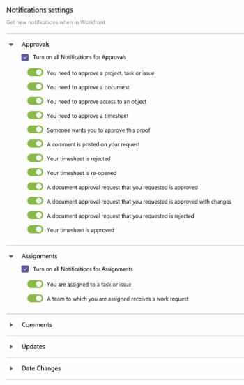

# Gerenciar [!DNL Adobe Workfront] notificações em [!DNL Microsoft Teams]

Você pode receber notificações de [!DNL Adobe Workfront] sobre itens que você precisa aprovar, atribuições que você recebeu ou comentários e alterações aos itens associados.

Essas notificações contêm [!DNL Workfront] ações que podem ser realizadas no [!DNL Microsoft Teams] sem sair de [!DNL Microsoft Teams] para realizá-los.

>[!NOTE]
>
>[!DNL Microsoft Teams] não é mais compatível [!DNL Internet Explorer]. Para usar o [!DNL Adobe Workfront for Microsoft Teams integration], você deve usar um navegador da Web diferente de [!DNL Internet Explorer].

## Requisitos de acesso

Você deve ter o seguinte acesso para executar as etapas neste artigo:

<table style="table-layout:auto"> 
 <col> 
 <col> 
 <tbody> 
  <tr> 
   <td role="rowheader">[!DNL Adobe Workfront] plano*</td> 
   <td> 
Qualquer Um
 </td> 
  </tr> 
  <tr> 
   <td role="rowheader">[!DNL Adobe Workfront] licença*</td> 
   <td> 
[!UICONTROL Trabalho], [!UICONTROL Plano]
 </td> 
  </tr> 
 </tbody> 
</table>

&#42;Para descobrir qual plano, tipo de licença ou acesso você tem, entre em contato com seu [!DNL Workfront] administrador.

## Pré-requisitos para recebimento [!DNL Workfront] Notificações em [!DNL Microsoft Teams]

Você pode receber [!DNL Workfront] notificações em [!DNL Microsoft Teams] se as seguintes condições forem cumpridas:

* Um proprietário de equipe instalou e configurou [!DNL Workfront for Microsoft Teams] para a sua equipe.
* Você está conectado [!DNL Workfront] from [!DNL Microsoft Teams].
* Você ativou notificações instantâneas em [!DNL Workfront]. Para obter informações sobre como ativar notificações instantâneas, consulte [Ativar ou desativar suas próprias notificações de evento](../../workfront-basics/using-notifications/activate-or-deactivate-your-own-event-notifications.md).

Para obter informações sobre a instalação [!DNL Workfront for Microsoft Teams] e fazer logon no [!DNL Workfront from Microsoft Teams], consulte [Instalar [!DNL Adobe Workfront for Microsoft Teams]](../../workfront-integrations-and-apps/using-workfront-with-microsoft-teams/install-workfront-ms-teams.md).

## Gerenciamento [!DNL Workfront] Notificações em [!DNL Microsoft Teams]

Quando a variável [!DNL Workfront for Microsoft Teams] o aplicativo está instalado, um [!DNL Workfront] canal de bate-papo é criado em [!DNL Microsoft Teams] para cada membro dessa equipe. Quando uma determinada ação é executada em [!DNL Workfront], você pode definir as configurações de [!DNL Workfront for Microsoft Teams] para receber notificações sobre essa ação no [!DNL Workfront] canal de bate-papo de [!DNL Microsoft Teams].

Considere o seguinte ao trabalhar com [!DNL Workfront] notificações de [!DNL Microsoft Teams]:

* Não é possível receber tudo, mas apenas um número selecionado de [!DNL Workfront] notificações em [!DNL Microsoft Teams].
* Todas as notificações recebidas de [!DNL Workfront] aparecem no [!DNL Workfront] canal de bate-papo de bot.

   Para obter informações sobre como instalar o [!DNL Workfront] canal de bot, consulte o [Logon em [!DNL Workfront] from [!DNL Microsoft Teams]](../../workfront-integrations-and-apps/using-workfront-with-microsoft-teams/install-workfront-ms-teams.md#logging-in-to-workfront) seção em [Instalar [!DNL Workfront for Microsoft Teams]](../../workfront-integrations-and-apps/using-workfront-with-microsoft-teams/install-workfront-ms-teams.md) artigo 10. o

* Pode haver um atraso de até 5 minutos entre a hora em que uma atualização é feita em [!DNL Workfront] e quando receber a notificação sobre ela em [!DNL Microsoft Teams].
* Para cada [!DNL Microsoft Teams] , você também receberá uma notificação por email.

Para gerenciar a [!DNL Workfront] notificações que você pode receber em [!DNL Microsoft Teams]:

1. Clique no botão **[!UICONTROL Mais adição]** Ícone de aplicativos (três pontos) na barra de navegação esquerda em [!DNL Microsoft Teams].

1. Clique em [!DNL Workfront] na lista exibida.
1. Selecione o **[!UICONTROL Configurações]** guia .

   

1. Desative qualquer uma das notificações que não deseja receber. Você pode ativar ou desativar grupos de notificações, como informações ou notificações de aprovação, ou gerenciar as notificações individualmente.

   Todas as notificações são ativadas por padrão.

   As configurações de notificações para [!DNL Workfront for Microsoft] As equipes são salvas automaticamente.

   >[!NOTE]
   >
   >Não é possível adicionar mais notificações às que estão disponíveis por padrão.

## Responder a [!DNL Workfront] Notificações e solicitações de aprovação em [!DNL Microsoft Teams]

1. Faça logon em [!DNL Workfront] from [!DNL Microsoft Teams].\
   Para obter informações sobre como fazer logon no [!DNL Workfront], consulte [Instalar [!DNL Adobe Workfront for Microsoft Teams]](../../workfront-integrations-and-apps/using-workfront-with-microsoft-teams/install-workfront-ms-teams.md).

1. Vá para o **[!UICONTROL Chat]** e clique no botão **[!DNL Workfront]** canal de bot.\
   Este canal serve para o seu bate-papo pessoal com o [!DNL Workfront] bot. Todos [!DNL Workfront] as notificações são exibidas aqui.
1. Dependendo do tipo de notificação recebida, vá para a seção relevante:

   * [Notificações de aprovação](#approval-notifications-approval-notifications)
   * [Notificações de atribuição](#assignment-notifications-assignment-notifications)
   * [Notificações de comentários](#comment-notifications-comment-notifications)
   * [Atualizar notificações](#update-notifications-update-notifications)
   * [Notificações de alteração de data](#date-change-notifications-date-change-notifications)

### Notificações de aprovação {#approval-notifications}

Você recebe notificações de aprovação quando é solicitado a aprovar um objeto, como uma tarefa, uma folha de ponto ou uma prova. No entanto, você ainda pode comentar a notificação. Na notificação de aprovação, é possível executar as seguintes ações:

* **[!UICONTROL Aprovar]**: Clique em para aprovar o item.
* **[!UICONTROL Alterar]**: Clique em para aprovar o item com alterações.
* **[!UICONTROL Rejeitar]**: Clique em para rejeitar o item.
* **[!UICONTROL Comentário]**: Clique em para fazer um comentário. Seu comentário também aparece em [!DNL Workfront] como uma atualização do objeto sobre o qual a notificação se refere.
* **[!UICONTROL Ir para prova]**: Clique em para abrir a prova. Você pode então tomar uma decisão diretamente na prova. Para obter mais informações, consulte [Tome uma decisão em uma prova no visualizador de prova](../../review-and-approve-work/proofing/reviewing-proofs-within-workfront/make-a-decision-on-a-proof/make-decisions-on-proof.md).

>[!NOTE]
>
>Depois de tomar uma decisão de aprovação, não é possível alterá-la a partir da notificação.

#### Ações disponíveis em notificações de aprovação específicas:

<table style="table-layout:auto"> 
 <col> 
 <col> 
 <col> 
 <col> 
 <col> 
 <col> 
 <thead> 
  <tr> 
   <th>Notificação</th> 
   <th>[!UICONTROL Aprovar]</th> 
   <th>[!UICONTROL Rejeitar]</th> 
   <th> 
[!UICONTROL Alterar]
 </th> 
   <th> 
[!UICONTROL Ir para prova] 
 </th> 
   <th>[!UICONTROL Comentário]</th> 
  </tr> 
 </thead> 
 <tbody> 
  <tr> 
   <td role="rowheader">Você precisa aprovar um projeto</td> 
   <td>✓</td> 
   <td>✓</td> 
   <td> </td> 
   <td> </td> 
   <td>✓</td> 
  </tr> 
  <tr> 
   <td role="rowheader">Você precisa aprovar uma tarefa</td> 
   <td>✓</td> 
   <td>✓</td> 
   <td> </td> 
   <td> </td> 
   <td>✓</td> 
  </tr> 
  <tr> 
   <td role="rowheader">Você precisa aprovar um problema</td> 
   <td>✓</td> 
   <td>✓</td> 
   <td> </td> 
   <td> </td> 
   <td>✓</td> 
  </tr> 
  <tr> 
   <td role="rowheader">Você precisa aprovar um documento</td> 
   <td>✓</td> 
   <td>✓</td> 
   <td>✓</td> 
   <td> </td> 
   <td>✓</td> 
  </tr> 
  <tr> 
   <td role="rowheader">É necessário aprovar o acesso a um objeto</td> 
   <td>✓</td> 
   <td>✓</td> 
   <td> </td> 
   <td> </td> 
   <td>✓</td> 
  </tr> 
  <tr> 
   <td role="rowheader">Você precisa aprovar uma folha de ponto</td> 
   <td>✓</td> 
   <td>✓</td> 
   <td> </td> 
   <td> </td> 
   <td> </td> 
  </tr> 
  <tr> 
   <td role="rowheader">Alguém quer que você aprove esta prova</td> 
   <td> </td> 
   <td> </td> 
   <td> </td> 
   <td>✓</td> 
   <td>✓</td> 
  </tr> 
  <tr> 
   <td role="rowheader">Sua folha de ponto é rejeitada</td> 
   <td> </td> 
   <td> </td> 
   <td> </td> 
   <td> </td> 
   <td> </td> 
  </tr> 
  <tr> 
   <td role="rowheader">Sua folha de ponto é reaberta</td> 
   <td> </td> 
   <td> </td> 
   <td> </td> 
   <td> </td> 
   <td> </td> 
  </tr> 
  <tr> 
   <td role="rowheader">Uma solicitação de aprovação de documento que você solicitou foi aprovada</td> 
   <td> </td> 
   <td> </td> 
   <td> </td> 
   <td> </td> 
   <td>✓</td> 
  </tr> 
  <tr> 
   <td role="rowheader">Uma solicitação de aprovação de documento solicitada é aprovada com alterações</td> 
   <td> </td> 
   <td> </td> 
   <td> </td> 
   <td> </td> 
   <td>✓</td> 
  </tr> 
  <tr> 
   <td role="rowheader">Uma solicitação de aprovação de documento que você solicitou foi rejeitada</td> 
   <td> </td> 
   <td> </td> 
   <td> </td> 
   <td> </td> 
   <td>✓</td> 
  </tr> 
  <tr> 
   <td role="rowheader">Sua folha de ponto está aprovada</td> 
   <td> </td> 
   <td> </td> 
   <td> </td> 
   <td> </td> 
   <td> </td> 
  </tr> 
 </tbody> 
</table>

### Notificações de atribuição {#assignment-notifications}

Você recebe notificações de atribuição quando você, ou uma equipe em que você está, é atribuído a uma tarefa ou problema no Workfront. Na notificação de atribuição, é possível executar as seguintes ações:

* **[!UICONTROL Trabalhe nele]**: Selecione para confirmar o trabalho no item. Uma notificação é exibida brevemente para confirmar que um novo item foi adicionado à lista de trabalho.
* **[!UICONTROL Exibir em[!DNL Workfront]]**: Selecione para exibir o problema atribuído ou a tarefa no Workfront, o que abre uma nova guia.
* **[!UICONTROL Iniciar]**: Clique em para iniciar o trabalho no item. Uma notificação é exibida brevemente para confirmar que um novo item foi adicionado à lista de trabalho.
* **[!UICONTROL Comentário]**: Clique em para fazer um comentário sobre o item. Seu comentário também aparece no fluxo de atualização do item no Workfront.
* **[!UICONTROL Status]**: Clique em e selecione o novo status do item de trabalho no menu suspenso.

#### Ações disponíveis em notificações de atribuição específicas:

<table style="table-layout:auto"> 
 <col> 
 <col> 
 <col> 
 <col> 
 <thead> 
  <tr> 
   <th>Notificação</th> 
   <th>[!UICONTROL Iniciar]</th> 
   <th>[!UICONTROL Comentário]</th> 
   <th> 
[!UICONTROL Status]
 </th> 
  </tr> 
 </thead> 
 <tbody> 
  <tr> 
   <td role="rowheader">Você está atribuído a uma tarefa</td> 
   <td>✓</td> 
   <td>✓</td> 
   <td>✓</td> 
  </tr> 
  <tr> 
   <td role="rowheader">Você está atribuído a um problema</td> 
   <td>✓</td> 
   <td>✓</td> 
   <td>✓</td> 
  </tr> 
  <tr> 
   <td role="rowheader">Uma equipe à qual você está atribuído recebe uma solicitação de trabalho para uma tarefa</td> 
   <td>✓</td> 
   <td>✓</td> 
   <td>✓</td> 
  </tr> 
  <tr> 
   <td role="rowheader">Uma equipe à qual você está atribuído recebe uma solicitação de trabalho para um problema</td> 
   <td>✓</td> 
   <td>✓</td> 
   <td>✓</td> 
  </tr> 
 </tbody> 
</table>

### Notificações de comentários {#comment-notifications}

Você recebe uma notificação de comunicação quando alguém comenta um item ao qual você está associado ou inclui você em uma atualização. Na notificação de comunicação, é possível executar as seguintes ações:

* **Reply**: Clique em para responder ao comentário ou [!UICONTROL atualizar]. Sua resposta também aparece no fluxo de atualização, onde o comentário aparece no Workfront.
* **[!UICONTROL Exibir no Workfront]**: Selecione para exibir o comentário e o item no Workfront, que é aberto em uma nova guia.
* **[!UICONTROL Status]**: Clique em e, em seguida, selecione um novo status para o item de trabalho sobre o qual o comentário ou a atualização se refere.

#### Ações disponíveis em notificações de comunicação específicas:

<table style="table-layout:auto"> 
 <col> 
 <col> 
 <col> 
 <thead> 
  <tr> 
   <th>Notificação</th> 
   <th>[!UICONTROL Responder]</th> 
   <th> 
[!UICONTROL Status]
 </th> 
  </tr> 
 </thead> 
 <tbody> 
  <tr> 
   <td role="rowheader">Um comentário é postado em sua solicitação</td> 
   <td>✓</td> 
   <td>✓</td> 
  </tr> 
  <tr> 
   <td role="rowheader">Uma resposta é postada na solicitação de trabalho</td> 
   <td>✓</td> 
   <td>✓</td> 
  </tr> 
  <tr> 
   <td role="rowheader">Alguém comenta em um tópico em que você está</td> 
   <td>✓</td> 
   <td>✓</td> 
  </tr> 
  <tr> 
   <td role="rowheader">Alguém comenta sobre um de seus itens de trabalho</td> 
   <td>✓</td> 
   <td>✓</td> 
  </tr> 
  <tr> 
   <td role="rowheader">Alguém comenta em uma folha de ponto que você aprova</td> 
   <td>✓</td> 
   <td> </td> 
  </tr> 
  <tr> 
   <td role="rowheader">Um comentário é adicionado na página do perfil do usuário ou pela edição em massa de vários usuários</td> 
   <td>✓</td> 
   <td> </td> 
  </tr> 
  <tr> 
   <td role="rowheader">Um comentário é adicionado em uma de suas atualizações</td> 
   <td>✓</td> 
   <td> </td> 
  </tr> 
  <tr> 
   <td role="rowheader">Um comentário é adicionado na folha de ponto</td> 
   <td>✓</td> 
   <td> </td> 
  </tr> 
 </tbody> 
</table>

### Atualizar notificações {#update-notifications}

Você recebe uma notificação de informações quando há uma atualização em um item associado, mas não é necessário executar nenhuma ação no item. Na notificação de informações, é possível executar as seguintes ações:

* **[!UICONTROL Responder]**: Clique em para responder ao [!UICONTROL atualizar]. Sua resposta também aparece no fluxo de atualização do item no Workfront.
* **Exibir no Workfront**: Selecione para exibir o comentário e o item no Workfront, que é aberto em uma nova guia.
* **[!UICONTROL Status]**: Clique em e selecione o novo status do item no menu suspenso.

#### Ações disponíveis em notificações de informações específicas:

<table style="table-layout:auto"> 
 <col> 
 <col> 
 <col> 
 <thead> 
  <tr> 
   <th>Notificação</th> 
   <th>[!UICONTROL Responder]</th> 
   <th> 
[!UICONTROL Status]
 </th> 
  </tr> 
 </thead> 
 <tbody> 
  <tr> 
   <td role="rowheader">É feita uma atualização em uma tarefa, edição ou projeto para o qual você está inscrito</td> 
   <td>✓</td> 
   <td>✓</td> 
  </tr> 
  <tr> 
   <td role="rowheader">Alguém inclui você em uma atualização direcionada</td> 
   <td>✓</td> 
   <td>✓</td> 
  </tr> 
  <tr> 
   <td role="rowheader">Alguém inclui sua equipe em uma atualização direcionada da [!UICONTROL]</td> 
   <td>✓</td> 
   <td>✓</td> 
  </tr> 
 </tbody> 
</table>

### Notificações de alteração de data {#date-change-notifications}

Você recebe uma notificação de alteração de data quando a data muda em um item de trabalho ao qual está atribuído. Na notificação de alteração de data, é possível executar as seguintes ações.

* **[!UICONTROL Comentário]**: Clique em para fazer um comentário sobre o item. Seu comentário também aparece no fluxo de atualização do item no Workfront.
* **[!UICONTROL Status]**: Clique em e selecione o novo status do item de trabalho no menu suspenso.

<table style="table-layout:auto"> 
 <col> 
 <col> 
 <col> 
 <thead> 
  <tr> 
   <th>Notificação</th> 
   <th> 
[!UICONTROL Comentário]
 </th> 
   <th> 
[!UICONTROL Status]
 </th> 
  </tr> 
 </thead> 
 <tbody> 
  <tr> 
   <td role="rowheader">A data de vencimento muda em uma tarefa atribuída a</td> 
   <td>✓</td> 
   <td>✓</td> 
  </tr> 
 </tbody> 
</table>
