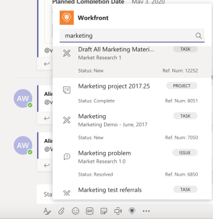

# Procurar e compartilhar [!DNL Adobe Workfront] itens em [!DNL Microsoft Teams]

>[!IMPORTANT]
>
>Como a [Microsoft faz a transição para o novo cliente Teams](https://learn.microsoft.com/pt-br/microsoftteams/teams-classic-client-end-of-availability), o cliente Classic Teams não estará mais disponível após 1º de julho de 2025. Para continuar usando o Microsoft Teams e aplicativos integrados como o Workfront, os clientes devem fazer a transição para o novo cliente Teams antes dessa data.
>
>A integração atualizada do Workfront já está disponível e é totalmente compatível com a nova experiência do Teams. Na maioria dos casos, o Workfront aparecerá automaticamente assim que os usuários tiverem feito a transição. Caso contrário, a integração pode ser instalada manualmente a partir da App Store do Microsoft Teams. Para instalar ou verificar a integração do Workfront no novo cliente do Teams, consulte [Instalar [!DNL Adobe Workfront] para Microsoft Teams](/help/quicksilver/workfront-integrations-and-apps/using-workfront-with-microsoft-teams/install-workfront-ms-teams.md).

Você pode pesquisar [!DNL Workfront] itens em qualquer canal [!DNL Adobe Workfront] no [!DNL Microsoft Teams] e compartilhar esses itens com membros de suas equipes.

* [Pré-requisitos para compartilhar [!DNL Workfront] itens em [!DNL Microsoft Teams]](#prerequisites-for-sharing-workfront-items-in-microsoft-teams-prerequisites-for-sharing-workfront-items-in-microsoft-teams)
* [Pesquisar e compartilhar [!DNL Workfront] itens em [!DNL Microsoft Teams]](#search-for-and-share-adobe-workfront-items-in-microsoft-teams)

## Requisitos de acesso

+++ Expanda para visualizar os requisitos de acesso da funcionalidade neste artigo.

<table style="table-layout:auto"> 
 <col> 
 <col> 
 <tbody> 
  <tr> 
   <td role="rowheader">Pacote do Adobe Workfront</td> 
   <td> 
Qualquer
 </td> 
  </tr> 
  <tr> 
   <td role="rowheader">Licença do Adobe Workfront</td> 
   <td> 
Padrão

   
Trabalho ou maior
 </td> 
  </tr> 
 </tbody> 
</table>

Para obter informações, consulte [Requisitos de acesso na documentação do Workfront](/help/quicksilver/administration-and-setup/add-users/access-levels-and-object-permissions/access-level-requirements-in-documentation.md).

+++

## Pré-requisitos para compartilhar [!DNL Workfront] itens em [!DNL Microsoft Teams] {#prerequisites-for-sharing-workfront-items-in-microsoft-teams}

Você pode pesquisar e compartilhar [!DNL Workfront] itens em [!DNL Microsoft Teams] se as seguintes condições forem atendidas:

* Um proprietário de equipe instalou e configurou o [!DNL Workfront for Microsoft Teams] para sua equipe.
* Você está conectado ao [!DNL Workfront] no [!UICONTROL Microsoft Teams].

Para obter informações sobre como instalar o [!UICONTROL Workfront para Microsoft Teams] e fazer logon no [!UICONTROL Workfront] a partir do [!DNL Microsoft Teams], consulte [Instalar o Adobe Workfront para Microsoft Teams](../../workfront-integrations-and-apps/using-workfront-with-microsoft-teams/install-workfront-ms-teams.md).

>[!NOTE]
>
>[!DNL Microsoft Teams] não dá mais suporte a [!DNL Internet Explorer]. Para usar o [!DNL Adobe Workfront for Microsoft Teams integration], você deve usar um navegador da Web diferente do [!DNL Internet Explorer].

## Procurar e compartilhar [!DNL Workfront] itens em [!DNL Microsoft Teams] {#search-for-and-share-workfront-items-in-microsoft-teams}

Você pode procurar os seguintes itens [!DNL Workfront] em um canal [!DNL Microsoft Teams]:

* Projetos
* Tarefas

  >[!NOTE]
  >
  >Não é possível pesquisar tarefas pessoais.

* Problemas

Depois de encontrar os itens procurados, você pode compartilhá-los com outros usuários no [!DNL Microsoft Teams].

Para procurar um item [!DNL Workfront] de [!DNL Microsoft Teams] e compartilhá-lo com outras pessoas:

1. No [!DNL Microsoft Teams], vá para qualquer canal de chat e clique no ícone **[!DNL Workfront]**.
1. Pesquise o item [!DNL Workfront] seguindo um destes procedimentos:

   * Clique no ícone [!DNL Workfront] no campo de conversa.\

     \
      Dependendo das configurações, esse ícone pode ser exibido sob o ícone **[!UICONTROL Mais]**.\
      \
      A caixa **[!UICONTROL Pesquisa]** é exibida por padrão.

   * Digite *@[!DNL Workfront]* de qualquer canal, selecione Workfront e **[!UICONTROL Pesquisar].**

     

1. Na caixa [!UICONTROL pesquisa] fornecida, comece digitando o nome ou o número de referência de um projeto, tarefa ou problema e clique nele quando ele aparecer na lista.\
   \
   Isso adiciona um cartão com o item [!DNL Workfront] no campo de chat. Algumas informações sobre o item são incluídas no cartão, incluindo o nome do item, o objeto principal, o status, a prioridade, o percentual concluído.

1. (Opcional) Adicione um comentário abaixo do cartão [!DNL Workfront] e clique em **[!UICONTROL Enviar]** ou pressione Enter.\
   Isso envia a mensagem incluindo o item [!DNL Workfront] para seu canal.\
   Todos os membros do canal podem ver esta mensagem, incluindo as informações no cartão [!DNL Workfront].

1. Clique em **[!UICONTROL Exibir no Workfront]** para exibir o item em [!DNL Workfront].\
   Somente usuários que têm uma licença [!DNL Workfront] podem exibir um item em [!DNL Workfront].
