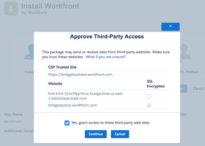
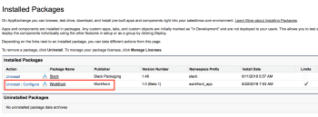

# Instalar [!DNL Adobe Workfront for Salesforce]

Para instalar o aplicativo antes que ele fique disponível na variável [!DNL Salesforce AppExchange], consulte [Instalar [!DNL Workfront for Salesforce] antes de se tornar disponível no [!DNL AppExchange] Marketplace](#installing-workfront-for-salesforce-before-it-becomes-available-in-the-appexchange-marketplace-installing-workfront-for-salesforce-before-it-becomes-available-in-the-appexchange-marketplace).

Como um [!DNL Salesforce] e [!DNL Adobe Workfront] administrador, você pode instalar [!DNL Workfront for Salesforce] para permitir que [!DNL Salesforce] usuários a enviar [!DNL Workfront] solicita e cria projetos automaticamente sem sair do Salesforce.

Para obter uma compreensão geral sobre o que você pode esperar ao instalar [!DNL Workfront for Salesforce], consulte [[!DNL Adobe Workfront for Salesforce] visão geral](../../workfront-integrations-and-apps/using-workfront-with-salesforce/workfront-for-salesforce-overview.md).

* [Pré-requisitos para instalar e usar [!DNL Workfront for Salesforce]](#prerequisites-for-installing-and-using-workfront-for-salesforce-prerequisites-for-installing-and-using-workfront-for-salesforce)
* [Instalar [!DNL Workfront for Salesforce]](#install-adobe-workfront-for-salesforce)

## Requisitos de acesso

Você deve ter o seguinte acesso para usar a funcionalidade descrita neste artigo:

<table style="table-layout:auto"> 
 <col> 
 <col> 
 <tbody> 
  <tr> 
   <td role="rowheader">[!DNL Adobe Workfront] plano*</td> 
   <td> 
[!UICONTROL Pro] ou superior
 </td> 
  </tr> 
  <tr> 
   <td role="rowheader">[!DNL Adobe Workfront] licença*</td> 
   <td> 
[!UICONTROL Plan]
 </td> 
  </tr>  </tbody> 
</table>

&#42;Para descobrir qual plano, tipo de licença ou acesso você tem, entre em contato com seu [!DNL Workfront] administrador.

## Pré-requisitos para instalar e usar [!DNL Workfront for Salesforce] {#prerequisites-for-installing-and-using-workfront-for-salesforce}

* Você deve ter um [!DNL Salesforce] com acesso a uma conta de administrador do sistema para instalar o aplicativo.
* Você deve ter um [!DNL Workfront] com acesso a uma conta de administrador do sistema para configurar a integração.
* [!UICONTROL Salesforce] os usuários devem ter uma [!DNL Workfront] para poder

   * Criar [!DNL Workfront] solicitações de [!DNL Salesforce] ou
   * Exibir [!DNL Workfront] pedidos ou projetos no Salesforce.

## Instalar [!DNL Workfrontfor Salesforce] {#installing-workfront-for-salesforce}

Você deve ser um [!DNL Salesforce] e [!DNL Workfront] administrador do sistema para instalar e configurar [!DNL Workfront for Salesforce].

As subseções a seguir descrevem como instalar [!DNL Workfront] para seu [!DNL Salesforce] Ambiente de produção. Você pode seguir as mesmas etapas para instalar o [!DNL Workfront] para seu [!DNL Salesforce] Ambiente de sandbox.

* [Instalar [!DNL Workfront for Salesforce] antes de se tornar disponível no [!DNL AppExchange] Marketplace](#installing-workfront-for-salesforce-before-it-becomes-available-in-the-appexchange-marketplace-installing-workfront-for-salesforce-before-it-becomes-available-in-the-appexchange-marketplace)
* [Instalar [!DNL Workfront for Salesforce] no [!DNL Salesforce Classic] Estrutura](#installing-workfront-for-salesforce-in-the-salesforce-classic-framework)
* [Instalar [!DNL Workfront for Salesforce] no [!DNL Salesforce Lightning Experience] Estrutura](#installing-workfront-for-salesforce-in-the-salesforce-lightning-experience-framework)

### Instalar [!DNL Workfront for Salesforce] antes de se tornar disponível no [!DNL AppExchange] Marketplace {#installing-workfront-for-salesforce-before-it-becomes-available-in-the-appexchange-marketplace}

[!DNL Workfront for Salesforce] estará disponível no [!DNL Salesforce AppExchange] logo.

Para instalar o aplicativo antes que ele esteja disponível:

1. No ambiente de Produção, acesse

   `https://login.salesforce.com/packaging/installPackage.apexp?p0=04t4K000002aUZY`

   No ambiente do Sandbox, acesse

   `https://test.salesforce.com/packaging/installPackage.apexp?p0=04t4K000002aUZY`

1. Verifique a **[!UICONTROL Sim, conceder acesso a esses sites de terceiros]** caixa.

   

   Uma tela de carregamento é exibida e a instalação pode levar algum tempo.

1. Clique em **[!UICONTROL Concluído]** quando a instalação for concluída.

1. Navegar para **[!UICONTROL Configurar>Controles de Segurança>Definições de Local Remoto]**.
1. (Condicional) Se você não visualizar seu [!DNL Workfront] URL listado na **[!UICONTROL Todos os Sites Remotos]** listar, clique em **[!UICONTROL Novo local remoto]**.

1. Especifique a **[!UICONTROL Nome do local remoto]**.

   Por exemplo, *[!DNL Workfront]*.

1. Especifique a **[!UICONTROL URL de local remoto]**.

   Por exemplo, *yourDomain.my.workfront.com*.

1. Clique em **[!UICONTROL Salvar]**.

   O [!DNL Workfront] O aplicativo agora está instalado no seu [!DNL Salesforce] e a **[!UICONTROL OportunidadesDaFrente DeTrabalhos]** e **[!UICONTROL WorkfrontAccounts]** [!UICONTROL Força Visual] As páginas foram criadas no seu ambiente.

   [!DNL Salesforce] os usuários podem usar o aplicativo depois de adicionar o [!DNL Workfront] seção à [!UICONTROL Oportunidade] ou [!UICONTROL Conta] layouts de página.\
   Para obter informações sobre como configurar a seção Workfront para usuários, consulte [Configurar a seção Adobe Workfront para usuários do Salesforce](../../workfront-integrations-and-apps/using-workfront-with-salesforce/configure-wf-section-for-salesforce-users.md).

### Instalar [!DNL Workfront] para [!DNL Salesforce] no [!DNL Salesforce Classic] Estrutura

1. Faça logon em [!DNL Salesforce] como administrador do sistema.
1. Ir para **Configuração.**
1. No **Criar** seção , clique em **AppExchange Marketplace**.

1. No **Pesquisar aplicativos do AppExchange** caixa, tipo **Workfront**.

1. Clique no aplicativo quando encontrá-lo e, em seguida, clique em **Obtenha agora**.
1. Clique em **[!UICONTROL Instalar em produção]** para instalar o [!DNL Workfront] no seu aplicativo [!DNL Salesforce] Ambiente de produção. (recomendado)
1. Selecione o **[!UICONTROL Li e concordo com os termos e condições]** depois de ler e concordar com os termos e condições.
1. Clique em **[!UICONTROL Confirmar e instalar]**.
1. Selecionar **[!UICONTROL Instalar para todos os usuários]** (recomendado), em seguida, clique em **[!UICONTROL Instalar]**.

1. (Condicional) Se for perguntado se você deseja aprovar um acesso de terceiros, é necessário selecionar **[!UICONTROL Sim, conceder acesso a esses sites de terceiros]**, depois clique em **[!UICONTROL Continuar]**.

1. Clique em **[!UICONTROL Concluído]** quando a instalação for concluída.

   O [!DNL Workfront] o aplicativo está listado em **[!UICONTROL Pacotes instalados]**.

   

1. Navegar para **[!UICONTROL Configurar>Controles de Segurança>Definições de Local Remoto]**.
1. (Condicional) Se você não visualizar seu [!DNL Workfront] URL listado na **[!UICONTROL Todos os Sites Remotos]** listar, clique em **[!UICONTROL Novo local remoto]**.\
   

1. Especifique a **[!UICONTROL Nome do local remoto]**.\
   Por exemplo, *[!DNL Workfront]*.

1. Especifique a **[!UICONTROL URL de local remoto]**.\
   Por exemplo, *yourDomain.my.workfront.com*.

1. Clique em **[!UICONTROL Salvar]**.\
   O [!DNL Workfront] O aplicativo agora está instalado no seu [!DNL Salesforce] e a **[!UICONTROL OportunidadesDaFrente DeTrabalhos]** e **[!UICONTROL WorkfrontAccounts]** [!UICONTROL Força Visual] As páginas foram criadas no seu ambiente.\
   [!DNL Salesforce] os usuários ainda não podem usar o aplicativo até que você adicione a variável [!DNL Workfront] seção à [!UICONTROL Oportunidade] ou [!UICONTROL Conta] layouts de página.\
   Para obter informações sobre como configurar o [!DNL Workfront] para usuários, consulte [Configure o [!DNL Adobe Workfront] seção para [!DNL Salesforce] usuários](../../workfront-integrations-and-apps/using-workfront-with-salesforce/configure-wf-section-for-salesforce-users.md).

### Instalar [!DNL Workfront for Salesforce] no [!DNL Salesforce Lightning Experience] Estrutura

1. Faça logon em [!DNL Salesforce] como administrador do sistema.
1. Clique no botão **[!UICONTROL Configuração] ícone**, depois clique em **[!UICONTROL Configuração]**.

1. No **[!UICONTROL FERRAMENTAS DA PLATAFORMA]** seção, expandir **[!UICONTROL Aplicativos].**

1. Clique em **[!DNL AppExchange Marketplace]**.
1. No **[!UICONTROL Pesquisar [!DNL AppExchange] Aplicativos]** caixa, tipo **[!DNL Workfront]**.

1. Clique no aplicativo quando encontrá-lo e, em seguida, clique em **[!UICONTROL Obtenha agora]**.
1. Clique em **[!UICONTROL Abrir tela de logon]**.\
   Você deve fazer logon com sua [!DNL Workfront] conta de administrador para [!DNL Salesforce].

1. Clique em **[!UICONTROL Permitir]**.
1. No **[!UICONTROL Instalar nesta Org]** , clique em **[!UICONTROL Instalar aqui]** para instalar [!DNL Workfront] em seu [!DNL Salesforce] Ambiente de produção. (recomendado)

1. Selecione o **[!UICONTROL Li e concordo com os termos e condições]** depois de ler e concordar com os termos e condições.
1. Clique em **[!UICONTROL Confirmar e instalar]**.
1. Selecionar **[!UICONTROL Instalar para todos os usuários]** (recomendado), em seguida, clique em **[!UICONTROL Instalar]**.

1. (Condicional) Se for perguntado se você deseja aprovar um acesso de terceiros, é necessário selecionar **[!UICONTROL Sim, conceder acesso a esses sites de terceiros]**, depois clique em **[!UICONTROL Continuar]**.

1. Clique em **[!UICONTROL Concluído]** quando a instalação for concluída.

   O [!DNL Workfront] o aplicativo está listado em **[!UICONTROL Pacotes instalados]**.

   

1. Navegar para **[!UICONTROL Configuração].**
1. No **[!UICONTROL CONFIGURAÇÕES]** seção, expandir &#x200B;**[!UICONTROL Segurança].**

1. Clique em **[!UICONTROL Configurações de local remoto]**.
1. (Condicional) Se você não visualizar seu [!DNL Workfront] URL listado na **[!UICONTROL Todos os Sites Remotos]** listar, clique em **[!UICONTROL Novo local remoto]**.

   

1. Especifique a **[!UICONTROL Nome do local remoto]**.

   Por exemplo, *[!DNL Workfront]*.

1. Especifique a **[!UICONTROL URL de local remoto]**.

   Por exemplo, *yourDomain.my.workfront.com*.

1. Clique em **[!UICONTROL Salvar]**.

   O [!DNL Workfront] O aplicativo agora está instalado no seu [!DNL Salesforce] e a **[!DNL Workfront]** agora é adicionado ao seu ambiente.

   [!UICONTROL Salesforce] os usuários podem usar a variável [!DNL Workfront] depois que você adiciona o aplicativo [!DNL Workfront] seção à [!UICONTROL Oportunidade] ou [!UICONTROL Conta] layouts de página.\
   Para obter informações sobre como configurar o [!DNL Workfront] para usuários, consulte [Configure o [!DNL Adobe Workfront] seção para [!DNL Salesforce] usuários](../../workfront-integrations-and-apps/using-workfront-with-salesforce/configure-wf-section-for-salesforce-users.md).
