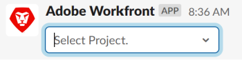

# Criar tarefas e problemas a partir de [!DNL Slack]

Depois de instalar e configurar [!DNL Adobe Workfront for Slack], você pode criar tarefas e problemas do [!DNL Slack] e associá-los a projetos em [!DNL Workfront].

Para obter mais informações sobre como configurar [!DNL Workfront] com [!DNL Slack], consulte [Configurar [!DNL Adobe Workfront for Slack]](../../workfront-integrations-and-apps/using-workfront-with-slack/configure-workfront-for-slack.md).

Você deve ter acesso para criar tarefas e problemas em seu Nível de acesso e [!UICONTROL Contribute] permissões no projeto ao qual você está associando.

Para obter mais informações sobre Níveis de Acesso, consulte [Visão geral dos níveis de acesso](../../administration-and-setup/add-users/access-levels-and-object-permissions/access-levels-overview.md). Para obter mais informações sobre permissões para objetos, consulte [Visão geral do compartilhamento de permissões em objetos](../../workfront-basics/grant-and-request-access-to-objects/sharing-permissions-on-objects-overview.md).

## Requisitos de acesso

Você deve ter o seguinte:

<table style="table-layout:auto"> 
 <col> 
 </col> 
 <col> 
 </col> 
 <tbody> 
  <tr> 
   <td role="rowheader"><a href="https://www.workfront.com/plans" target="_blank">[!DNL [!DNL Adobe Workfront] plano]</a>*</td> 
   <td> 
[!UICONTROL Pro] ou superior
 </td> 
  </tr> 
 </tbody> 
</table>

&#42;Para descobrir qual plano, tipo de licença ou acesso você tem, entre em contato com seu [!DNL Workfront] administrador.\

## Pré-requisitos

Antes de criar tarefas e problemas do [!DNL Slack], você deve

* Configurar [!DNL Workfront] para Slack\
   Para obter instruções sobre como configurar [!DNL Workfront for Slack], consulte [Configurar [!DNL Adobe Workfront for Slack]](../../workfront-integrations-and-apps/using-workfront-with-slack/configure-workfront-for-slack.md).

## Criar tarefas a partir de [!DNL Slack]

1. Faça logon no [!DNL Slack] instância e faça logon no [!DNL Workfront] from [!DNL Slack].\
   Para obter mais informações sobre como fazer logon no Workfront a partir de [!DNL Slack], consulte o tópico &quot;Fazer logon no [!DNL Workfront] from [!DNL Slack]&quot; na seção [Acesso [!DNL Adobe Workfront] from [!DNL Slack]](../../workfront-integrations-and-apps/using-workfront-with-slack/access-workfront-from-slack.md).

1. Em qualquer canal, comece a digitar o seguinte comando no campo de mensagem:

   `/workfront add task <Task Name>`

   >[!NOTE]
   >
   >Os comandos fazem distinção entre maiúsculas e minúsculas. Você pode iniciar seu comando com `/wf` em vez de `/workfront`.
   >  
   >O Nome da Tarefa deve ser inserido como ele aparecerá no [!DNL Workfront] , sem colchetes ou aspas.\
   >

1. (Opcional) Comece digitando o nome de um projeto ao qual deseja associar a nova tarefa e selecione-a quando ela for exibida na lista.\
   Você recebe uma confirmação indicando que a tarefa foi adicionada ao projeto selecionado.
1. (Opcional) Clique no nome da tarefa na mensagem de confirmação para abri-la em [!DNL Workfront], em uma nova guia do navegador.

## Criar problemas de [!DNL Slack]

1. Faça logon no [!DNL Slack] instância e faça logon no [!DNL Workfront] from [!DNL Slack].\
   Para obter mais informações sobre como fazer logon no [!DNL Workfront] from [!DNL Slack], consulte o tópico &quot;Fazer logon no [!DNL Workfront] from [!DNL Slack]&quot; na seção [Acesso [!DNL Adobe Workfront] from [!DNL Slack]](../../workfront-integrations-and-apps/using-workfront-with-slack/access-workfront-from-slack.md).

1. Em qualquer canal, comece a digitar o seguinte comando no campo de mensagem:

   `/workfront add issue <Issue Name>`

   >[!NOTE]
   >
   >Os comandos fazem distinção entre maiúsculas e minúsculas. Você pode iniciar seu comando com &#39;/wf&#39; em vez de &#39;/workfront&#39;. \
   >O Nome do problema deve ser inserido como ele aparecerá no [!DNL Workfront] , sem colchetes ou aspas.\
   >

1. (Opcional) Comece a digitar o nome de um projeto ao qual deseja associar o novo problema e selecione-o quando ele for exibido na lista.\
   Você recebe uma confirmação indicando que o problema foi adicionado ao projeto selecionado.
1. (Opcional) Clique no nome do problema na mensagem de confirmação para abri-lo em [!DNL Workfront], em uma nova guia do navegador.
