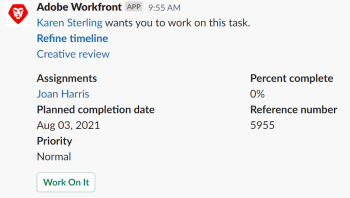

# Receber [!DNL Adobe Workfront] notificações em [!DNL Slack]

<!--

(NOTE: Alina: *** Linked to Accessing Workfront from Slack.***Some of this information is duplicating in Accessing Workfront from Slack (also screen shots))

-->

Depois de instalar o [!DNL Adobe Workfront for Slack], você pode receber [!DNL Workfront] notificações em [!DNL Slack].\
Para obter informações sobre a instalação [!DNL Workfront for Slack], consulte [Configurar [!DNL Adobe Workfront for Slack]](../../workfront-integrations-and-apps/using-workfront-with-slack/configure-workfront-for-slack.md).

Você pode ativar um número selecionado de [!UICONTROL notificações] que aparecem na bolha de notificações no [!DNL Workfront] , que também será entregue em [!DNL Slack].

As notificações por email funcionam independentemente do [!DNL Workfront] notificações da interface. Você ou seu [!DNL Workfront] o administrador pode desabilitar as notificações por email, enquanto as notificações da interface não podem ser desabilitadas em [!DNL Workfront].\
No entanto, você pode desativar o [!DNL Workfront] notificações que você pode receber em [!DNL Slack], se quiser se concentrar nessas notificações somente dentro do [!DNL Workfront] interface.

## Requisitos de acesso

Você deve ter o seguinte:

<table style="table-layout:auto"> 
 <col> 
 </col> 
 <col> 
 </col> 
 <tbody> 
  <tr> 
   <td role="rowheader"><a href="https://www.workfront.com/plans" target="_blank">[!DNL [!DNL Adobe Workfront] plano]</a>*</td> 
   <td> 
[!UICONTROL Pro] ou superior
 </td> 
  </tr> 
 </tbody> 
</table>

&#42;Para descobrir qual plano, tipo de licença ou acesso você tem, entre em contato com seu [!DNL Workfront] administrador.\

## Pré-requisitos

Antes de poder receber [!DNL Workfront] notificações em [!DNL Slack], você deve

* Configurar [!DNL Workfront for Slack]\
   Para obter instruções sobre como configurar [!DNL Workfront for Slack], consulte [Configurar [!DNL Adobe Workfront for Slack]](../../workfront-integrations-and-apps/using-workfront-with-slack/configure-workfront-for-slack.md).

## Configurar [!DNL Workfront] notificações para [!DNL Slack] {#configure-workfront-notifications-for-slack}

1. (Condicional) Depois [!DNL Workfront] foi adicionado ao [!DNL Slack] instância, faça logon [!DNL Workfront] from [!DNL Slack].\
   Para obter informações sobre como fazer logon [!DNL Workfront] from [!DNL Slack], consulte [Acesso [!DNL Adobe Workfront] from [!DNL Slack]](../../workfront-integrations-and-apps/using-workfront-with-slack/access-workfront-from-slack.md).

1. Em qualquer canal, comece a digitar um dos seguintes comandos no campo de mensagem:

   `/workfront settings`

   Ou

   `/wf settings`

   

1. Todas as notificações estão habilitadas, por padrão.\
   Desative qualquer uma das seguintes notificações:

   * [!UICONTROL Estou atribuído a uma nova tarefa ou problema]
   * [!UICONTROL Minha equipe está atribuída a uma nova tarefa ou problema]
   * [!UICONTROL Recebo uma nova solicitação de aprovação ou acesso]
   * [!UICONTROL Alguém tiver me incluído em uma atualização direcionada]
   * [!UICONTROL Quando alguém comentar em um item de trabalho, envie email para qualquer um que tiver comentado este item de trabalho]
   * [!UICONTROL Foi feita uma atualização em uma tarefa, problema ou projeto que eu assino]
   * [!UICONTROL Quando alguém comentar no item de trabalho, envie email para os atribuídos]
   * [!UICONTROL Alguém comenta sobre minha solicitação de ajuda]

   As alterações feitas na variável [!UICONTROL notificações] as opções entrarão em vigor imediatamente.\
   As notificações ativadas são entregues na variável [!DNL Workfront] [!DNL Slack] canal. Quando você desativa as notificações aqui, elas só são desativadas para [!DNL Slack]e não para o [!DNL Workfront] interface. Você continua a recebê-los no [!DNL Workfront] bolha de notificações no canto superior direito da interface.

## Gerenciar [!DNL Workfront] notificações de [!DNL Slack]

Você pode receber e responder a [!DNL Workfront] notificações de [!DNL Slack].

Você pode desativar notificações por email para notificações ativadas em [!DNL Slack], para garantir que você não receba notificações duplicadas.\
Para obter informações sobre como configurar suas notificações por email, consulte [Ativar ou desativar suas próprias notificações de evento](../../workfront-basics/using-notifications/activate-or-deactivate-your-own-event-notifications.md).

Ativar ou desativar [!DNL Workfront] notificações em [!DNL Slack] não afeta as notificações que você recebe dentro do [!DNL Workfront] interface.\
Notificações dentro do [!DNL Workfront] não é possível desabilitar a interface.

Para gerenciar a [!DNL Workfront] notificações para [!DNL Slack]:

1. Faça logon em [!UICONTROL Slack].
1. Faça logon em [!DNL Workfront] from [!DNL Slack].\
   Para obter informações sobre como fazer logon no [!DNL Workfront] from [!DNL Slack], consulte o tópico &quot;Fazer logon no [!DNL Workfront] from [!DNL Slack]&quot; na seção [Acesso [!DNL Adobe Workfront] from [!DNL Slack]](../../workfront-integrations-and-apps/using-workfront-with-slack/access-workfront-from-slack.md).

1. Certifique-se de que [!DNL Workfront] notificações para [!DNL Slack] estão ativadas.\
   Para obter mais informações sobre [!DNL Workfront] as notificações podem ser configuradas para também serem enviadas para [!DNL Slack], consulte [Configurar [!DNL Workfront] notificações para [!DNL Slack]](#configure-workfront-notifications-for-slack-configure-workfront-notifications-for-slack).

1. Vá para o **[!DNL Workfront]** canal para localizar seu [!DNL Workfront] notificações.
1. (Condicional e opcional) Siga um destes procedimentos:

   * Clique em **[!UICONTROL Trabalhe nele]** para aceitar trabalhar em uma tarefa.

      <!--   
        
     -->

   * (Condicional e opcional) Clique em **[!UICONTROL Responder em[!DNL Workfront]]** para responder a um comentário, digite a resposta e clique em **[!UICONTROL Responder]**.\

      

   * (Condicional e opcional) Clique em **[!UICONTROL Aprovar]** ou **[!UICONTROL Rejeitar]** para aprovar ou rejeitar uma tarefa, problema ou projeto que está pendente de aprovação.\

      

   * (Condicional e opcional) Clique em **[!UICONTROL Aprovar]**, **[!UICONTROL Alterações]** ou **[!UICONTROL Rejeitar]**, para aprovar, aprovar com alterações ou rejeitar um documento.\

      \
      Você também pode passar o mouse sobre a miniatura do documento e clicar no ícone da lupa para exibir uma visualização maior do documento, antes de aprová-lo.\
      Apenas o Slack aprovado [tipos de arquivo](https://api.slack.com/types/file) pode ser visualizado.

   * (Condicional e opcional) Clique em **[!UICONTROL Subvenção]** ou **[!UICONTROL Ignorar]** para conceder ou ignorar a solicitação de mais acesso de outro usuário.\

      \
      Você recebe uma confirmação de que sua ação foi concluída em [!DNL Workfront], para cada decisão tomada em suas notificações.
