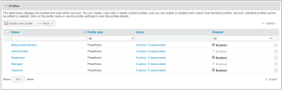

# Configurar perfis personalizados em [!DNL Workfront Proof]

>[!IMPORTANT]
>
>Este artigo se refere à funcionalidade no produto independente [!DNL Workfront] Proof. Para obter informações sobre provas dentro de [!DNL Adobe Workfront], consulte [Prova](../../../review-and-approve-work/proofing/proofing.md).

Como Administrador de Cobrança do [!DNL Workfront Proof] ou Administrador do [!DNL Workfront Proof], você pode configurar perfis personalizados para outros usuários.

Perfis personalizados permitem atribuir permissões granulares aos usuários em sua conta e definir o nível de acesso e os direitos que eles têm sobre os itens em sua conta. Para obter mais informações sobre perfis personalizados, consulte [Criar e Gerenciar Perfis Personalizados usando [!DNL Workfront Proof]](../../../workfront-proof/wp-mnguserscontacts/users/create-and-manage-custom-profiles.md).

É possível ajustar o layout da página para exibir apenas as informações relevantes para você:

* Você pode ajustar o número de itens exibidos (1)
* Filtre a lista de perfis para localizar aqueles com os quais deseja trabalhar (2)
* Você pode verificar facilmente o número de perfis que você tem na conta (3)\
   

## Guia Perfis

A guia [!UICONTROL Perfis] permite adicionar e gerenciar perfis personalizados de maneira conveniente. Aqui, é possível executar as seguintes ações:

* Adicionar um novo perfil (1)
* Executar ações em massa em perfis:
* Excluir vários perfis (2)
* Desativar múltiplos perfis (3)
* Ativar vários perfis (4)
* Detalhes do perfil de acesso (5)
* Copiar um perfil (6)
* Desativar um perfil (7)

Para obter informações adicionais sobre como personalizar a guia Perfis, consulte [Criar e gerenciar perfis personalizados usando o [!DNL Workfront Proof]](../../../workfront-proof/wp-mnguserscontacts/users/create-and-manage-custom-profiles.md).

## Detalhes do perfil

A página Detalhes do perfil permite modificar as permissões ativadas para seu perfil personalizado, copiar o perfil, excluir o perfil e exibir a lista de usuários aos quais o perfil é atribuído.

Para obter mais informações sobre as ações que você pode executar nesta página, consulte &quot;[Criar e Gerenciar Perfis Personalizados usando o [!DNL Workfront Proof]](../../../workfront-proof/wp-mnguserscontacts/users/create-and-manage-custom-profiles.md).

* [Acessando a página Detalhes do perfil](#accessing-the-profile-details-page)
* [Exibindo a Lista de Usuários com um Perfil Atribuído](#viewing-the-list-of-users-with-a-profile-assigned)

### Acessando a página Detalhes do perfil {#accessing-the-profile-details-page}

Para acessar os detalhes do perfil:

1. Clique no nome do perfil.
1. 

### Exibindo a Lista de Usuários com um Perfil Atribuído {#viewing-the-list-of-users-with-a-profile-assigned}

Para exibir a lista de usuários que receberam um determinado perfil:

1. Clique no link que mostra o número de usuários ativos e desativados com esse perfil (1).
1. Como alternativa, essa lista é exibida na página Detalhes do perfil.
1. 

1. A lista mostra os usuários ativos e desativados na sua conta que receberam o perfil em questão. Se a lista for muito longa, você poderá ajustar convenientemente o layout da página para visualizar apenas as informações que estiver procurando.
1. 
