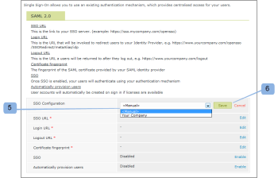

# Configurar logon único para [!DNL Workfront Proof] usuários

>[!IMPORTANT]
>
>Este artigo se refere à funcionalidade no produto independente [!DNL Workfront Proof]. Para obter informações sobre prova dentro de [!DNL Adobe Workfront], consulte [Tofing](../../../review-and-approve-work/proofing/proofing.md).

Se você tiver o plano Select ou Premium , poderá fornecer o recurso de Logon único (SSO) que permite usar o nome de usuário e a senha de sua organização existente para acessar seu [!DNL Workfront Proof] conta.

Isso significa que você será autenticado em seu próprio sistema de logon, não em relação à variável [!DNL Workfront Proof] página de logon.

>[!NOTE]
>
>Você deve ter um subdomínio ou domínio personalizado configurado em [!DNL Workfront Proof] para ativar o SAML. Subdomínios personalizados podem ser configurados livremente. Consulte [Marca](https://support.workfront.com/hc/en-us/sections/115000921208-Branding) para obter mais informações.Leia mais sobre domínios totalmente personalizados em nossa [Marca [!DNL Workfront Proof] site - avançado](../../../workfront-proof/wp-acct-admin/branding/brand-wp-site-advanced.md).

## Ativar SSO dentro de [!DNL Workfront Proof]

A funcionalidade de Logon único pode ser ativada na variável [!UICONTROL Logon único] da sua [!UICONTROL Configurações da conta]e se aplicará a todos os usuários em seu [!DNL Workfront Proof] conta. Consulte [Configurações da conta](https://support.workfront.com/hc/en-us/sections/115000912147-Account-settings) para obter mais informações.

## ID da entidade

Como Provedor de serviços, publicamos nossa ID de entidade aqui:

[https://yoursubdomain.proofhq.com/saml/module.php/saml/sp/metadata.php/phq](https://yoursubdomain.proofhq.com/saml/module.php/saml/sp/metadata.php/phq) (onde &quot;seu subdomínio&quot; é o subdomínio de sua conta)

[!DNL Workfront Proof] O requer o endereço de email do usuário como seu identificador exclusivo, que pode ser passado como um dos seguintes atributos:

* urn:mace:dir:attribute-def:emailAddress
* http://schemas.xmlsoap.org/ws/2005/05/identity/claims/emailaddress
* http://schemas.xmlsoap.org/claims/EmailAddress
* urn:oid:0.9.2342.19200300.100.1.3
* http://axschema.org/contact/email
* openid.sreg.email
* email
* email
* emailAddress

Para configurar o SSO:

1. Abra o **[!UICONTROL Logon único]** (1).
1. Insira o **URL SSO** (2)
Esse é o link para seu servidor SSO (por exemplo, **https://sso.mycompany.com/opensso**).

1. Insira o **URL de logon** (3)
Esse é o URL que será chamado para redirecionar os usuários para seu Provedor de identidade.

1. Esse não é um URL real inserido no navegador, mas um terminal que processará as informações enviadas para apresentar a tela de Logon.

Insira o **URL de logout** (4)
Esse é o URL para o qual você será retornado após fazer logoff, por exemplo

**https://www.yourcompany.com/services/logout.asp**

1. Insira o **Impressão digital do certificado** 5.
1. A impressão digital SHA1 do certificado SAML fornecido pelo Provedor de identidade SAML.
1. Certifique-se de incluir as Informações-chave definindo isso em seu Provedor de identidade.
1. Switch **SSO** para **[!UICONTROL Ativado]** (6)
Quando o SSO estiver ativado, você e outros usuários em sua conta farão logon usando seu próprio mecanismo de autenticação. O que isso significa é que quando os usuários acessam seu [!DNL Workfront Proof] tela de logon da conta (por exemplo, **yourcompany.proofhq.com/login**), eles serão solicitados com a janela de transferência para sua própria página de logon de autenticação.

1. (Opcional) Ativar **Provisionar usuários automaticamente** (7)
Quando esta opção estiver ativada, as contas de usuário serão criadas automaticamente para pessoas que não têm suas próprias contas [!DNL Workfront Proof] , mas acessará seus [!DNL Workfront Proof] usando suas credenciais de logon único. Isso será acionado somente quando o limite do usuário ainda não for atingido em sua conta.

1. Os novos usuários provisionados terão as permissões de perfil do Gerenciador atribuídas por padrão. Se precisar de mais informações, consulte [Perfis de prova de permissões em [!DNL Workfront Proof]](../../../workfront-proof/wp-acct-admin/account-settings/proof-perm-profiles-in-wp.md).

## Ativação do SSO para contas satélite

Quando tiver contas satélite conectadas à sua conta do hub, você poderá administrá-las a partir do nível da conta do hub.

O Logon único é um recurso Select e Premium , portanto, o Logon Único só pode ser ativado em satélites que estão em planos Select e Premium.

1. Clique em **[!UICONTROL Configurações]** > **[!UICONTROL Configurações da conta]** (1)

1. Clique na conta satélite no menu suspenso (2).
1. Abra o **[!UICONTROL Logon único]** (3).
1. Comece a editar a configuração do SSO (4).
1. 
Aqui você terá dois métodos (5) de configuração:

1. **Herdado:** SSO com a configuração obtida de sua conta de hub.
Se um usuário acessar [!DNL Workfront Proof] através da **página de logon padrão** ([https://www.proofhq.com/login](https://www.proofhq.com/login)) será **dois níveis de autorização**: Primeiro, um usuário é solicitado a fazer logon usando [!DNL Workfront Proof] dados de acesso (e-mail e senha); em seguida, o usuário é transferido por meio de uma janela SSO para a página de logon SSO.
Portanto, com o serviço de SSO ativado, recomendamos fazer logon por meio de sua [!DNL Workfront Proof] subdomínio/domínio.

   >[!NOTE]
   >
   >Nesse momento, quando o Logon único é ativado no [!DNL Workfront Proof] não será possível fazer logon no aplicativo iPhone com essas credenciais.

   1. **Manual** (padrão): SSO com uma configuração diferente (por exemplo, apontando para outro Provedor de identidade).

      >[!NOTE]
      >
      >Se a conta satélite estiver herdando a configuração SSO da conta do hub, a tela de logon será a da conta do hub. Quando o usuário da conta satélite insere seus detalhes de logon SSO nessa página, eles são redirecionados para a conta satélite.

      

   1. Clique em **[!UICONTROL Salvar]** (6)

## Configurações do SSO herdadas de uma conta de Hub

Ao escolher herdar as configurações da sua conta de hub, você observará que todos os campos agora são preenchidos com os dados da sua conta de hub (7) e que o Logon único é Ativado/Desativado(8) automaticamente como em sua conta principal. Também não há mais links de edição nos campos, já que a configuração do SSO para a Conta do Satélite agora é definida e gerenciada de sua conta do hub.

Na sua conta do hub (9), a variável [!UICONTROL Uso de SSO] mostra que essa configuração está sendo usada por contas satélite (10).\

## SSO Configurado Manualmente

Se a configuração manual do SSO tiver sido escolhida para uma conta satélite (1), será necessário inserir manualmente os dados do Logon único.

1. Clique em **[!UICONTROL Configurações]** > **[!UICONTROL Configurações da conta]** (1)

1. Abra o **[!UICONTROL Logon único]** guia .
1. Clique em **[!UICONTROL Editar],** preencha o campo e clique em **[!UICONTROL Salvar]** (2)

1. No **[!UICONTROL SSO]** , clique em **[!UICONTROL Ativado]** (3)

## Logon SSO

1. Clique em **[!UICONTROL Configurações]** > **[!UICONTROL Configurações da conta]** (1)

1. Abra o **[!UICONTROL Logon único]** guia .
1. Certifique-se de que [!DNL Workfront Proof] domínio/subdomínio (1) está configurado e seus usuários acessam seu [!DNL Workfront Proof] por meio desse domínio/subdomínio personalizado.
   
Com o Logon único ativado, o URL de logon do subdomínio (por exemplo, yourcompany.proofhq.com/login) exibe uma tela de transferência (2) que leva você diretamente para a página de logon SSO.
   

1. Se um usuário acessar [!DNL Workfront Proof] através da **página de logon padrão** ([https://www.proofhq.com/login](https://www.proofhq.com/login)) será **dois níveis de autorização**. Primeiro, um usuário é solicitado a fazer logon usando [!DNL Workfront Proof] acessar dados (email e senha). Em seguida, o usuário é transferido por meio de uma janela SSO (2) para a página de logon SSO.\
   Portanto, com o serviço de SSO ativado, recomendamos fazer logon por meio de sua [!DNL Workfront Proof] subdomínio/domínio.

1. No momento, quando o Logon único é ativado em sua conta da Workfront Proof, você não poderá fazer logon no aplicativo iPhone com essas credenciais.

## Sobre como adicionar um novo usuário

Quando a funcionalidade Logon único estiver ativada em seu [!DNL Workfront Proof] , os novos usuários não receberão qualquer email de confirmação, pois suas contas serão ativadas automaticamente e estarão prontas para uso.

Em seu [!DNL Workfront Proof] página de logon, depois de clicar no [!UICONTROL Logon] , os usuários são encaminhados para sua página de logon SSO e solicitados a inserir suas credenciais de logon de Logon único.

>[!IMPORTANT]
>
>Os usuários são identificados por meio de um endereço de email durante o processo de autenticação, o que significa que a conta de email usada para seu logon SSO deve ser o endereço de email do usuário registrado em sua conta.

## Serviços de Federação do Ative Diretory (AD FS)

O Ative Diretory Federation Services (AD FS) é um [!DNL Microsoft] componente de software que pode ser instalado em sistemas operacionais Windows Server para fornecer aos usuários acesso de Logon Único a sistemas e aplicativos localizados além dos limites organizacionais. Para obter mais informações, consulte &quot;Serviços de Federação do Ative Diretory&quot; no site da Rede de Desenvolvedores do Microsoft.

O [!DNL Workfront Proof] O sistema suporta SAML 2.0 e só é compatível com o AD FS versão 2.0 ou superior.

Consulte [Logon único [!DNL Workfront Proof]: Configuração do AD FS](../../../workfront-proof/wp-acct-admin/account-settings/sso-in-wp-adfs-configuration.md) para obter instruções detalhadas.
