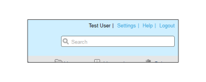

# Marcar o site [!DNL Workfront Proof] - avançado

>[!IMPORTANT]
>
>Este artigo se refere à funcionalidade no produto independente [!DNL Workfront Proof]. Para obter informações sobre provas dentro de [!DNL Adobe Workfront], consulte [Prova](../../../review-and-approve-work/proofing/proofing.md).

A marca avançada está disponível nos planos Select e Premium e está incluída no custo do plano.

Para obter informações sobre marcas básicas, que incluem a página de logon, notificações por email e provas, consulte [Marcar o [!DNL Workfront Proof] site](../../../workfront-proof/wp-acct-admin/branding/brand-wp-site.md).

As opções avançadas de marca incluem a personalização das seguintes áreas:

* Cor do cabeçalho e do texto
* Cabeçalho do aplicativo web
* Barra de menus e cor do texto
* Caixa de boas-vindas do painel e caixa de início rápido
* Testo de rodapé
* Favicon
* Título da página
* Links de ajuda

As seções a seguir descrevem a marca avançada com mais detalhes:

## Visão geral de marca avançada

Você encontrará a seção [!UICONTROL Configuração de identidade visual] na guia da página [Configurações de Conta](https://support.workfront.com/hc/en-us/sections/115000912147-Account-Settings). Para aplicar as alterações à sua conta, verifique se a opção Identidade Visual está definida como [!UICONTROL Habilitada] (1).

Consulte a seção abaixo para obter informações mais detalhadas sobre como configurar as opções de marca Avançadas (2-14).

## Configuração avançada de marca

Você pode marcar as seguintes áreas do [!DNL Workfront Proof]:

* [Aplicativo web](#web-application)
* [Cabeçalho](#header)
* [Links de cabeçalho](#header-links)
* [Barra lateral](#sidebar)
* [Caixa de boas-vindas](#welcome-box)
* [Cabeçalhos da seção](#section-headers)

### Aplicativo web {#web-application}

Você tem três opções de marca para o cabeçalho da aplicação Web (2):

* Imagem da marca no cabeçalho
* O nome da sua conta no cabeçalho
* Se você desabilitar a marca, o logotipo [!DNL Workfront Proof] permanecerá no cabeçalho do aplicativo Web

Imagem da marca - redimensiona para um tamanho máximo de 550x90px. É possível usar JPG ou GIF ou PNGs, e os planos de fundo transparentes são compatíveis.

Nome da conta - extraído dos detalhes da conta e exibido com fonte branca. O nome da sua conta pode ter até 60 caracteres (incluindo espaços e sinais de pontuação).

### Cabeçalho {#header}

Neste campo (3) você pode definir o fundo do cabeçalho e escolher uma cor sólida ou uma imagem de fundo.

Cor - aqui, como em todos os outros campos de marca da configuração do esquema de cores, você pode inserir um valor de cor hexadecimal de sua escolha ou usar um seletor de cores útil (clicar no campo de texto abre a janela pop-up). A cor de fundo padrão do cabeçalho é #232d2e.

Imagem de plano de fundo - pode ser combinada com a imagem da marca.

* Você pode usar JPG ou GIF ou PNGs - para os arquivos com transparência, uma cor de fundo branca é exibida.
* A altura do cabeçalho é 96px e a imagem carregada não será redimensionada para a opção [!UICONTROL Não repetir].
* A imagem de fundo está posicionada no canto superior esquerdo.

### Links de cabeçalho {#header-links}

Neste campo (4) você pode modificar a cor e a cor do nome de usuário dos links no menu Cabeçalho visível no canto superior direito da sua conta.

### Barra lateral {#sidebar}

Escolha cores para a barra de menus (5) e a fonte de menus (6) para personalizar a barra lateral

>[!NOTE]
>
>A cor da focalização ajustada automaticamente adicionando um valor hexadecimal constante à cor da barra de menus selecionada.

A cor do botão Nova prova não pode ser personalizada.

### Caixa de boas-vindas {#welcome-box}

Nesse campo (7) é possível definir a cor da caixa de boas-vindas exibida na página Painel.

### Cabeçalhos da seção {#section-headers}

Esses campos permitem personalizar o plano de fundo (8) e a cor da fonte (9) dos cabeçalhos da seção nas [[!UICONTROL Configurações da conta]](https://support.workfront.com/hc/en-us/sections/115000912147-Account-Settings) páginas.

**Rodapé**

Neste campo (10) da configuração Branding você pode compor um rodapé que será exibido na parte inferior de todas as páginas da conta. Você pode usar o editor WYSIWYG integrado ou pode simplesmente colar seu próprio design.

>[!NOTE]
>
>Não é possível editar HTML no editor de texto de rodapé, mas você pode colar um design copiado (incluindo todos os links e imagens).

**Favicon e título de página**

É possível personalizar a forma como as páginas do [!DNL Workfront Proof] são apresentadas nos navegadores definindo sua própria imagem favicon (arquivo .ICO) (11) e Título da página (12) - elas serão exibidas nos cabeçalhos de guias/janelas dos navegadores de todas as páginas da conta.

>[!NOTE]
>
>Seu favicon também será exibido nos cabeçalhos das janelas do Visualizador [!DNL Workfront Proof] para todas as provas criadas em sua conta.

**Links de ajuda**

Você pode personalizar seus próprios links de ajuda para apontar seus usuários e revisores para o seu próprio conteúdo. Para ativar isso, defina a opção [!UICONTROL Links de ajuda] (13) como Habilitada e adicione seus links nos próximos campos (14). É possível configurar até quatro links, que estarão disponíveis:

* no menu [!UICONTROL Cabeçalho], no link [!UICONTROL Ajuda]
  

* no painel [!UICONTROL Ajuda] da barra lateral [!DNL Workfront Proof] [!UICONTROL Visualizador]
  

Por uma taxa adicional, os clientes nos planos Enterprise também têm a opção de personalizar totalmente o seguinte:

* Personalizar totalmente as páginas de aterrissagem (por exemplo, páginas de logon e logout, página de senha esquecida)
* Personalizar totalmente seu domínio

Entre em contato conosco em sales.team@workfront.com para saber mais sobre as opções adicionais de marca.

<!--
<h2 data-mc-conditions="QuicksilverOrClassic.Draft mode">Custom Domains</h2>
-->

<!--

Our Select and Premium plans include the option to purchase a fully-branded domain. This means that you can customize your URL as well as all links included in notification emails.&nbsp;

-->

<!--

For more information, please see&nbsp;<a href="../../../workfront-proof/wp-acct-admin/branding/configure-branded-domain-in-wp.md" class="MCXref xref">Configure a branded domain in Workfront Proof</a>.

-->

<!--
<h2 data-mc-conditions="QuicksilverOrClassic.Draft mode">Custom Page Branding</h2>
-->

<!--

Custom branding of the Workfront Proof pages is a paid service and by default&nbsp;includes full customization of the following:

-->

<!--
  <li data-mc-conditions="QuicksilverOrClassic.Draft mode"><a href="https://app.proofhq.com/login">Log in/landing page</a> </li>
  -->

<!--
  <li data-mc-conditions="QuicksilverOrClassic.Draft mode"><a href="https://app.proofhq.com/logout">Logout page</a> </li>
  -->

<!--
  <li data-mc-conditions="QuicksilverOrClassic.Draft mode"><a href="https://app.proofhq.com/login/password">Forgot password page</a> </li>
  -->

<!--
<h3 data-mc-conditions="QuicksilverOrClassic.Draft mode">Design Elements</h3>
-->

<!--

Please create your design&nbsp;in&nbsp;a .PSD file with all the elements placed in the separate layers - this will allow us to prepare the scalable pages for you.

-->

<!--

There are no particular restrictions on the .PSD files, and the look and layout of the pages is completely up to you. However please make sure that the key elements are included in your design:

-->

<!--

<strong>Login Page</strong>    

-->

<!--

<strong>Logout page</strong>    

-->

<!--

<strong>Forgot password</strong>    

-->

<!--

<strong>Inactivity alert</strong>    

-->

<!--

<strong>Invalid email address</strong>    

-->

<!--

<strong>Inactivity and incorrect email address</strong>    

-->

<!--
<note type="note">
&nbsp;The separate designs for the alerts are not required. If you'd like us to leave the default style of the messages, as shown on the screencasts above, please let us know. The team will match the colors with your design.
</note>
-->

<!--

If you'd like to have placeholder text in the text fields, please include this in your designs.

-->

<!--
<note type="note">
The wording of the alerts cannot be changed as these are the system messages.
</note>
-->

<!--

<strong>2. Fonts</strong> 

-->

<!--

Please make sure that the text is not rasterized but kept as the text layers, unless you want the particular elements to be displayed as images on your landing pages.

-->

<!--

If you use custom fonts in your design, please make sure to include the following font files: EOT + .TTF + OTF + SVG + WOFF for support in all browsers.

-->

<!--
<note type="note">
&nbsp; You need to hold an appropriate license, which allows implementing your selected fonts on the web pages.
</note>
-->

<!--

If you use the standard and widely available fonts, the font files are not required. Please see the following lists for reference:

-->

<!--
  <li data-mc-conditions="QuicksilverOrClassic.Draft mode"><a href="http://www.w3schools.com/cssref/css_websafe_fonts.asp">Websafe fonts listed in the standard Font families</a> </li>
  -->

<!--
  <li data-mc-conditions="QuicksilverOrClassic.Draft mode"><a href="https://www.google.com/fonts">Open Source Google fonts</a> </li>
  -->

<!--

<strong>3. Screen resolution</strong> 

-->

<!--

We support 1024x768 screen resolution (1366x768 for wide screens) and upwards. However, for the landing pages designs we do recommend using higher resolution for the better results on the various screens. The best practice would be to determine what screen resolution is the most common on your users' machines and prepare a slightly bigger design.

-->

<!--

<strong>4. Browsers compatibility</strong> 

-->

<!--

The newer browsers generally don't require any custom code to display the pages properly. However, if your users have the older browser versions installed on their machines some code adjustments may be needed.

-->

<!--

By default we do prepare the pages compatible with the following browsers:

-->

<!--
  <li data-mc-conditions="QuicksilverOrClassic.Draft mode">Internet Explorer 9+</li>
  -->

<!--
  <li data-mc-conditions="QuicksilverOrClassic.Draft mode">Safari 6.x+</li>
  -->

<!--
  <li data-mc-conditions="QuicksilverOrClassic.Draft mode">Chrome 22+ *</li>
  -->

<!--
  <li data-mc-conditions="QuicksilverOrClassic.Draft mode">Firefox 15+ *</li>
  -->

<!--

* Preferred browsers 

-->

<!--
<note type="note"> Workfront Proof will not design your custom pages, the PSD files must be supplied by you, but if you have any questions, please contact our Support team.
</note>
-->
