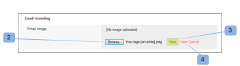

# Marcar o site [!DNL Workfront Proof]

>[!IMPORTANT]
>
>Este artigo se refere à funcionalidade no produto independente [!DNL Workfront] Proof. Para obter informações sobre provas dentro de [!DNL Adobe Workfront], consulte [Prova](../../../review-and-approve-work/proofing/proofing.md).

Como administrador do [!DNL Workfront Proof], você pode marcar a conta do [!DNL Workfront Proof] para fornecer a você e a seus usuários uma experiência mais personalizada.

A marca básica da conta está disponível em todos os planos sem custo adicional.

Para obter informações sobre marca avançada, que inclui marcas no cabeçalho, barra de menu, painel e muito mais, consulte [Marcar o [!DNL Workfront Proof] site - avançado](../../../workfront-proof/wp-acct-admin/branding/brand-wp-site-advanced.md). A marca avançada está disponível apenas nos planos Select e Premium

Consulte as seguintes seções para obter informações sobre como marcar vários aspectos do site de prova [!DNL Workfront]:

## Habilitando a Identidade Visual na Página de Logon [!DNL Workfront Proof]

Para ativar a marca em sua conta:

1. Faça logon em [!DNL Workfront Proof] como administrador [!DNL Workfront Proof].
1. Clique em **[!UICONTROL Configurações da conta]** no canto superior direito da interface [!DNL Workfront Proof].

   Para obter mais informações sobre as várias configurações de conta que você pode definir, consulte [Configurações de conta.](https://support.workfront.com/hc/en-us/sections/115000912147-Account-Settings)

1. Clique na guia **[!UICONTROL Configurações]**.
1. Na seção **[!UICONTROL Identidade Visual]**, clique em **[!UICONTROL Habilitar]**. (1)

   

   A imagem da marca agora aparece na página de logon.

   >[!NOTE]
   >
   >A imagem de marca não será exibida na página de logon se você acessar por meio da URL de logon de prova [!DNL Workfront] principal. Por exemplo, `https://www.proofhq.com/login`. Ela será exibida somente se você acessar a página de logon por meio do subdomínio personalizado ou do domínio totalmente marcado. Para acessar a página de logon personalizada, basta digitar o URL da conta no navegador. Por exemplo, `http://<yoursubdomain>.proofhq.com.` <!--For more information about fully branded domains, see "Fully Branded Domains" in the article [Configure a branded domain in [!DNL Workfront Proof]](../../../workfront-proof/wp-acct-admin/branding/configure-branded-domain-in-wp.md).-->

   

## Ativação da identidade visual em provas

Para adicionar sua própria imagem de marca à página [!UICONTROL carregamento de prova] de cada prova criada em sua conta:

1. Faça logon em [!DNL Workfront Proof] como administrador [!DNL Workfront Proof].
1. Clique em **[!UICONTROL Configurações da conta]** no canto superior direito da interface [!DNL Workfront Proof].

   Para obter mais informações sobre as várias configurações de conta que você pode definir, consulte [Configurações de conta.](https://support.workfront.com/hc/en-us/sections/115000912147-Account-Settings)

1. Clique na guia **[!UICONTROL Configurações]**.
1. Na seção **[!UICONTROL Identidade visual]**, clique em **[!UICONTROL Configurar]** ao lado de **[!UICONTROL Identidade visual da prova]**. (1)

   

1. No menu suspenso, selecione **[!UICONTROL Imagem de marca]**.
Se você selecionar **[!UICONTROL Desabilitar]**, o logotipo [!DNL Workfront Proof] aparecerá na página de carregamento de prova

1. Clique em **[!UICONTROL Salvar]**. (3)

   

1. Clique em **[!UICONTROL Editar]** para selecionar a imagem de marca (4).

   Você pode usar JPG, GIF ou PNGs. A transparência é compatível. O tamanho de imagem recomendado é 150x300px. Sua imagem nas páginas de logon e logout será redimensionada para essas dimensões.

   

1. Selecione a imagem que deseja fazer upload. (5)
1. Clique em **[!UICONTROL Salvar]**.

   A imagem da sua marca agora é exibida na página de carregamento de prova de cada prova criada em sua conta.

   

## Notificações por email sobre identidade visual

Você pode configurar a imagem de marca para ser incluída nas notificações por email enviadas aos revisores. Esta imagem é redimensionada para o tamanho máximo de 90x550px.

Para configurar a identidade visual do email:

1. Faça logon em [!DNL Workfront Proof] como administrador [!DNL Workfront Proof].
1. Clique em **[!UICONTROL Configurações da conta]** no canto superior direito da interface [!DNL Workfront Proof].

   Para obter mais informações sobre as várias configurações de conta que você pode definir, consulte [Configurações de conta.](https://support.workfront.com/hc/en-us/sections/115000912147-Account-Settings)

1. Clique na guia **[!UICONTROL Configurações]**.
1. Na seção **[!UICONTROL Identidade Visual]**, clique em **[!UICONTROL Editar]** ao lado da imagem do aplicativo de email (1).
   

1. Selecione a imagem que deseja usar para marcar os emails. (2)

   Se você tiver uma identidade visual de email já configurada e quiser desabilitá-la, clique em **[!UICONTROL Limpar]**. (4)

   

1. Clique em **[!UICONTROL Salvar]**.

   A imagem agora aparece em todos os emails de notificações de prova. (3)

   

<!--
<h2 data-mc-conditions="QuicksilverOrClassic.Draft mode">Custom Sub-Domains</h2>
-->

<!--

You can add your brand name to your Workfront Proof account URL. For example, your URL might look like this:

-->

<!--

<strong>http://yoursubdomain.proofhq.com</strong> 

-->

<!--

This customization is also included in all your proof links, as well as in the 'From' email address for your proof notifications.

-->

<!--

For more information on how to set up a branded sub-domain, see <a href="../../../workfront-proof/wp-acct-admin/branding/configure-branded-domain-in-wp.md" class="MCXref xref">Configure a branded domain in Workfront Proof</a>

-->

## Supressão de botões e links por meio da API

Se você criar uma prova por meio da API do [!DNL Workfront Proof], poderá suprimir botões e links e criar seus próprios links personalizados.

Consulte [[!DNL Workfront Proof] API](https://api.proofhq.com/) para obter mais informações.
