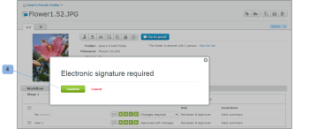

# Noções básicas sobre assinaturas eletrônicas no [!DNL Workfront Proof]

>[!IMPORTANT]
>
>Este artigo se refere à funcionalidade no produto independente [!DNL Workfront Proof]. Para obter informações sobre prova dentro de [!DNL Adobe Workfront], consulte [Tofing](../../../review-and-approve-work/proofing/proofing.md).

As assinaturas eletrônicas permitem que você aumente a segurança em suas provas e cumpra os padrões do setor, como o ISO.

Essa configuração pode ser tornada obrigatória ou não obrigatória no nível da conta. Se for obrigatório por padrão, ele será ativado em todas as provas criadas em sua conta e não poderá ser desativado no nível de prova. Se essa configuração não for obrigatória por padrão, você poderá ativá-la/desativá-la em um nível de prova.

Para obter mais informações, consulte .

Quando a configuração de assinatura eletrônica é ativada em uma prova, uma caixa de assinatura eletrônica solicita que qualquer revisor que tome uma decisão na prova para fornecer seu email e senha.

## Assinaturas eletrônicas na [!UICONTROL Detalhes da prova] Página

Se um revisor tomar sua decisão selecionando sua decisão na variável [!UICONTROL Detalhes da prova] página (1) [!UICONTROL Assinatura eletrônica] será exibida uma caixa pop-up solicitando que insira os detalhes (2) e confirme a decisão (3).

A pop-up exibirá o conjunto de mensagens padrão (se houver) e o revisor será solicitado a inserir seu email e senha.

O [!UICONTROL Assinatura eletrônica] aparecerá no visualizador de prova e também no [!UICONTROL Detalhes da prova] página se o revisor decidir tomar sua decisão a partir desse nível.

Se a variável [!UICONTROL Logon único] estiver ativada na prova, os detalhes do email e da senha não serão exibidos no [!UICONTROL Assinatura eletrônica] apareça ao tomar uma decisão.

Em vez disso, depois de clicar no botão [!UICONTROL Confirmar] (4) nessa janela, o revisor será redirecionado para a função [!UICONTROL Logon único] página.

Depois de inserir suas credenciais de SSO, o revisor será redirecionado automaticamente de volta para a [!UICONTROL Detalhes da prova] ou voltar para a página [!UICONTROL Visualizador de prova] se a decisão for tomada a partir dessa data).

>[!NOTE]
>
> Se a decisão for assinada eletronicamente, a **[!UICONTROL ícone de assinatura]** (5) aparece ao lado da decisão da [!UICONTROL Fluxo de trabalho] seção sobre [!UICONTROL Detalhes da prova] página. Se a decisão for alterada não pelo revisor, mas por outra pessoa que tenha direitos de edição na prova, essa pessoa não será solicitada a assinar eletronicamente a decisão e não haverá nenhum ícone de assinatura ao lado da decisão (6).

Para obter informações sobre o logon único, consulte [Logon único na prova do Workfront](../../../workfront-proof/wp-acct-admin/managing-security/single-sign-on-overview.md).

Para obter informações sobre a página Detalhes da prova , consulte [Gerenciar detalhes de prova em [!DNL Workfront] Prova](../../../workfront-proof/wp-work-proofsfiles/manage-your-work/manage-proof-details.md).
