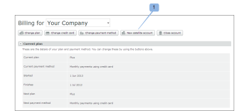
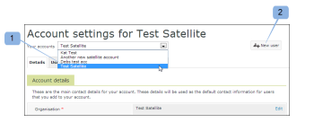

# Configure uma conta satélite em [!DNL Workfront Proof]

>[!IMPORTANT]
>
>Este artigo se refere à funcionalidade no produto independente [!DNL Workfront Proof]. Para obter informações sobre prova dentro de [!DNL Adobe Workfront], consulte [Tofing](../../../review-and-approve-work/proofing/proofing.md).

As contas satélite são contas pagas que você configura e gerencia de dentro de suas próprias contas [!DNL Workfront Proof] conta. Para obter mais informações, consulte [Contas satélite em [!DNL Workfront] Prova](../../../workfront-proof/wp-acct-admin/satellite-accounts/sat-accts-in-wp.md).

Qualquer Administrador de Faturamento pode criar uma conta Satélite. Para obter informações sobre Administradores de Faturamento, consulte [[!UICONTROL Perfis de permissões de prova] em [!DNL Workfront Proof]](../../../workfront-proof/wp-acct-admin/account-settings/proof-perm-profiles-in-wp.md).

>[!NOTE]
>
> As contas via satélite devem ser estabelecidas numa das nossas [!UICONTROL Padrão] ou planos superiores.

## Criação de uma conta Satellite {#creating-a-satellite-account}

Para criar uma conta Satélite:

1. Vá para o [!UICONTROL Faturamento] página.\
   Para obter mais informações sobre a página de faturamento, consulte  [O [!DNL Workfront Proof] [!UICONTROL Faturamento] Página](../../../workfront-proof/wp-billingsettings/manage-your-billing/wp-billing-page.md).

1. Clique no botão **[!UICONTROL Novo Satélite]** botão da conta. (1)

   Uma janela pop-up é exibida.

   

1. Insira os detalhes do cliente, incluindo quaisquer códigos promocionais relevantes.
1. Clique em **[!UICONTROL Salvar]**. A conta Satellite é exibida automaticamente no [!UICONTROL Contas] menu suspenso na parte superior do [!UICONTROL Faturamento] página.
1. Selecione a nova conta Satélite no menu suspenso.
1. Continue com [Selecionar um plano para sua conta Satélite](#selecting-a-plan-for-your-satellite-account) para atualizar sua conta Satellite.

## Selecionar um plano para sua conta Satélite {#selecting-a-plan-for-your-satellite-account}

Depois de configurar a conta Satélite, como descrito em [Criação de uma conta Satellite](#creating-a-satellite-account), é necessário atualizá-lo para o plano desejado.

1. Vá para o [!UICONTROL Faturamento] página.\
   Para obter mais informações sobre a página de faturamento, consulte  [O [!DNL Workfront Proof] [!UICONTROL Faturamento] Página](../../../workfront-proof/wp-billingsettings/manage-your-billing/wp-billing-page.md).

1. No **[!UICONTROL Suas contas]** no menu suspenso na parte superior da página (1), escolha a Conta de satélite relevante.

   A página de faturamento da conta Satellite é exibida e os detalhes do contato de faturamento da sua conta são replicados automaticamente.

   

1. Clique no botão **[!UICONTROL Alterar plano]** no canto superior direito da página. (2)\
   Ou\
   Abra o pop-up clicando no nome do plano atual ou seguinte. (3)

1. Atualize ou baixe seu plano.

## Adicionar usuários à sua conta Satélite

Depois de atualizar a conta Satellite para o plano escolhido, é necessário adicionar usuários à conta.

1. Faça logon em [!DNL Workfront Proof] como [!DNL Workfront Proof] administrador.
1. Clique em **[!UICONTROL Configurações da conta]**.
1. No menu suspenso na parte superior da página, selecione a Conta de satélite relevante. (1)\
   A página de configurações da conta da conta Satellite é exibida.
1. Clique no botão **[!UICONTROL Novo usuário]** no canto superior direito da página. (2)\
   O [!DNL New User] será exibida.

1. Insira os detalhes do usuário e clique em **[!UICONTROL Salvar]**.\
   O usuário recebe uma notificação por email dando acesso à conta.

Os usuários adicionados à conta Satellite são exibidos como membros na lista de contatos da conta do hub.

Da mesma forma, os usuários na conta do hub aparecem como membros nos contatos da conta Satellite.

Para ver uma lista completa de todos os usuários na conta Satélite, clique no botão **[!UICONTROL Usuários]** guia .

## Vincular contas separadas existentes à conta do hub

Se você criou outras contas separadas para seus clientes anteriormente, elas podem ser convertidas em contas Satélite.

Nós cuidaremos disso para você, vinculando-os ao seu [!DNL Workfront Proof] (tornando-a uma conta de hub).

Basta fornecer os seguintes detalhes:

* O nome da sua [!DNL Workfront Proof] e o endereço de email usado para configurá-lo
* Os nomes das contas separadas que você deseja vincular à sua conta e os endereços de email usados para configurar as contas separadas.
