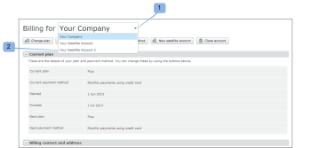

# Gerenciar uma conta satélite em [!DNL Workfront Proof]

>[!IMPORTANT]
>
>Este artigo se refere à funcionalidade no produto independente [!DNL Workfront Proof]. Para obter informações sobre prova dentro de [!DNL Adobe Workfront], consulte [Tofing](../../../review-and-approve-work/proofing/proofing.md).

Como um [!DNL Workfront Proof] administrador, é possível gerenciar uma conta satélite configurada na conta da organização.

## Atualizando Informações de Faturamento

Para visualizar e gerenciar os detalhes de faturamento da sua conta satélite:

1. Vá para o [!UICONTROL Faturamento] página.
1. Abra o menu suspenso na parte superior da página (1) e escolha a conta satélite relevante. (2)

   Para obter mais informações, consulte &quot; [O [!DNL Workfront Proof] [!UICONTROL Faturamento] Página](../../../workfront-proof/wp-billingsettings/manage-your-billing/wp-billing-page.md).

   

## Atualizando Informações da Conta

Para visualizar e gerenciar as configurações da Conta da conta Satélite:

1. Ir para [!UICONTROL Configurações da conta] na parte superior da página.
1. Clique no botão **[!UICONTROL Suas contas]** selecione o menu suspenso e escolha a conta Satélite relevante. (1)
1. Clique na guia relevante para gerenciar a configuração Conta para a conta Satélite.

