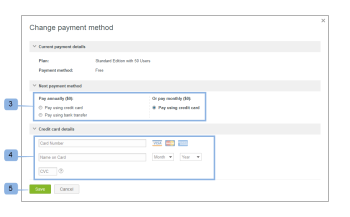

# Escolha do Método de Pagamento em [!DNL Workfront Proof]

>[!IMPORTANT]
>
>Este artigo se refere à funcionalidade no produto independente [!DNL Workfront Proof]. Para obter informações sobre prova dentro de [!DNL Adobe Workfront], consulte [Tofing](../../../review-and-approve-work/proofing/proofing.md).

## Noções básicas sobre opções de pagamento

Estão disponíveis as seguintes opções de pagamento:

| **Assinaturas mensais** | **Assinaturas anuais** |
|---|---|
| cartão de crédito | cartão de crédito |
| transferência bancária |

{style="table-layout:auto"}

Não aceitamos controlos

## Alterar o método de pagamento e os detalhes do cartão de crédito {#changing-your-payment-method-and-credit-card-details}

>[!NOTE]
>
>Considere o seguinte antes de alterar seu método de pagamento:
>
>* A alteração no método de pagamento não é aplicada à sua assinatura atual. Se quiser alterar isso para uma fatura que já foi emitida, entre em contato com a equipe de finanças em [finance@proofhq.com](mailto:finance@proofhq.com).
>* Não é possível alterar seu método de pagamento ou adicionar um Cartão de Crédito se um plano de avaliação estiver definido em sua conta. Você poderá definir esses detalhes ao atualizar sua conta.
>

Para alterar seu próximo método de pagamento e atualizar os detalhes do cartão de crédito:

1. Clique em **[!UICONTROL Alterar detalhes do pagamento]** (1) na parte superior da página\
   Ou\
   Clique em **[!UICONTROL Próximo método de pagamento]**. (2)\
   

1. No **[!UICONTROL Alterar detalhes do pagamento]** selecione o próximo método de pagamento. (3)
1. (Condicional) Para os pagamentos do Cartão de Crédito, insira os detalhes do seu cartão.\
   Se quiser alterar apenas os detalhes do cartão de crédito, preencha apenas os campos de detalhes (4) do cartão de crédito com os novos dados do cartão e salve (5) as alterações. Você pode alterar os detalhes do cartão de crédito a qualquer momento. O novo cartão é usado para todos os pagamentos de assinatura em vigor imediatamente.\
   Aceitamos [!DNL Visa], [!DNL American Express] e [!DNL MasterCard].

1. Clique em **[!UICONTROL Salvar]**. (4)\
   

## Alteração dos detalhes do método de pagamento das contas satélite

Se tiver contas Satélite, será necessário atualizar os detalhes do cartão de crédito e o método de pagamento separadamente para cada conta. Para obter mais informações sobre contas satélite, consulte  [Contas por satélite.](https://support.workfront.com/hc/en-us/sections/115000921108-Satellite-accounts)

1. Vá para o [!UICONTROL Faturamento] em sua conta do Hub.\
   Para obter mais informações sobre a página Faturamento, consulte [O [!DNL Workfront] Página de Faturamento da Prova](../../../workfront-proof/wp-billingsettings/manage-your-billing/wp-billing-page.md).

1. Abra o [!UICONTROL lista de contas] menu suspenso. (1)
1. Escolha a conta satélite (2) associada ao cartão de crédito que deseja atualizar.
1. Continue com [Alterar o método de pagamento e os detalhes do cartão de crédito](#changing-your-payment-method-and-credit-card-details).\
   
