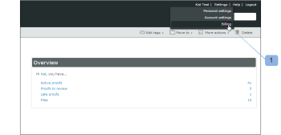
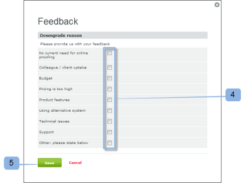

# Feche sua conta [!DNL Workfront Proof]

>[!IMPORTANT]
>
>Este artigo se refere à funcionalidade no produto independente [!DNL Workfront Proof]. Para obter informações sobre provas dentro de [!DNL Adobe Workfront], consulte [Prova](../../../review-and-approve-work/proofing/proofing.md).

Após concluir as etapas desta seção, sua conta será fechada imediatamente. Todos os dados na sua conta serão excluídos e não poderão ser restaurados.

Estamos continuamente tentando melhorar nosso produto. Se você quiser fechar sua conta, agradeceremos que você reserve alguns minutos e nos informe como podemos melhorar.

Você pode entrar em contato conosco em [!DNL support@proofhq.com] com seus comentários; todos os comentários são bem-vindos.

1. Abra a página [!UICONTROL Faturamento] em sua conta abrindo o menu [!UICONTROL Configurações] e escolhendo **[!UICONTROL Faturamento]** (1).

   Para obter mais informações sobre a página de Faturamento, consulte [A [!DNL Workfront] Página de Faturamento de Prova](../../../workfront-proof/wp-billingsettings/manage-your-billing/wp-billing-page.md).

   

1. Clique no botão **[!UICONTROL Fechar conta]** (3).

   

1. Selecione o motivo para fechar a conta. (4)
1. Confirme sua decisão clicando em **[!UICONTROL Salvar]**. (5)

   

1. Digite sua senha para fechar sua conta. (6)

   
