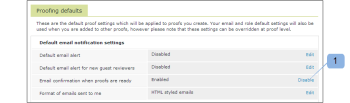

# O email [!UICONTROL Prova feita]

>[!IMPORTANT]
>
>Este artigo se refere à funcionalidade no produto independente [!DNL Workfront Proof]. Para obter informações sobre provas dentro de [!DNL Adobe Workfront], consulte [Prova](../../../review-and-approve-work/proofing/proofing.md).

Um email [!UICONTROL Prova feita] é enviado ao criador da prova somente quando ele cria uma prova. Se uma pessoa tiver criado uma prova e tornado Proprietário outra pessoa, somente o novo Proprietário também receberá o email [!UICONTROL Prova feita]. O Criador e/ou Proprietário não receberá um; eles recebem somente o email [!UICONTROL Prova feita]. Para obter mais informações sobre o email [!UICONTROL Nova prova], consulte [[!UICONTROL Novo email de prova]](../../../workfront-proof/wp-emailsntfctns/proof-notifications-and-reminders/new-proof-email.md).

Os usuários podem desabilitar emails do [!UICONTROL Prova feita] em suas configurações de perfil, conforme explicado abaixo.

>[!NOTE]
>
> Se o Criador ou Proprietário da prova tiver emails do [!UICONTROL Prova feita] desabilitados por padrão em suas configurações pessoais, ele não receberá emails do [!UICONTROL Prova feita] ou [!UICONTROL Nova Prova], mesmo se a caixa [!UICONTROL Notificar pessoas por email] estiver marcada na página [!UICONTROL Nova prova].

Um email [!UICONTROL Prova feita] inclui sua mensagem pessoal (se você incluir uma) e os seguintes detalhes de prova:

* Nome da prova
* Link pessoal para a prova
* Número da versão
* Miniatura da prova
* Progresso da prova
* Um link para compartilhar a prova com outra pessoa
* Isso permite compartilhar o URL da prova e/ou o link de download do arquivo original.

>[!NOTE]
>
> O compartilhamento de links de prova não permite que você adicione explicitamente revisores à prova. Você só compartilhará o URL de prova pública e o recipient receberá acesso somente leitura à prova.

Consulte [Compartilhar uma prova no [!DNL Workfront Proof]](../../../workfront-proof/wp-work-proofsfiles/share-proofs-and-files/share-proof.md) para obter mais informações.

Se não quiser que este link apareça no email do destinatário, desabilite as configurações de [!UICONTROL Compartilhamento público] na prova ([!UICONTROL Baixar arquivo original] e [!UICONTROL URL público]).

## Desabilitando o email [!UICONTROL Prova feita]

1. Clique em **[!UICONTROL Configurações]** > **[!UICONTROL Configurações pessoais]**, abra a guia **[!UICONTROL Padrões de provas]** e clique em **[!UICONTROL Desabilitar]** ao lado de **[!UICONTROL Confirmação por email quando as provas estiverem prontas]**.

1. 

1. Consulte [Definir configurações de notificação por email no Workfront Proof](../../../workfront-proof/wp-emailsntfctns/email-alerts/config-email-notification-settings-wp.md) para obter instruções mais detalhadas.
1. Se as notificações por email estiverem desabilitadas como padrão nas [!UICONTROL Configurações da conta], o Criador ou Proprietário da prova não receberá emails do [!UICONTROL Comprovação feita] ou do [!UICONTROL Nova Prova], mesmo que isso esteja habilitado nas configurações Pessoais e a caixa [!UICONTROL Notificar pessoas por email] esteja marcada na página [!UICONTROL Nova prova].
