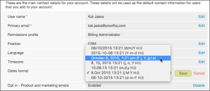

# Definindo fusos horários em [!DNL Workfront Proof]

>[!IMPORTANT]
>
>Este artigo se refere à funcionalidade no produto independente [!DNL Workfront Proof]. Para obter informações sobre provas dentro de [!DNL Adobe Workfront], consulte [Prova](../../../review-and-approve-work/proofing/proofing.md).

[!DNL Workfront Proof] exibe a hora em que uma prova foi criada e quando qualquer atividade ocorreu na prova, como prazos, decisões e comentários. Por padrão, a hora é exibida em GMT.

Como usuário com sua própria conta [!DNL Workfront Proof], você pode definir seu fuso horário em configurações pessoais. Todos os horários em [!DNL Workfront] serão exibidos neste fuso horário, mesmo para uma prova que foi criada por um usuário em um fuso horário diferente. Para obter mais informações, consulte [Configurações Pessoais.](https://support.workfront.com/hc/en-us/sections/115000921168-Personal-settings)

Todos os revisores convidados (usuários sem sua própria conta [!DNL Workfront Proof]) verão todos os tempos no fuso horário do proprietário da prova. Para obter mais informações, consulte [Entender usuários, membros e convidados em [!DNL Workfront Proof]](../../../workfront-proof/wp-mnguserscontacts/contacts/use-members-guests.md).

## Definindo seu Fuso Horário Pessoal

1. Clique em **[!UICONTROL Configurações]** > **[!UICONTROL Configurações pessoais]** e abra a guia **[!UICONTROL Configurações]**.

1. (Opcional) Para alterar o formato das datas e horas exibidas em sua conta, edite o **[!UICONTROL formato de Datas]**.\
   Se quiser ver as horas exibidas no formato AM/PM, selecione a seguinte opção no menu:

1. 

## Definindo o Fuso Horário Padrão da Organização

Se você for um Administrador de conta, poderá definir um fuso horário padrão para sua organização. Esse fuso horário será definido por padrão para todos os novos usuários adicionados à organização (mas pode ser alterado pelo usuário individual).

1. Clique em **[!UICONTROL Configurações]** > **[!UICONTROL Configurações pessoais]** e abra a guia **[!UICONTROL Configurações]**.

1. Em **[!UICONTROL Detalhes da conta]**, clique em [!UICONTROL Editar] à direita de **[!UICONTROL Padrão de fuso horário]** e faça a alteração.
