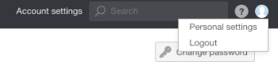
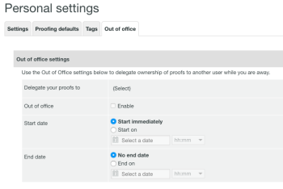
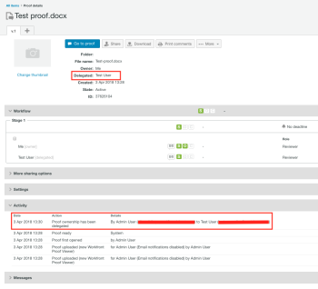
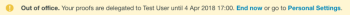

# Designando Proprietários de Prova Temporários em [!DNL Workfront Proof]

>[!IMPORTANT]
>
>Este artigo se refere à funcionalidade no produto independente [!DNL Workfront Proof]. Para obter informações sobre provas dentro de [!DNL Adobe Workfront], consulte [Prova](../../../review-and-approve-work/proofing/proofing.md).

Se você ficar fora do escritório por um período de tempo estendido, poderá delegar a propriedade de suas provas a outro usuário em sua conta.

>[!NOTE]
>
>Esta função está disponível somente em [!DNL Workfront Proof].

Para designar a propriedade temporária de suas provas:

1. Em [!DNL Workfront Proof], vá para **[!UICONTROL Configurações pessoais]**.\
   

1. Clique na guia **[!UICONTROL Ausência temporária]**. As seguintes configurações estão disponíveis:

   * **[!UICONTROL Delegar suas provas a]** outro usuário em sua conta.
   * Habilite e desabilite a função **[!UICONTROL Ausência Temporária]** marcando ou desmarcando a caixa de seleção.
   * Selecione a **[!UICONTROL Data de início]**.

     Se a opção **[!UICONTROL Iniciar imediatamente]** for escolhida, a propriedade das provas será delegada ao usuário selecionado imediatamente após você ativar o recurso.

     Se uma data e hora de início específicas forem definidas, o recurso será ativado no dia selecionado e na hora escolhida.

   * Selecione a **[!UICONTROL Data final]**.

     Se nenhuma data final for escolhida, a propriedade das provas será delegada até que o recurso seja desativado manualmente.

     Se uma data e hora de término específicas forem definidas, o recurso será desativado no dia e na hora selecionados.

     

1. Quando as provas são delegadas, o proprietário delegado é mostrado na seção **[!UICONTROL Detalhes]** da página de detalhes da prova. A nota de delegação de propriedade aparece na seção **[!UICONTROL Atividade]** da página de detalhes da prova.

   

   Uma notificação de [!UICONTROL Ausência Temporária] também é exibida na conta do proprietário da prova original durante o tempo em que o recurso é habilitado. Isso funciona como um lembrete para o proprietário original e também permite que ele encerre a delegação imediatamente ou vá para [!UICONTROL Configurações pessoais] para ajustar isso.

   

   Quando a propriedade das provas é retomada pelo proprietário original, o proprietário delegado desaparece da seção [!UICONTROL Detalhes] da página de detalhes da prova e a notificação [!UICONTROL Ausência Temporária] não é mais exibida na conta do proprietário da prova original. Uma observação mostrando que a propriedade da prova foi revertida aparece na seção [!UICONTROL Atividade] da página de detalhes da prova.

   >[!NOTE]
   >
   >O proprietário delegado permanece no fluxo de trabalho de prova, a menos que você o remova manualmente.

   ![[!UICONTROL seção-atividade-retirada-de-volta].png](assets/activity-section-taken-back-350x99.png)
