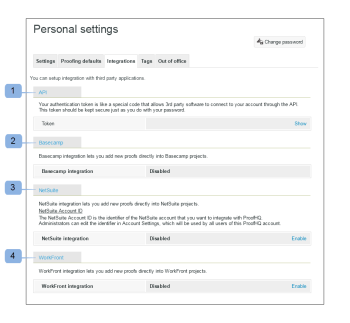

# Integrações - Configuração do usuário

>[!IMPORTANT]
>
>Este artigo se refere à funcionalidade no produto independente [!DNL Workfront Proof]. Para obter informações sobre prova dentro de [!DNL Adobe Workfront], consulte [Tofing](../../../review-and-approve-work/proofing/proofing.md).

Esta seção mostra as opções que você tem para configurar links de integração pré-criados com aplicativos de terceiros.

Também é aqui que você pode encontrar o token de autenticação que permite que software de terceiros se conecte à sua conta por meio da API.

Os pontos de integração atuais estão disponíveis para o seguinte:

* API pública (1) - Consulte nossa [Página de ajuda da API](http://api.proofhq.com/)
* [!DNL Basecamp] (2) - Consulte nosso [[!DNL Basecamp]](https://support.workfront.com/hc/en-us/sections/115000911927-Basecamp) e [[!DNL Basecamp Classic]](https://support.workfront.com/hc/en-us/categories/115000588707-Basecamp-Classic) páginas de ajuda

* [!DNL NetSuite] (3)
* [!DNL WorkFront] (4)

