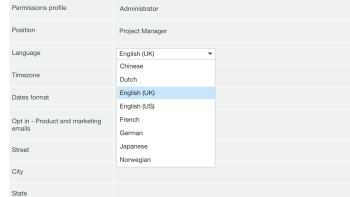

# Configurações de Idioma em [!DNL Workfront Proof]

>[!IMPORTANT]
>
>Este artigo se refere à funcionalidade no produto independente [!DNL Workfront Proof]. Para obter informações sobre provas dentro de [!DNL Adobe Workfront], consulte [Prova](../../../review-and-approve-work/proofing/proofing.md).

Como administrador do [!DNL Workfront Proof], você pode escolher o idioma a ser usado no [!DNL Workfront Proof] para todos os usuários da sua conta.

## Idiomas com Suporte no [!DNL Workfront Proof]

[!DNL Workfront Proof] está disponível nos seguintes idiomas:

* Inglês (EUA/Reino Unido)
* Brasileiro (Português)
* Chinese
* Holandês
* Francês
* Alemão
* Japonês
* Norueguês
* Espanhol
* Sueco

## Alterar o Idioma Padrão em [!UICONTROL Configurações da Conta]

Para alterar o idioma padrão da sua conta, siga as etapas abaixo.

1. Vá para a guia **[!UICONTROL Detalhes]** em **[!UICONTROL Configurações da conta]** em [!DNL Workfront Proof].

1. Na seção **[!UICONTROL Detalhes da conta]**, clique em **[!UICONTROL Editar]** para as configurações de **[!UICONTROL Idioma padrão]**.

1. No menu suspenso, selecione o idioma padrão.\
   

1. Clique em **[!UICONTROL Salvar].**

## Alterando o Idioma Padrão em [!UICONTROL Configurações Pessoais]

Os usuários individuais do [!DNL Workfront Proof] podem especificar um idioma diferente daquele usado por padrão em suas contas. Para alterar o idioma padrão pessoal, siga as etapas abaixo.

1. Vá para a guia **[!UICONTROL Detalhes pessoais]** nas **[!UICONTROL Configurações pessoais]** em [!DNL Workfront Proof].\
   Para obter mais informações, consulte [Gerenciar [!DNL Workfront Proof] usuários](../../../workfront-proof/wp-acct-admin/account-settings/manage-wp-users.md).

1. Clique no idioma visível na configuração **[!UICONTROL Idioma]**.
1. No menu suspenso, selecione o idioma preferido. Sua seleção será salva automaticamente.\
   

## Adicionar Comentários De Prova Usando Alfabeto Não Latino

Você pode adicionar comentários usando um alfabeto que difere do idioma padrão. Quando visualizados por outro recipient de prova, os comentários são exibidos no idioma usado para adicionar o conteúdo.

Você pode escolher entre os seguintes alfabetos:

* Script latino
* Chinese
* Coreano
* Japonês
* Cirílico
* Hebraico
* Árabe
* Grego

## Configurações de idioma do visualizador de prova

A capacidade de ajustar o idioma no visualizador de provas depende de a pessoa que acessa uma prova ser um usuário ou um convidado.

Para [!DNL Workfront Proof] usuários, o Visualizador de Provas exibe o conteúdo no idioma padrão definido em suas [!UICONTROL Configurações pessoais].

Para convidados, o visualizador de provas exibe o conteúdo no idioma definido pelo proprietário da prova nas [!UICONTROL Configurações pessoais].

>[!NOTE]
>
>Se houver ações ou decisões personalizadas presentes na conta, elas serão exibidas no idioma em que foram adicionadas originalmente, independentemente das preferências de idioma dos revisores.
