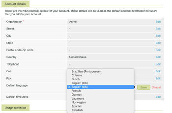

# Configurações de idioma em [!DNL Workfront Proof]

>[!IMPORTANT]
>
>Este artigo se refere à funcionalidade no produto independente [!DNL Workfront Proof]. Para obter informações sobre prova dentro de [!DNL Adobe Workfront], consulte [Tofing](../../../review-and-approve-work/proofing/proofing.md).

Como um [!DNL Workfront Proof] administrador, você pode escolher o idioma a ser usado em [!DNL Workfront Proof] para todos os usuários em sua conta.

## Idiomas suportados em [!DNL Workfront Proof]

[!DNL Workfront Proof] está disponível nos seguintes idiomas:

* Inglês (EUA/Reino Unido)
* Brasileiro (Português)
* Chinese
* Holandês
* Francês
* Alemão
* Japonês
* Norueguês
* Espanhol
* Sueco

## Altere o idioma padrão em [!UICONTROL Configurações da conta]

Para alterar o idioma padrão da sua conta, siga as etapas abaixo.

1. Vá para o **[!UICONTROL Detalhes]** em **[!UICONTROL Configurações da conta]** em [!DNL Workfront Proof].

1. Em **[!UICONTROL Detalhes da conta]** seção , clique em **[!UICONTROL Editar]** para **[!UICONTROL Idioma padrão]** configurações.

1. No menu suspenso , selecione o idioma padrão.\
   

1. Clique em **[!UICONTROL Salvar].**

## Alteração do idioma padrão em [!UICONTROL Configurações pessoais]

Individual [!DNL Workfront Proof] os usuários do podem especificar um idioma diferente do usado por padrão em suas contas do . Para alterar seu idioma padrão pessoal, siga as etapas abaixo.

1. Vá para o **[!UICONTROL Detalhes pessoais]** na guia **[!UICONTROL Configurações pessoais]** em [!DNL Workfront Proof].\
   Para obter mais informações, consulte [Gerenciar [!DNL Workfront Proof] usuários](../../../workfront-proof/wp-acct-admin/account-settings/manage-wp-users.md).

1. Clique no idioma visível no **[!UICONTROL Idioma]** configuração.
1. No menu suspenso , selecione o idioma desejado. Sua seleção será salva automaticamente.\
   

## Adicionar comentários de prova usando alfabeto não latino

É possível adicionar comentários usando um alfabeto diferente do seu idioma padrão. Quando visualizados por outro recipient de prova, os comentários são exibidos no idioma usado para adicionar o conteúdo.

Você pode escolher entre os seguintes alfabetos:

* Script latino
* Chinese
* Coreano
* Japonês
* Cirílico
* Hebraico
* Árabe
* Grego

## Configurações de idioma do visualizador de prova

A capacidade de ajustar o idioma no visualizador de prova depende de a pessoa que acessa uma prova ser um usuário ou um convidado.

Para [!DNL Workfront Proof] usuários, o Visualizador de prova exibe conteúdo no idioma padrão definido em seus [!UICONTROL Configurações pessoais].

Para convidados, o visualizador de prova exibe conteúdo no idioma definido pelo proprietário da prova no [!UICONTROL Configurações pessoais].

>[!NOTE]
>
>Se houver ações ou decisões personalizadas presentes na conta, elas serão exibidas no idioma em que foram originalmente adicionadas, independentemente das preferências de idioma dos revisores.
