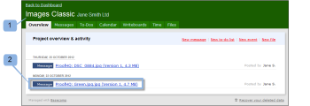

# Revisar uma Prova no [!DNL Basecamp] Classic

>[!IMPORTANT]
>
>Este artigo se refere à funcionalidade no produto independente [!DNL Workfront Proof]. Para obter informações sobre provas dentro de [!DNL Adobe Workfront], consulte [Prova](../../../review-and-approve-work/proofing/proofing.md).

[!DNL Basecamp] é uma ferramenta de gerenciamento de projetos online desenvolvida pela [!DNL 37signals]. Se você usar o [!DNL Basecamp] para gerenciamento de projetos, poderá oferecer à sua equipe de projetos ferramentas de revisão e aprovação mais avançadas usando o [!DNL Workfront Proof].

## Noções básicas das revisões de prova no [!DNL Basecamp Classic]

Quando integrado ao [!DNL Workfront Proof], o [!DNL Basecamp] permite que os usuários façam o seguinte com provas:

* Os usuários podem revisar e aprovar provas em [!DNL Basecamp Classic].
* Os usuários têm ferramentas de análise prontamente disponíveis.
* As equipes de revisão de projetos recebem uma mensagem em [!DNL Basecamp] com uma minitorprova para revisão e aprovação.
* Os usuários podem alternar para uma prova de página inteira para revisão e aprovação.
* Os usuários podem adicionar comentários e marcações a provas de tamanho menor e maior.
* Depois que um comentário é respondido, ele não pode ser editado/excluído. Para obter informações sobre comentários, consulte [Comentário sobre uma prova](../../../review-and-approve-work/proofing/reviewing-proofs-within-workfront/comment-on-a-proof/comment-on-proof.md).
* Os revisores podem responder às marcações e feitas por outros revisores. Para obter informações sobre comentários, consulte [Comentário sobre uma prova](../../../review-and-approve-work/proofing/reviewing-proofs-within-workfront/comment-on-a-proof/comment-on-proof.md).
* Os usuários são alertados quando uma nova versão da prova está disponível.
* Os usuários que não são [!DNL Workfront Proof] podem trabalhar em uma prova no [!DNL Basecamp].

## Exibir uma prova por meio do email de notificação

Se você vincular uma prova a [!DNL Basecamp], [!DNL Workfront Proof] enviará um email de notificação de prova (1) a todos os revisores, contendo as seguintes informações:

* **Detalhes da prova** (2): exibe informações sobre a prova. As informações exibidas dependem de como o administrador do Workfront configurou o Basecamp.
* **[!UICONTROL Link Ir para prova]** (3): abre a prova no Workfront.
* **[!DNL Basecamp]URL** (4): abre a prova no Basecamp. Se revisores que não forem do Basecamp forem adicionados à prova, sua notificação por email não incluirá o link Basecamp.
* **[!UICONTROL Progresso da prova]** (5): lista os estágios de aprovação e exibe os indicadores de progresso da prova.
* **[!UICONTROL Estágio]** (6): lista os revisores e seu progresso individual.

Para abrir a prova na notificação por email:

1. Para abrir a prova em [!DNL Workfront Proof], clique em **[!UICONTROL Ir para Prova]**.\
   Ou\
   Para abrir a prova em [!DNL Basecamp], clique na URL listada no campo **[!UICONTROL [!DNL Basecamp]URL]**.\
   Para obter informações sobre como revisar uma prova no [!DNL Basecamp Classic], consulte [Revisão de uma Prova no [!DNL Basecamp]](#reviewing-a-proof-in-basecamp) neste artigo.

## Exibindo a Prova por meio da Mensagem [!DNL Basecamp Classic]

Você pode acessar uma prova de uma mensagem [!DNL Basecamp Classic].

1. Em [!DNL Basecamp], vá para a página do seu projeto (1).\
   

1. Clique na mensagem da prova que deseja abrir. (2)\
   A mensagem para a prova é aberta, exibindo uma mini prova. O nome da prova é exibido na parte superior da janela de mensagem (3).\
   Você pode exibir a prova de miniatura em [!DNL Basecamp Classic] ou em [!DNL Workfront Proof].\
   

1. Para exibir a prova no modo de tela cheia no [!DNL Workfront proof], clique na URL listada acima da prova (4).
1. (Condicional) Se você não estiver conectado à sua conta do [!DNL Workfront Proof] em uma das janelas do navegador, registre para revisar a prova:

   1. Clique em **[!UICONTROL Entrar]** (5) acima da prova.
   1. Digite seu endereço de email (6).\

      Você deve usar o mesmo endereço de email usado quando foi adicionado à prova.
   1. Clique em **[!UICONTROL Avançar]**.
   1. Digite sua senha do [!DNL Workfront Proof] (7).\

      Ou\
      Se você não tiver uma conta [!DNL Workfront Proof], digite um nome público para exibir.\
      Você pode selecionar &quot;[!UICONTROL lembrar-se de mim]&quot; para que só precise inserir seus detalhes uma vez.

1. Para revisar a prova, continue com [Revisão de uma Prova em [!DNL Basecamp]](#reviewing-a-proof-in-basecamp).

>[!NOTE]
>
> A caixa de comentário mostrada abaixo da mini prova na página de mensagem se aplica somente à própria mensagem. Para enviar comentários de revisão, você deve usar o botão ícone de comentários na parte superior da miniprova ou o botão maior [!UICONTROL Comentários] na parte superior da prova de página inteira. Para obter mais informações, consulte Revisão de uma [Revisão de uma Prova em [!DNL Basecamp]](#reviewing-a-proof-in-basecamp).

## Revisando uma Prova em [!DNL Basecamp]

A miniprova no [!DNL Basecamp] fornece as ferramentas necessárias para você adicionar e tomar a [Decisão sobre uma prova no visualizador de provas](../../../review-and-approve-work/proofing/reviewing-proofs-within-workfront/make-a-decision-on-a-proof/make-decisions-on-proof.md) sobre a prova. Todos os usuários atribuídos ao projeto visualizam suas marcações e comentários e podem responder com seus próprios comentários em tempo real.

Quando você abre a prova, ela é exibida na janela [!UICONTROL prova] (1) e o nome da prova e o número da versão são exibidos no canto superior esquerdo (2).

Para revisar a prova:

1. Para adicionar um comentário, clique em [!UICONTROL Comentário] (3) na parte superior da prova e digite seu comentário.\
   Não há necessidade de enviar uma resposta à mensagem [!DNL Basecamp], já que os comentários e [Tomar uma decisão sobre uma prova no visualizador de provas](../../../review-and-approve-work/proofing/reviewing-proofs-within-workfront/make-a-decision-on-a-proof/make-decisions-on-proof.md) foram salvos na prova (similar a revisar uma prova no [!DNL Workfront Proof]).

1. Para adicionar uma decisão, clique em Decisão (3) na parte superior da prova e selecione sua decisão de aprovação.\
   Para obter mais informações sobre como tomar decisões em uma prova, consulte [Tomar uma decisão sobre uma prova no visualizador de provas](../../../review-and-approve-work/proofing/reviewing-proofs-within-workfront/make-a-decision-on-a-proof/make-decisions-on-proof.md#making-a-decision-on-a-proof).

Outros recursos na janela de prova incluem:

* **[!UICONTROL Menus de ação]** (4): permite selecionar configurações para a prova.
* **[!UICONTROL Botão de tela cheia]** (5): permite alternar entre tela cheia e miniprova.
* **[!UICONTROL Barra lateral]** (6): permite expandir ou reduzir a exibição da prova.
* **[!UICONTROL Nome de usuário]** (7): exibe seu nome de usuário se você estiver conectado ao Workfront.
* **[!UICONTROL Ferramentas de zoom]** (8): permite ampliar uma área da prova.
* **[!UICONTROL Ferramentas de navegação de página]** (9): permite rolar a tela para outras páginas dentro da prova.

<!--For more information on reviewing proofs, see [Legacy proofing viewer Overview](../../../workfront-proof/wp-work-proofsfiles/review-proofs-lpv/legacy-proofing-viewer.md).-->
