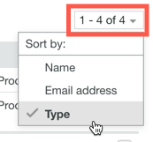

# Gerenciar seus Contatos no [!DNL Workfront Proof]

>[!IMPORTANT]
>
>Este artigo se refere à funcionalidade no produto independente [!DNL Workfront Proof]. Para obter informações sobre provas dentro de [!DNL Adobe Workfront], consulte [Prova](../../../review-and-approve-work/proofing/proofing.md).

Você pode gerenciar colegas, membros e convidados na página Contatos.

## Abrindo a Página Contatos

1. Clique em **[!UICONTROL Contatos]** na barra lateral de navegação à esquerda.
1. (Opcional) Clique em **[!UICONTROL Alterar exibição]** e selecione uma opção para especificar se você deseja exibir por contato ou por empresa.

## Classificando Contatos

1. Clique em **[!UICONTROL Contatos]** na barra lateral de navegação à esquerda.
1. Clique no cabeçalho da coluna pelo qual deseja classificar.
Ou
Selecione uma opção no menu **[!UICONTROL Classificar]**, no canto superior direito da página Contatos.

1. 

1. O triângulo em um cabeçalho de coluna indica a ordem de classificação. Apontado para cima, indica ordem crescente; apontar para baixo indica ordem decrescente.

## Filtrar contatos

1. Clique em **[!UICONTROL Contatos]** na barra lateral de navegação à esquerda.
1. Clique no ícone **[!UICONTROL Filtro]** na extremidade direita dos cabeçalhos de coluna para exibir as opções de filtragem abaixo dos cabeçalhos de coluna.
1. Selecione [!UICONTROL opções de filtragem] nos menus suspensos e digite as caixas de filtragem exibidas abaixo de cada cabeçalho de coluna e clique novamente no ícone **[!UICONTROL Filtro]** para aplicar as opções.
1. 

1. Ou
1. Selecione a primeira letra no nome do contato desejado.
1. 

## Gerenciar um ou mais contatos

1. Clique em **[!UICONTROL Contatos]** na barra lateral de navegação à esquerda.
1. Marque a caixa de seleção de um ou mais contatos.
1. Siga um destes procedimentos:

   * Clique em **[!UICONTROL Adicionar ao Grupo]** para adicionar os contatos selecionados a um Grupo.

     

   * Clique em **[!UICONTROL Remover]** e, em seguida, clique em uma opção no menu suspenso para remover o contato de provas ou grupos.
   * Clique em **[!UICONTROL Mais]** > **[!UICONTROL Enviar lembrete sobre provas atrasadas]** para enviar um email de lembrete aos contatos selecionados sobre qualquer prova atrasada.

   * Clique em **[!UICONTROL Mais]** > **[!UICONTROL Exportar contatos para CSV]** para exportar os contatos selecionados para um arquivo CSV.

   * Clique em **[!UICONTROL Excluir contatos]** para remover os contatos selecionados da lista.

     
Excluir um contato não significa que um usuário seja removido da sua conta. No entanto, se um Administrador ou Administrador de Faturamento excluir alguém da lista de contatos, essa pessoa será completamente excluída da conta da sua organização.

   * Clique no ícone **[!UICONTROL Mais]** ao final da linha de um contato e use qualquer uma das opções do menu suspenso que for exibida.

     Essas opções são diferentes para diferentes tipos de contatos. Consulte [Entender usuários, membros e convidados em [!DNL Workfront Proof]](../../../workfront-proof/wp-mnguserscontacts/contacts/use-members-guests.md) para obter mais informações.

## Importando Contatos

Você pode importar contatos de um arquivo CSV.

1. Clique em **[!UICONTROL Contatos]** na barra lateral de navegação à esquerda.
1. Na página Contatos, clique em **[!UICONTROL Mais]** > **[!UICONTROL Importar contatos]** para adicionar contatos à sua lista.

1. Na página Importar pessoas que é exibida, clique em **[!UICONTROL Escolher Arquivo]**.
1. Selecione o método de separação de campos no arquivo.
1. Clique em **[!UICONTROL Salvar]**.

   * O arquivo CSV deve ter pelo menos uma coluna chamada &quot;Email&quot; (contendo os endereços de email).
   * Você também pode incluir colunas adicionais para &quot;Nome&quot;, &quot;Empresa&quot;, &quot;Telefone&quot; e &quot;Celular&quot;.
   * Em vez de &quot;Nome&quot;, você pode usar duas colunas para &quot;Nome&quot; e &quot;Sobrenome&quot;. Se forem usadas colunas separadas de nome e sobrenome, certifique-se de não incluir também uma coluna &quot;Nome&quot;.
