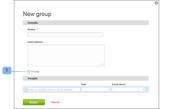

# Tornar Grupos Privados usando [!DNL Workfront Proof]

>[!IMPORTANT]
>
>Este artigo se refere à funcionalidade no produto independente [!DNL Workfront Proof]. Para obter informações sobre provas dentro de [!DNL Adobe Workfront], consulte [Prova](../../../review-and-approve-work/proofing/proofing.md).

Tornar seu grupo privado significa que somente você poderá exibir, usar, editar ou excluir o grupo. Se o grupo não for privado, todos os usuários na sua conta poderão ver e usar o grupo.

## Configurar um novo grupo para privado

Para tornar um novo grupo privado:

1. Vá para **[!UICONTROL Grupos]** no lado esquerdo da tela.
1. Selecione a opção **[!UICONTROL Particular]** na página [!UICONTROL Novo grupo] ao configurar o grupo. (1)

## Definindo um Grupo Existente como Privado

Para tornar privado um grupo existente:

1. Vá para **[!UICONTROL Grupos]** no lado esquerdo da tela.
1. Habilite a opção **[!UICONTROL Particular]** na página Detalhes do grupo. (2)

