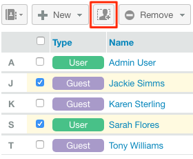

# Gerenciar grupos usando [!DNL Workfront Proof]

>[!IMPORTANT]
>
>Este artigo se refere à funcionalidade no produto independente [!DNL Workfront Proof]. Para obter informações sobre provas dentro de [!DNL Adobe Workfront], consulte [Prova](../../../review-and-approve-work/proofing/proofing.md).

Como administrador do [!DNL Workfront Proof], você pode gerenciar seus Grupos públicos e privados na página Grupos.

## Abrindo a página Grupos

1. Clique em **[!UICONTROL Grupos]** na barra lateral de navegação à esquerda.
Na página [!UICONTROL Grupos], você pode:

   * Exibir todos os seus Grupos públicos e privados.
   * Crie um novo Grupo. Para obter mais informações, consulte [Criar grupos de revisão usando [!DNL Workfront Proof]](../../../workfront-proof/wp-mnguserscontacts/groups/create-proofing-groups.md).
   * Exportar grupos para arquivo CSV.
   * Filtrar e classificar grupos.
   * Após selecionar um ou mais grupos, as seguintes opções adicionais estarão disponíveis:

      * Adicionar pessoas aos Grupos selecionados.

        

      * Tornar os Grupos selecionados privados ou públicos, conforme descrito em [Tornar Grupos Privados usando [!DNL Workfront Proof]](../../../workfront-proof/wp-mnguserscontacts/groups/make-groups-private.md)
      * Grupos privados são visíveis apenas para seus criadores.
      * Excluir os grupos selecionados.

        
   * Você pode executar ações em Grupos também em cada Grupo separadamente do menu **[!UICONTROL Mais]** (três pontos):

     

      * Exibir detalhes do Grupo.

        Você também pode exibir detalhes do Grupo clicando no nome do Grupo.
      * Adicione pessoas.
      * Tornar um grupo público/privado.
      * Excluir um grupo.

## Classificação de grupos

Você pode Classificar grupos por nome de grupo, status de privacidade e descrição.

1. Clique no cabeçalho da coluna pelo qual deseja classificar.
Ou
Selecione uma opção de classificação no menu Classificar.
   
O triângulo em um cabeçalho de coluna indica a ordem de classificação. Apontado para cima, indica ordem crescente; apontar para baixo indica ordem decrescente.

## Filtrar grupos

1. Clique no ícone **[!UICONTROL Filtro]** na extremidade direita dos cabeçalhos de coluna para exibir as opções de filtragem abaixo dos cabeçalhos de coluna.
   

1. Selecione [!UICONTROL opções de filtragem] nos menus suspensos e digite as caixas de filtragem exibidas abaixo de cada cabeçalho de coluna e clique novamente no ícone **[!UICONTROL Filtro]** para aplicar as opções.
Ou\
   Selecione a primeira letra no nome do Grupo.
   

## Exibindo e Editando Detalhes do Grupo

1. Clique no botão **[!UICONTROL Mais]**, na extremidade direita do nome do Grupo, e clique em **[!UICONTROL Exibir detalhes do grupo]** no menu suspenso.
Na página exibida, você pode exibir todas as pessoas que estão atualmente no Grupo, juntamente com suas funções padrão e alertas de email para o Grupo.

1. Siga qualquer um destes procedimentos para editar os detalhes do Grupo:

   * Edite o Nome do grupo e a Descrição clicando nele e digitando. Clicar em qualquer lugar fora do campo salva as alterações.
   * Clique em **[!UICONTROL Privacidade]** para alterar a configuração de privacidade do Grupo no menu suspenso.
   * Clique em **[!UICONTROL Adicionar ao grupo]** para adicionar novas pessoas ao Grupo.

     

   * Clique em **[!UICONTROL Excluir grupo]** no canto superior direito para excluir o grupo.\

     

   * Clique na caixa de seleção no início da linha de um membro do Grupo e use qualquer uma das opções exibidas logo acima da lista.
   * Clique no ícone **[!UICONTROL Mais]** no final da linha de um membro do Grupo e use qualquer uma das opções do menu suspenso.

     

## Adicionando Contatos a Grupos

1. Clique em **[!UICONTROL Contatos]** no painel de navegação esquerdo para ir para a página **[!UICONTROL Contatos]**.

1. Marque as caixas de seleção ao lado do nome ou nomes dos contatos que deseja adicionar a um grupo.
1. Clique no botão **[!UICONTROL Adicionar ao grupo]**.
   
A caixa de diálogo **[!UICONTROL Adicionar ao grupo]** é exibida.

1. Na seção **[!UICONTROL Pessoas]**:

   1. Use os menus suspensos para alterar a **Função** ou os **Alertas por email** de um membro. Para obter mais informações, consulte [Gerenciar funções de prova em [!DNL Workfront Proof]](../../../workfront-proof/wp-work-proofsfiles/share-proofs-and-files/manage-proof-roles.md) e [Definir configurações de notificação por email em [!DNL Workfront Proof]](../../../workfront-proof/wp-emailsntfctns/email-alerts/config-email-notification-settings-wp.md).

   1. Use o campo **[!UICONTROL Inserir um nome de contato]** ou **[!UICONTROL endereço de email]** para adicionar outros contatos ao grupo.

1. Na seção **[!UICONTROL Grupos]**, selecione o grupo ao qual deseja adicionar o(s) contato(s).
1. Clique em **[!UICONTROL Adicionar ao grupo]**.
