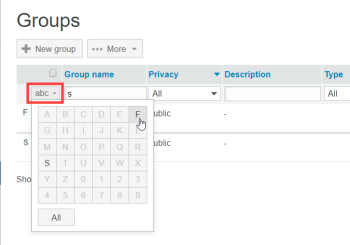

# Gerenciar grupos usando [!DNL Workfront Proof]

>[!IMPORTANT]
>
>Este artigo se refere à funcionalidade no produto independente [!DNL Workfront Proof]. Para obter informações sobre prova dentro de [!DNL Adobe Workfront], consulte [Tofing](../../../review-and-approve-work/proofing/proofing.md).

Como um [!DNL Workfront Proof] administrador, é possível gerenciar seus grupos públicos e privados na página Grupos .

## Abrir a página Grupos

1. Clique em **[!UICONTROL Grupos]** na barra lateral de navegação esquerda.
No [!UICONTROL Grupos] é possível:

   * Exibir todos os seus grupos públicos e privados.
   * Crie um novo grupo. Para obter mais informações, consulte [Criar grupos de revisão de texto usando [!DNL Workfront Proof]](../../../workfront-proof/wp-mnguserscontacts/groups/create-proofing-groups.md).
   * Exportar grupos para arquivo CSV.
   * Filtre e classifique Grupos.
   * Após selecionar um ou mais Grupos, as seguintes opções adicionais estão disponíveis:

      * Adicionar pessoas aos Grupos selecionados.

         

      * Torne os Grupos selecionados privados ou públicos, conforme descrito em [Tornar grupos privados usando [!DNL Workfront Proof]](../../../workfront-proof/wp-mnguserscontacts/groups/make-groups-private.md)
      * Grupos privados ficam visíveis somente para seus criadores.
      * Excluir os grupos selecionados.

         
   * Você pode executar ações em Grupos também em cada Grupo separadamente das próprias **[!UICONTROL Mais]** menu (três pontos):

      

      * Exibir detalhes do grupo.

         Você também pode exibir os detalhes do Grupo clicando no nome do Grupo.
      * Adicionar pessoas.
      * Tornar um grupo público/privado.
      * Excluir um grupo.

## Grupos de classificação

Você pode Classificar grupos por nome do grupo, status de privacidade e descrição.

1. Clique no cabeçalho da coluna que deseja classificar.
Ou Selecione uma opção de classificação no menu Classificar.
   
O triângulo em um cabeçalho de coluna indica a ordem de classificação. Apontado para cima, indica ordem crescente; apontar para baixo indica a ordem decrescente.

## Filtrar grupos

1. Clique no botão **[!UICONTROL Filtro]** ícone à extrema direita dos cabeçalhos de coluna para exibir as opções de filtragem abaixo dos cabeçalhos de coluna.
   

1. Selecionar [!UICONTROL opções de filtragem] nos menus suspensos, digite as caixas de filtragem exibidas abaixo de cada cabeçalho de coluna e clique no botão **[!UICONTROL Filtro]** ícone novamente para aplicar as opções.
Ou\
   Selecione a primeira letra no nome do Grupo.
   

## Visualizando e editando detalhes do grupo

1. Clique no botão **[!UICONTROL Mais]** à extrema direita do nome do Grupo e clique em **[!UICONTROL Exibir detalhes do grupo]** no menu suspenso.
Na página exibida, é possível visualizar todas as pessoas atualmente no Grupo, juntamente com suas funções padrão e alertas de email para o Grupo.

1. Siga um destes procedimentos para editar os detalhes do Grupo:

   * Edite o Nome do grupo e a Descrição clicando nele e digitando. Clicar em qualquer lugar fora do campo salva as alterações.
   * Clique em **[!UICONTROL Privacidade]** para alterar a configuração de privacidade do Grupo no menu suspenso.
   * Clique em **[!UICONTROL Adicionar ao grupo]** para adicionar novas pessoas ao Grupo.

      

   * Clique em **[!UICONTROL Excluir grupo]** no canto superior direito para excluir o grupo.\

      

   * Clique na caixa de seleção no início de uma linha de membro do Grupo e use qualquer uma das opções que aparecem logo acima da lista.
   * Clique no botão **[!UICONTROL Mais]** no final de uma linha de membro do Grupo e use qualquer uma das opções no menu suspenso.

      

## Adicionar contatos a grupos

1. Clique em **[!UICONTROL Contatos]** no painel de navegação esquerdo, vá para o **[!UICONTROL Contatos]** página.

1. Marque as caixas de seleção ao lado do nome ou nomes dos contatos que deseja adicionar a um grupo.
1. Clique no botão **[!UICONTROL Adicionar ao grupo]** botão.
   
O **[!UICONTROL Adicionar ao grupo]** será exibida.

1. No **[!UICONTROL Pessoas]** seção:

   1. Use os menus suspensos para alterar **Função** ou **Alertas por email**. Para obter mais informações, consulte [Gerenciar funções de prova em [!DNL Workfront Proof]](../../../workfront-proof/wp-work-proofsfiles/share-proofs-and-files/manage-proof-roles.md) e  [Defina as configurações de notificação de email em [!DNL Workfront Proof]](../../../workfront-proof/wp-emailsntfctns/email-alerts/config-email-notification-settings-wp.md).

   1. Use o **[!UICONTROL Inserir um nome de contato]** ou **[!UICONTROL endereço de email]** para adicionar contatos adicionais ao grupo.

1. No **[!UICONTROL Grupos]** selecione o grupo ao qual deseja adicionar o contato ou contatos.
1. Clique em **[!UICONTROL Adicionar ao grupo]**.
