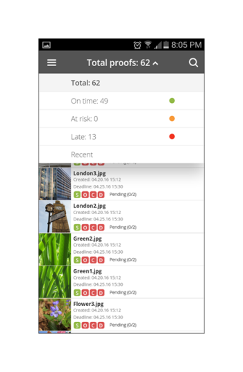

# Aplicativo móvel Workfront Proof

>[!IMPORTANT]
>
>Este artigo se refere à funcionalidade no produto independente [!DNL Workfront Proof]. Para obter informações sobre prova dentro de [!DNL Adobe Workfront], consulte [Tofing](../../../review-and-approve-work/proofing/proofing.md).

Baixe o [!DNL Workfront Proof] aplicativo da Apple App Store ou da Google Store para ser produtivo onde você estiver. O [!DNL Workfront Proof] O aplicativo tem os seguintes recursos no iPhone e iPod Touch:

* Exibir, revisar e aprovar provas estáticas e audiovisuais
* Exibir, adicionar e responder a comentários
* Gerencie suas provas por meio do painel e das visualizações

Você não precisa ser um usuário de [!DNL Workfront Proof] (ou seja, tenha suas próprias credenciais de logon) para revisar e aprovar uma prova por meio do aplicativo iOS. Desde que baixe o aplicativo no dispositivo iOS e acesse seu URL pessoal por meio do aplicativo de email iOS, você pode revisar e aprovar em qualquer lugar.

## Requisitos do dispositivo

Requer iOS 7.0 ou posterior. Android 4.0 e superior. Compatível com iPhone, iPad e iPod touch.

## Baixe e instale o aplicativo

>[!IMPORTANT]
>
>O aplicativo móvel Workfront Proof não é mais compatível e está disponível como está.  Nenhum problema no aplicativo será corrigido.

Baixe nosso [!DNL Workfront Proof] Aplicativo móvel diretamente da [Apple App Store](https://itunes.apple.com/us/app/workfront-proof/id1030372728?mt=8) ou [Google Play Store](https://play.google.com/store/apps/details?id=com.proofhq.tabletapp).

Em dispositivos iOS, desinstale o [!DNL Workfront Proof] aplicativo para dispositivos iOS antes de instalar o novo aplicativo.

O [!DNL Workfront Proof] O aplicativo detecta automaticamente o tipo de dispositivo que você está usando. Se quiser usar o aplicativo no tablet, consulte [[!DNL Workfront Proof] aplicativo móvel para tablets](../../../workfront-proof/wp-mobile/wp-mobile-apps/wp-mobile-app-tablet.md).

>[!NOTE]
>
>Não é possível revisar arquivos SWF ou arquivos de áudio, como MP3 em dispositivos iOS, devido às limitações de software de dispositivos móveis. Se você deseja revisar uma prova criada a partir de um arquivo SWF ou de um arquivo de áudio em um dispositivo móvel, converta-a em um formato compatível antes de fazer upload para [!DNL Workfront Proof].

## Introdução ao aplicativo

Você não precisa ser um [!DNL Workfront Proof] usuário para começar a usar o aplicativo. Basta instalar o aplicativo em seu dispositivo e clicar em um **[!UICONTROL Ir para prova]** na sua notificação por email. O aplicativo inicia automaticamente e carrega a prova.

Se você for um [!DNL Workfront Proof] usuário, você pode fazer logon no aplicativo antes de abrir qualquer prova. O aplicativo permite navegar em todas as provas compartilhadas com você e alternar facilmente entre elas.

1. Abra o aplicativo.
1. Digite seu email e senha e toque em **[!UICONTROL Logon]**.

   Ou

   Use o Logon único, se estiver configurado no [!DNL Workfront Proof] conta.

   Você pode usar o **[!UICONTROL Esqueceu a senha]** se você não lembrar sua senha.

## O painel

Depois de fazer logon no [!DNL Workfront Proof] , o Painel é exibido. Aqui você pode acessar facilmente suas provas. Você pode abrir uma das exibições disponíveis, Minhas provas e Todas as provas. Como alternativa, toque no nome de uma das provas recentes para ir diretamente para o visualizador de prova.

Por padrão, o Painel abrirá a exibição Total de provas. Esta exibição mostra todas as provas das quais você é o proprietário ou que foram compartilhadas com você. Você pode alterar a exibição tocando na barra na parte superior da página para abrir um menu suspenso contendo o [!UICONTROL No horário], [!UICONTROL Em risco], [!UICONTROL Atraso] e [!UICONTROL Recente] opções. Para abrir uma prova em qualquer exibição, role para baixo na lista para localizar a prova desejada, em seguida, toque no nome para ir para o visualizador de prova.

| **Na exibição de tempo** | Mostra todas as provas ativas em sua conta que você tem permissão para ver e que não têm prazo ou há mais de 24 horas até o prazo final. |
|---|---|
| **Visualização de risco** | Exibe todas as provas para as quais o prazo é inferior a 24 horas. |
| **Exibição tardia** | Lista todas as provas em que nem todas as ações são concluídas, para as quais o prazo já foi ultrapassado. |
| **Visualização recente** | Inclui as provas que você acessou recentemente e que é seu proprietário, tem permissões para ver de acordo com as permissões do perfil e que foram compartilhadas com você. Essa exibição mostra apenas as provas que você mesmo abriu (por meio da variável [!DNL Workfront Proof] Visualizador ou por meio da página Detalhes da prova ). |
| **Link de email** | Para abrir uma prova do seu email, basta abrir o email no seu aplicativo de email, clique no link [!UICONTROL Ir para prova] no link do botão no email (1) e você será levado à prova no [!DNL Workfront Proof] aplicativo. |

{style=&quot;table-layout:auto&quot;}

## Revisar uma prova estática no aplicativo

Ao abrir uma prova no aplicativo móvel, você pode fazer o seguinte:

* Leia e responda aos comentários deixados por outros revisores (1 - o dígito visível no ícone indica números de comentários deixados na prova, se nenhum comentário foi deixado na prova, este botão mostrará 0 e estará esmaecido).
* Adicione comentários e marcações (2).
* A visibilidade do botão Comentário e Decisão depende da função de prova.
* Tomar uma decisão (3).
* Vá para o menu (4).
* Dimensione a prova apertando a tela.
   

## Adicionar comentários e respostas

1. Quando tiver aberto uma prova, toque no **[!UICONTROL Adicionar comentário]** botão (1).

   

1. Digite seu comentário (2).

   

1. Clique em **[!UICONTROL Salvar]**.

## Ler e responder comentários

1. Abra a prova e toque no ícone de chamada no canto superior direito para exibir a lista de comentários (1) e escolha o comentário que deseja revisar.
1. Toque no pino para abrir o comentário associado a ele (2).

   

1. Siga um destes procedimentos:

   * Para responder a um comentário, toque no botão **[!UICONTROL Responder]** botão (3).
   * Para voltar para a imagem de prova, toque no [!UICONTROL chamada] ícone .
   * Para exibir o comentário completo e suas respostas, toque no próprio comentário.

      

   * Para aplicar uma ação a um comentário:

      1. Abra um comentário.
      1. Toque **[!UICONTROL Responder]**.
      1. Abra o [!UICONTROL ações] no lado direito do campo de texto (1).
      1. Toque **[!UICONTROL Adicionar ação]** (2)

         

         Para obter mais informações sobre ações, consulte [Usar ações em comentários de prova](../../../review-and-approve-work/proofing/reviewing-proofs-within-workfront/comment-on-a-proof/use-actions-on-comments-in-viewer.md).

## Adicionar marcações

É possível adicionar uma marcação (como uma caixa destacando uma área na prova) e digitar um comentário anexado à marcação. Você também pode fazer um comentário sem adicionar uma marcação. E você pode adicionar várias marcas a um único comentário.

1. Em uma prova aberta, toque em **Adicionar comentário** (1)

   

1. Escolha entre as [!UICONTROL modo panorâmico] (2) [!UICONTROL ferramenta retângulo] (3) [!UICONTROL desenho à mão livre] (4) ou [!UICONTROL seta] ferramenta (5).

   Também é possível alterar a cor da linha da marcação (6).

1. Para desenhar uma marcação na prova, toque na tela e mova o dedo através da prova.

   Não é necessário adicionar texto para salvar sua marcação (7).

1. Toque **[!UICONTROL Cancelar]** (8) se quiser descartar sua marcação .

   

   Marcar uma área na prova abre automaticamente o campo de comentário. Você pode remover a marcação criada ao tocar na cruz ao lado da forma de marcação (9).

   

## Tomar decisões em uma prova

1. Abra a prova no Visualizador de prova e toque na guia [!UICONTROL Decisão] botão (1).

   

1. Toque na decisão que deseja enviar (2).
1. Toque **[!UICONTROL Salvar]** para submeter sua decisão.

   

   >[!NOTE]
   >
   >* Se uma mensagem pop-up de decisão for definida na conta em que a prova foi criada, ela também aparecerá no aplicativo iOS quando uma decisão for tomada em uma prova.
   >* Se você configurar os motivos da decisão, eles serão exibidos na variável [!UICONTROL Envie sua decisão] para você escolher.

   Se já tiver enviado uma decisão e quiser alterá-la ou removê-la, faça isso facilmente. Após a apresentação de uma decisão, uma nova opção, **[!UICONTROL Remover minha decisão]** (6), aparece no [!UICONTROL Envie sua decisão] tela.

   

## Revisar uma prova de áudio ou vídeo no aplicativo

Revisar uma prova de áudio e vídeo no aplicativo iOS é tão simples quanto revisar um arquivo estático:

1. Toque em [!UICONTROL reproduzir/pausar] para reproduzir ou pausar o vídeo (1).
1. Para navegar pelo vídeo, toque no [!UICONTROL navegação] barra (2).
1. Para deixar um comentário, toque no botão **[!UICONTROL Comentário]** e siga as instruções descritas acima.

   Quaisquer comentários ou marcações deixados na prova serão marcados por pinos ao longo da barra de navegação (4).

1. Se quiser revisar os comentários deixados na prova, toque no **[!UICONTROL Comentários]** e siga as instruções descritas acima.
1. Para tomar uma decisão, toque no **[!UICONTROL Decisão]** e siga as instruções acima.

   
