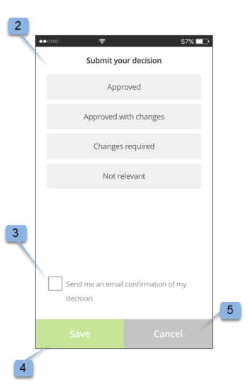

# aplicativo móvel Workfront Proof

>[!IMPORTANT]
>
>Este artigo se refere à funcionalidade no produto independente [!DNL Workfront Proof]. Para obter informações sobre provas dentro de [!DNL Adobe Workfront], consulte [Prova](../../../review-and-approve-work/proofing/proofing.md).

Baixe o aplicativo [!DNL Workfront Proof] da Apple App Store ou da Google Store para ser produtivo onde quer que você esteja. O aplicativo [!DNL Workfront Proof] tem os seguintes recursos no iPhone e no iPod Touch:

* Exibir, revisar e aprovar provas estáticas e audiovisuais
* Exibir, adicionar e responder a comentários
* Gerencie suas provas por meio do painel e das visualizações

Você não precisa ser um usuário do [!DNL Workfront Proof] (ou seja, ter suas próprias credenciais de logon) para revisar e aprovar uma prova através do aplicativo iOS. Desde que você baixe o aplicativo no seu dispositivo iOS e acesse seu URL pessoal por meio do aplicativo de email do iOS, será possível revisar e aprovar em qualquer lugar.

## Requisitos do dispositivo

Exige o iOS 7.0 ou posterior. Android 4.0 e superior. Compatível com iPhone, iPad e iPod touch.

## Baixe e instale o aplicativo

>[!IMPORTANT]
>
>O aplicativo móvel do Workfront Proof não é mais compatível e está disponível como está.  Quaisquer problemas no aplicativo não serão corrigidos.

Para dispositivos iOS, desinstale o aplicativo [!DNL Workfront Proof] anterior para dispositivos iOS antes de instalar o novo aplicativo.

O aplicativo [!DNL Workfront Proof] detecta automaticamente o tipo de dispositivo que você está usando. Se você quiser usar o aplicativo em seu tablet, consulte [[!DNL Workfront Proof] aplicativo móvel para tablets](../../../workfront-proof/wp-mobile/wp-mobile-apps/wp-mobile-app-tablet.md).

>[!NOTE]
>
>Não é possível revisar arquivos SWF ou arquivos de áudio, como MP3 em dispositivos iOS, devido às limitações de software de dispositivos móveis. Se você quiser revisar uma prova criada a partir de um arquivo SWF ou de um arquivo de Áudio em um dispositivo móvel, converta-a para um formato compatível antes de carregá-la para [!DNL Workfront Proof].

## Introdução ao aplicativo

Você não precisa ser um usuário [!DNL Workfront Proof] para começar a usar o aplicativo. Basta instalar o aplicativo em seu dispositivo e clicar no link **[!UICONTROL Ir para Prova]** na notificação por email. O aplicativo inicia e carrega automaticamente a prova.

Se você for um usuário do [!DNL Workfront Proof], poderá fazer logon no aplicativo antes de abrir qualquer prova. O aplicativo permite navegar em todas as provas compartilhadas com você e alternar facilmente entre elas.

1. Abra o aplicativo.
1. Insira seu email e senha e toque em **[!UICONTROL Logon]**.

   Ou

   Use o Logon Único, se ele estiver configurado na sua conta [!DNL Workfront Proof].

   Você pode usar a opção **[!UICONTROL Esqueceu sua senha]** se não lembrar de sua senha.

## O Painel

Depois de fazer logon na conta do [!DNL Workfront Proof], o Painel é exibido. Aqui você pode acessar facilmente suas provas. Você pode abrir uma das exibições disponíveis, Minhas provas e Todas as provas. Como alternativa, toque no nome de uma de suas provas recentes para ir diretamente para o visualizador de provas.

Por padrão, o Painel abrirá a visualização Total proofs. Esta exibição mostra todas as provas de que você é o proprietário ou que foram compartilhadas com você. Você pode alterar o modo de exibição tocando na barra na parte superior da página para abrir um menu suspenso que contém as opções [!UICONTROL No prazo], [!UICONTROL Em risco], [!UICONTROL Atrasado] e [!UICONTROL Recente]. Para abrir uma prova em qualquer exibição, role para baixo na lista para encontrar a prova desejada e toque no nome para ir para o visualizador de provas.

| **Exibição no Prazo** | Mostra todas as provas ativas na sua conta que você tem permissão para ver e que não têm prazo ou que há mais de 24 horas até o prazo final. |
|---|---|
| **Modo de Exibição de Risco** | Exibe todas as provas para as quais o prazo final é inferior a 24 horas. |
| **Exibição atrasada** | Lista todas as provas em que nem todas as ações estão concluídas para as quais o prazo já foi violado. |
| **Modo de exibição recente** | Inclui as provas que foram acessadas recentemente por você e que você possui, tem permissões para visualizar de acordo com suas permissões de perfil e que foram compartilhadas com você. Este modo de exibição mostra apenas as provas que você mesmo abriu (por meio do Visualizador [!DNL Workfront Proof] ou pela página de detalhes da Prova). |
| **Link de email** | Para abrir uma prova do seu email, basta abrir o email no seu aplicativo de email, clicar no link do botão [!UICONTROL Ir para prova] no email (1) e você será direcionado à prova no aplicativo [!DNL Workfront Proof]. |

{style="table-layout:auto"}

## Revisar uma prova estática no aplicativo

Ao abrir uma prova no aplicativo móvel, você pode fazer o seguinte:

* Leia e responda a comentários deixados por outros revisores (1 - o dígito visível no ícone indica os números de comentários deixados na prova; se nenhum comentário for deixado na prova, esse botão mostrará 0 e ficará esmaecido).
* Adicione comentários e marcações (2).
* A visibilidade do botão Comentário e Decisão depende da função de prova.
* Tomar uma decisão (3).
* Acesse o menu (4).
* Dimensione a prova apertando a tela.
  

## Adicionar comentários e respostas

1. Ao abrir uma prova, toque no botão **[!UICONTROL Adicionar comentário]** (1).

   

1. Digite seu comentário (2).

   

1. Clique em **[!UICONTROL Salvar]**.

## Ler e responder comentários

1. Abra a prova e toque no ícone de texto explicativo no canto superior direito para exibir a lista de comentários (1) e escolha o comentário que deseja revisar.
1. Toque no pino para abrir o comentário associado (2).

   

1. Siga um destes procedimentos:

   * Para responder a um comentário, toque no botão **[!UICONTROL Responder]** (3).
   * Para voltar para a imagem de prova, toque no ícone [!UICONTROL texto explicativo].
   * Para exibir o comentário completo e suas respostas, toque no próprio comentário.

     

   * Para aplicar uma ação em um comentário:

      1. Abra um comentário.
      1. Toque em **[!UICONTROL Responder]**.
      1. Abra o menu [!UICONTROL ações] no lado direito do campo de texto (1).
      1. Toque em **[!UICONTROL Adicionar ação]** (2).

         

         Para obter mais informações sobre ações, consulte [Usar ações em comentários de prova](../../../review-and-approve-work/proofing/reviewing-proofs-within-workfront/comment-on-a-proof/use-actions-on-comments-in-viewer.md).

## Adicionar marcações

É possível adicionar uma marcação (como uma caixa que destaca uma área na prova) e digitar um comentário anexado à marcação. Também é possível fazer um comentário sem adicionar uma marcação. E você pode adicionar várias marcações a um único comentário.

1. Em uma prova aberta, toque em **Adicionar comentário** (1).

   

1. Escolha entre o [!UICONTROL modo panorâmico] (2), a [!UICONTROL ferramenta retângulo] (3), o [!UICONTROL desenho à mão] (4) ou a ferramenta [!UICONTROL seta] (5).

   Também é possível alterar a cor da linha da marcação (6).

1. Para desenhar uma marcação na prova, toque na tela e mova o dedo pela prova.

   Não é necessário adicionar texto para salvar a marcação (7).

1. Toque em **[!UICONTROL Cancelar]** (8) se desejar descartar a marcação.

   

   Marcar uma área na prova abre automaticamente o campo de comentário. Você pode remover a marcação criada tocando na cruz ao lado da forma de marcação (9).

   

## Tomar decisões sobre uma prova

1. Abra a prova no Visualizador de provas e toque no botão [!UICONTROL Decisão] (1).

   

1. Toque na decisão que gostaria de enviar (2).
1. Toque em **[!UICONTROL Salvar]** para enviar sua decisão.

   

   >[!NOTE]
   >
   >* Se uma mensagem pop-up de decisão for definida na conta em que a prova foi criada, ela também aparecerá no aplicativo do iOS quando uma decisão for tomada em uma prova.
   >* Se você configurar motivos de decisão, eles serão exibidos na tela [!UICONTROL Enviar sua decisão] para você escolher.

   Se você já tiver enviado uma decisão e desejar alterá-la ou removê-la, é possível fazê-lo facilmente. Depois de enviar uma decisão, uma nova opção, **[!UICONTROL Remover minha decisão]** (6), aparece na tela [!UICONTROL Enviar sua decisão].

   

## Revise uma prova de áudio ou vídeo no aplicativo

Revisar uma prova de áudio e vídeo no aplicativo iOS é tão simples quanto revisar um arquivo estático:

1. Toque no botão [!UICONTROL reproduzir/pausar] para reproduzir ou pausar o vídeo (1).
1. Para navegar no vídeo, toque na barra de [!UICONTROL navegação] (2).
1. Para deixar um comentário, toque no botão **[!UICONTROL Comentário]** (3) e siga as instruções descritas acima.

   Quaisquer comentários ou marcações deixados na prova serão marcados por pinos na barra de navegação (4).

1. Se quiser revisar os comentários deixados na prova, toque no botão **[!UICONTROL Comentários]** (5) e siga as instruções descritas acima.
1. Para tomar uma decisão, toque no botão **[!UICONTROL Decisão]** (6) e siga as instruções acima.

   
