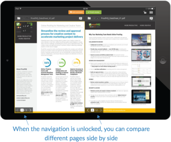

# [!DNL Workfront Proof] aplicativo móvel para tablets

>[!IMPORTANT]
>
>Este artigo se refere à funcionalidade no produto independente [!DNL Workfront Proof]. Para obter informações sobre prova dentro de [!DNL Adobe Workfront], consulte [Tofing](../../../review-and-approve-work/proofing/proofing.md).

O [!DNL Workfront Proof] o aplicativo tablet permite que você revise e aprove com conveniência suas provas em qualquer lugar. O aplicativo está disponível para download para todos, você não precisa ser um [!DNL Workfront Proof] para poder revisar provas em seu tablet ou telefone.

Os convidados podem simplesmente clicar no botão [!UICONTROL Ir para prova] na notificação por email recebida para abrir a prova no aplicativo.

[!DNL Workfront Proof] os usuários podem fazer logon no aplicativo e usar o painel para gerenciar convenientemente seu trabalho.

## Requisitos do dispositivo

* Dispositivos iOS: iPad 3, iPad air, iPad mini
* Dispositivos Android: Android OS versão 4.4+, 5+; Samsung Galaxy Tab 3+ (10,1&quot;)

Este é um aplicativo criado especificamente para tablets. Se quiser usar [!DNL Workfront Proof] no seu iPhone, baixe o aplicativo iOS na iTunes Store.

## Baixar o aplicativo

>[!IMPORTANT]
>
>O aplicativo móvel Workfront Proof não é mais compatível e está disponível como está.  Nenhum problema no aplicativo será corrigido.

O [!DNL Workfront Proof] O aplicativo para tablet está disponível na Apple App Store e na Google Play Store.

1. Clique no link abaixo para baixar o aplicativo e instalá-lo em seu dispositivo.

   

   

## Login

O [!DNL Workfront Proof] o aplicativo tablet fornece acesso ao painel com as provas que precisam de sua atenção. Para acessar o painel:

1. Siga um destes procedimentos:

   * Faça logon usando sua [!DNL Workfront Proof] credenciais.

      Se você receber um email de convite de prova e abrir no seu dispositivo móvel, o link o levará à prova no aplicativo. Você não precisa ser um usuário para poder revisar provas; no entanto, é necessário ter o aplicativo instalado no dispositivo para poder visualizá-lo.

   * Se o Logon único estiver ativado em sua conta, toque nessa opção na tela de logon.

      Você será direcionado para a página de logon que solicitará seu endereço de email. Depois de digitar seu endereço de email, você será redirecionado para a página do Provedor de identidade, onde poderá fazer logon usando sua senha.

      

## O painel

Se quiser continuar conectado ao seu [!DNL Workfront Proof] conta:

1. Habilitar **[!UICONTROL Manter-me conectado]** no menu da barra lateral em **[!UICONTROL Configurações]**:

O *[!UICONTROL Painel]* levará você de volta ao painel de qualquer visualização no aplicativo. Também é possível usá-lo para recarregar o painel.

Outros elementos do painel são a barra de pesquisa que permite pesquisar a conta pelo nome da prova e por exibições diferentes que ajudam a gerenciar efetivamente sua carga de trabalho.

## Gerenciar sua carga de trabalho usando as Visualizações de painel

De maneira semelhante aos gráficos de painel em nosso aplicativo da Web, no aplicativo móvel, exibimos uma lista de provas que foram compartilhadas com você. A mensagem de boas-vindas na parte superior da página fornecerá o número total de provas e abaixo delas em que as dividiremos em *No horário*, *Em risco* e *Provas atrasadas*.

* **Provas no tempo** são provas que não têm prazo definido ou o prazo expira em mais de 24 horas.
* **Em provas de risco** são aqueles em que o prazo está dentro das próximas 24 horas - a barra de progresso é laranja para essas provas.
* **Provas atrasadas** são as provas que já ultrapassaram o prazo - a barra de progresso é vermelha para essas provas. Ao atingir o prazo [!DNL Workfront Proof] envia um email de lembrete automático aos tomadores de decisão tardios e ao proprietário da prova.

Essas provas são agrupadas em exibições separadas, permitindo que você priorize convenientemente seu trabalho, começando pelas provas que já ultrapassaram o prazo.

Outra visualização que pode ser útil é a Visualização recente - ela mostra as provas que você acessou recentemente no aplicativo. Dessa forma, se você quiser ver a mesma prova novamente, poderá encontrá-la facilmente nessa lista.

## Revisar provas no aplicativo

1. Clique no nome da prova para abrir na [!DNL Workfront Proof] Visualizador.

   Ou

   Para abrir uma prova de uma notificação por email, os revisores podem clicar no botão **[!UICONTROL Ir para prova]** na notificação.
Se você tiver uma [!DNL Workfront Proof] , você pode fazer logon e acessar sua prova no painel.

   >[!NOTE]
   >
   >Você deve ter o aplicativo instalado no seu dispositivo para poder revisar provas em [!DNL Workfront Proof], mesmo que você não tenha um [!DNL Workfront Proof] conta.

   Ao abrir uma prova pela primeira vez, mostraremos um tour, ajudando você a começar a revisar provas no aplicativo.

   

1. Navegue na sua prova:

   * Para ir para uma página específica da prova, passe o dedo para o lado ou use a variável [!UICONTROL miniaturas] lista.

      Você também pode usar as setas na parte inferior da página ou colocar um número de página específico.

   * Para acessar uma versão diferente da prova, use o menu suspenso de versão na parte superior da página.
   * Para ampliar, aperte a tela.
   * Para deslocar, mantenha pressionada a imagem e mova-a até encontrar a posição correta.

      A revisão de provas no aplicativo móvel é tão simples quanto revisar provas usando a [!DNL Workfront Proof] Visualizador. Abaixo, vamos analisar a adição de comentários e marcações, o gerenciamento de feedback e a tomada de decisões. Também discutiremos diferentes opções disponíveis na barra lateral do aplicativo.

## Comentário no aplicativo

O vídeo abaixo mostra as noções básicas dos comentários no aplicativo móvel. Ele mostra como fazer um comentário, como postar uma resposta em um comentário, como usar diferentes marcações e excluí-las e como editar e excluir comentários.

Você pode editar e excluir somente comentários se nenhuma resposta tiver sido postada. Se você não vir o [!UICONTROL lixo] é possível que essa opção tenha sido desativada pelo seu [!DNL Workfront Proof] administrador.

Há três opções de visualização de comentários no aplicativo. Você pode alternar entre elas clicando no botão Comentar .

* **[!UICONTROL Exibição de lista]** exibe uma lista de todos os comentários. Você pode navegá-los tocando em cada comentário ou tocando nas setas para cima e para baixo.
* **[!UICONTROL Exibição de comentário único]** exibe um comentário de cada vez. Para acessar o próximo comentário, toque na seta na parte superior da página.
* **[!UICONTROL Ocultar exibição de comentários]** oculta todos os comentários.

Cada marcação deixada na prova solta um pino na imagem. Para visualizar o comentário e a marcação associada ao pino, basta tocar no pino. Você pode fazer isso somente se a caixa de edição de comentários estiver fechada. Para fechar a caixa de comentários, toque no [!UICONTROL x] no comentário superior esquerdo da caixa.

## Ferramenta de anotação de texto

Texto de prova em qualquer lugar está realmente no [!DNL Workfront Proof] aplicativo para tablet. A ferramenta de anotação de texto está disponível na barra de ferramentas de marcações depois de clicar em laranja **[!UICONTROL Adicionar comentário]** botão.

1. Selecione a ferramenta e toque na palavra que deseja realçar.
1. Mantenha o dedo na palavra até que o destaque fique disponível e use os controles deslizantes para realçar a palavra ou frase inteira que você deseja marcar.

   A ferramenta de texto tem quatro opções para escolher:

   | **[!UICONTROL Realçar]** | Destaca o texto e o copia na caixa de comentários. |
   |---|---|
   | **[!UICONTROL Substituir]** | Adiciona [[!UICONTROL SUBSTITUIR]] e [[!UICONTROL COM]] na caixa de comentários juntamente com o texto, facilitando a recomendação do texto de substituição. |
   | **[!UICONTROL Excluir]** | Pega o texto e adiciona [DELETE] na caixa de comentários. |
   | **[!UICONTROL Inserir depois de]** | Adicionadas [INSERIR APÓS] na caixa de comentários. |

   {style=&quot;table-layout:auto&quot;}

1. (Opcional) Para colar o texto de outro documento que você salvou no tablet, toque e segure o dedo na caixa de comentários até ver uma opção para colar o texto copiado do documento.

## Gerenciar comentários no aplicativo móvel

Depois que todos deixarem seus comentários e marcações na prova, muitas vezes o gerente de prova precisa passar pelo feedback e decidir quais alterações devem ser aplicadas à próxima versão da prova. Em [!DNL Workfront Proof] você pode usar Ações em comentários para sinalizar cada comentário individual e marcar aqueles que devem ser ativados.

As ações nos comentários precisam ser configuradas em sua conta pelo [!DNL Workfront Proof] e só podem ser usados em uma prova por pessoas com direitos de edição.

Ao preparar a próxima versão da prova, você pode fazer check-out dos comentários durante o processo. O comentário é marcado como resolvido com uma marca de seleção verde. Se precisar reabrir o comentário, clique na seta na parte inferior da caixa de comentário.

Se você quiser impedir que outros revisores respondam a um encadeamento de comentários, é possível bloqueá-lo. Para fazer isso, você precisa ter direitos de edição na prova. Bloquear o encadeamento de comentários é muito simples, tudo o que você precisa fazer é tocar no ícone de cadeado na parte inferior da caixa de comentários.

## Revisar provas de vídeo

A visualização de vídeo em qualquer lugar é fácil com o [!DNL Workfront Proof] aplicativo para tablet. O vídeo abaixo mostra como fazer comentários, marcações e decisões no aplicativo.

## Modo Comparar

O modo de comparação no aplicativo tablet permite comparar facilmente duas versões diferentes de uma prova ou duas provas da mesma pasta.

>[!NOTE]
>
>Devido às limitações do iOS, a comparação de dois vídeos não está disponível em iPads. Ele está disponível em tablets com sistemas operacionais Android.

O modo de comparação está disponível no canto superior direito da tela.

A ferramenta de comparação exibe as duas versões mais recentes da prova.

1. Para alterar as versões que deseja comparar, use os menus suspensos da versão na parte superior da página.
1. Para selecionar uma prova diferente da mesma pasta, use o navegador de pastas (o ícone de pasta disponível na parte superior da página).

   
   
A ferramenta de comparação oferece a capacidade de comparar versões lado a lado para verificar se as alterações solicitadas foram feitas. Se você desbloquear a navegação, será possível comparar diferentes páginas de ambas as versões.

   

   Agora é possível comparar diferentes páginas das provas que você está visualizando. Você também pode comparar diferentes páginas da mesma prova, o que pode ser útil se estiver verificando suas provas para ver se há mensagens e consistência de marca.

   

## Tome decisões no aplicativo

1. Toque no botão de decisão verde na parte superior da página.

   

   Se você não vir o verde **[!UICONTROL Concluir revisão]** e você acha que deveria tomar uma decisão sobre a prova, sua [!DNL Workfront Proof] o administrador pode atualizar sua função de prova, como explicado em [Gerenciar funções de prova em [!DNL Workfront Proof]](../../../workfront-proof/wp-work-proofsfiles/share-proofs-and-files/manage-proof-roles.md).

## A barra lateral do visualizador de prova

A barra lateral contém vários recursos e funcionalidades úteis. Dependendo das permissões na prova, talvez você não veja todas. Abaixo, todos eles são discutidos com mais detalhes.

| Painel de Controle | Retorna ao painel do aplicativo móvel. |
|---|---|
| **[!UICONTROL Fluxo de trabalho]** | Mostra os detalhes das etapas de revisão, juntamente com uma lista de revisores, seus prazos, barras de progresso, decisões e o número de comentários e respostas. |
| **[!UICONTROL Detalhes]** | Mostra informações sobre a prova, opções de compartilhamento adicionais e a trilha de auditoria de atividade. |
| **[!UICONTROL Compartilhar]** | Exibe o URL da prova e o código Incorporado. |
| **[!UICONTROL Notificações]** | Permite atualizar seus alertas de email sobre a prova que você está revisando no momento. Isso não altera suas configurações padrão. |
| **[!UICONTROL Bloquear]** | Permite bloquear a prova. Você precisa ter direitos de edição na prova para ver essa opção. |
| **[!UICONTROL Excluir]** | Move a prova para a pasta Lixeira. Você precisa ter direitos de edição na prova para poder excluí-la. |
| **[!UICONTROL Configurações]** | Você pode decidir mostrar pinos e/ou marcações na prova, também pode ativar [!UICONTROL Manter-me conectado] para impedir que você seja desconectado do aplicativo. |
| **[!UICONTROL Ajuda]** | Permite que você faça o tour do aplicativo novamente. |
| **[!UICONTROL Logout]** | Efetue logoff no aplicativo e em sua conta. |
