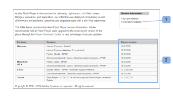

# Solução de problemas - [!DNL Workfront Proof] revisor de provas

<!-- Audited: 01/2024 -->

>[!IMPORTANT]
>
>Este artigo se refere à funcionalidade no produto independente [!DNL Workfront Proof]. Para obter informações sobre prova dentro do [!DNL Adobe Workfront], consulte [Prova](../../../review-and-approve-work/proofing/proofing.md).

Se o conteúdo de prova não estiver carregando e você só puder ver um visualizador de prova vazio, é provável que algo esteja bloqueando essa ação localmente. Tente as soluções possíveis abaixo.

## Verifique se o navegador <!--and [!DNL Flash Player]--> A versão do está atualizada

Todos os desenvolvedores trabalham constantemente em seus aplicativos e lançam regularmente novos recursos e correções para seus produtos. Isso é para melhorar a experiência do usuário e manter o nível de segurança, de modo que seja a prática recomendada usar apenas as versões mais recentes. Isso também ajuda a evitar conflitos entre os aplicativos.

<!--
### [!DNL Flash Player] Plugin Version

To check your current [!DNL Flash Player] version visit the [[!DNL Adobe] website](http://www.adobe.com/software/flash/about/).

If your version number differs from the one listed for your platform go to the [[!DNL Flash Player] download page](http://get.adobe.com/flashplayer/otherversions/) and get the latest version.

Please note: we do recommend using the original [!DNL Adobe] plugin, so if your browser uses a built-in solution deactivate it and install the [!DNL Adobe] solution.
-->

### Versão do navegador

Normalmente, a maioria dos navegadores é atualizada automaticamente, mas se tiver problemas, vale a pena verificar qual versão você está usando e executar uma atualização, se necessário.

No navegador, acesse [!UICONTROL Menu] e localize o [!UICONTROL Sobre] opção (em alguns casos, isso pode ser visível em uma [!UICONTROL Ajuda] menu ). No [!UICONTROL Sobre] você encontrará informações sobre a versão atual do navegador e também uma opção para atualizar/verificar se há atualizações.

Por exemplo, no Chrome:

Depois que tiver a versão mais recente do navegador instalada, tente reabrir a prova e veja se o problema foi resolvido.

<!--
## Ensure Your Local [!DNL Flash] Storage is Available

Our [!DNL Workfront Proof] Viewer is based on Flash, and we store some data about the proofs (i.e., comments, proof tiles, [!DNL Workfront Proof] Viewer settings) on your computer using [!DNL Flash Player]. If the [!DNL Workfront Proof] Viewer opens, but there is no content inside you will want to make sure that the Flash Storage is available on your machine and that [!DNL Workfront Proof] is allowed to use it.

If there is some storage allocated, but you're working with the bigger proofs with multiple pages and comments try to increase the [!DNL Flash] Storage and re-load your proof.

Please see [Problems With Viewing Proofs - [!DNL Flash] Shared Objects Explained](../../../workfront-proof/wp-tech-corner/troubleshooting/view-proof-flash-shared-object.md) for the detailed instructions.
-->

## Identifique onde está o problema

* As provas são abertas em um navegador diferente?
* Se você estiver usando um navegador diariamente e tiver problemas para exibir as provas nele, tente abrir a mesma prova em um navegador diferente no seu computador. Para fazer isso, basta copiar o link de prova da barra de URL do seu navegador principal e colá-lo em um navegador diferente. Se a prova for aberta lá, revise a configuração principal do navegador, os plug-ins e as extensões, pois eles podem estar interferindo.
* Não temos nenhum navegador preferido, mas se você tiver algum problema de desempenho em seu navegador atual, recomendamos mudar para um diferente.
* As provas são abertas em uma máquina diferente em sua localidade?
Se a prova não estiver sendo aberta em nenhum navegador do computador, tente abri-la em outro computador no local e/ou fora do local. Isso permitirá determinar se há um problema em seu computador específico ou se o problema está em sua rede local.
Se o seu nível de segurança for superior, suas conexões com [!DNL Workfront Proof] pode ser bloqueado por:

   * Seu software AV local
   * Sua solução de segurança de rede
   * Configuração de DNS, firewall ou proxy
   * Essas são as configurações que estão além de nosso controle. Há várias soluções de segurança disponíveis e não podemos saber quais estão implementadas em sua rede e quais podem estar bloqueando as conexões com o [!DNL Workfront Proof]. Também não cabe à [!DNL Workfront Proof] para decidir sobre a configuração de segurança interna. Se tiver problemas ao abrir as provas em vários computadores no seu local/rede, recomendamos que entre em contato com a sua equipe de TI para que ela possa verificar as configurações de rede e autorizar ou adicionar o [!DNL Workfront Proof] para o incluo na lista de permissões ➡, se necessário.

* As conexões com o [!DNL Workfront Proof] permitido em sua rede?
Dentro do Visualizador de prova, carregamos os blocos - fragmentos das páginas. Se esse conteúdo não for carregado corretamente no seu lado, pode ser que algumas conexões com [!DNL Workfront Proof] estão bloqueados na rede. Verifique se todas as conexões e todo o conteúdo de *.proofhq.com foram adicionados ao arquivo de inclui na lista de permissões. Sua equipe de TI deve poder ajudar na verificação.

## Revisar plug-ins

Se o seu navegador e [!DNL Flash Player] plug-in está atualizado e sua rede não está bloqueando as conexões com o [!DNL Workfront Proof] pode haver algo em seu navegador que esteja afetando a exibição das provas. Atualmente, há vários plug-ins e extensões disponíveis em seu navegador e alguns deles interferem ou estão em conflito com os outros.

A prática recomendada é remover todos os complementos desconhecidos e manter apenas aqueles que você usa e nos quais confia. Cada navegador deve fornecer opções para verificar/modificar/excluir os plug-ins e as extensões. Nosso [!DNL Workfront Proof] O visualizador se baseia em [!DNL Flash] e usamos o JavaScript para carregar o visualizador e, portanto, você deve rever especialmente os plug-ins que podem afetá-los.

Se houver algum complemento específico que interfira no carregamento das provas, você pode tentar verificar os detalhes no console do navegador.

Na maioria dos navegadores mais recentes, há algumas ferramentas adicionais de desenvolvedores disponíveis e elas podem ser usadas para solucionar problemas mais avançadas.

Se tiver problemas com a visualização das provas:

* Abra o console do navegador e recarregue a prova.
* Verifique se há alertas ou mensagens no console. Esses detalhes podem ajudar a identificar a causa raiz dos problemas.
* Peça à sua equipe de TI para analisar os resultados. Eles devem poder aconselhar e ajudar a resolver o problema local.
* Compartilhe os resultados com nossa equipe de suporte. Nós ficaremos felizes em ajudar.

## Verificar configurações de conteúdo misto

Todas as conexões com o [!DNL Workfront Proof] são sobre HTTPS. No entanto, no [!DNL Workfront Proof] Visualizador que carregamos os blocos por HTTP e os dados são protegidos com os tokens. Isso cria conteúdo misto que alguns dos navegadores ou soluções de segurança podem estar bloqueando (por padrão ou de acordo com a configuração manual).

Se esse for o motivo pelo qual as provas não estão sendo abertas no computador (você deve conseguir ver os alertas relevantes no console do navegador), autorize essas conexões para [!DNL Workfront Proof] ou corrija suas configurações para permitir conteúdo misto passivo em sua máquina. O conteúdo misto pode ser bloqueado pelo seu navegador, software antivírus, configuração de rede etc. Para determinar a causa exata, entre em contato com a equipe de TI/administradores de rede. Eles também devem poder ajudar com a ativação do conteúdo misto no seu computador.

