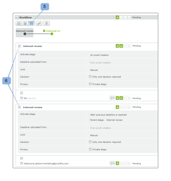

# Gerenciar uma prova configurada com um Fluxo de trabalho automatizado no [!DNL Workfront Proof]

>[!IMPORTANT]
>
>Este artigo se refere à funcionalidade no produto independente [!DNL Workfront Proof]. Para obter informações sobre prova dentro de [!DNL Adobe Workfront], consulte [Tofing](../../../review-and-approve-work/proofing/proofing.md).

Você pode acompanhar convenientemente o progresso das provas de Fluxo de trabalho automatizado na seção Fluxo de trabalho do [!UICONTROL Detalhes da prova] página. Você pode visualizar o trabalho feito em cada estágio e modificar, adicionar, iniciar e bloquear os estágios em sua prova.

## Visualizar um fluxo de trabalho automatizado

Você pode visualizar seu Fluxo de trabalho automatizado de três formas principais:

* [Exibir um estágio em detalhes](#view-a-stage-in-detail)
* [Exibir todos os estágios](#view-all-stages)
* [Exibir todos os estágios detalhadamente](#view-all-stages-in-detail)

### Exibir um estágio em detalhes {#view-a-stage-in-detail}

1. Clique no botão na parte superior da seção (1).

   Você pode alternar entre palcos usando o diagrama. O palco que você está visualizando é destacado em cinza (2).

1. Para exibir um estágio diferente, selecione-o no diagrama.

### Exibir todos os estágios {#view-all-stages}

Para exibir todos os estágios em um Fluxo de trabalho automatizado:

1. Clique no botão na parte superior da página (3).

   Todos os estágios do Fluxo de trabalho automatizado são listados na seção , no entanto, os detalhes são ocultos.

1. Para visualizar os detalhes de um estágio, clique no ícone de adição ao lado do nome de cada estágio (4).

### Exibir todos os estágios detalhadamente {#view-all-stages-in-detail}

Para exibir detalhadamente todos os estágios do Fluxo de trabalho automatizado:

1. Clique no botão na parte superior da página (5).

   Isso mostrará todos os estágios do Fluxo de trabalho automatizado com os detalhes de cada estágio expandido.

   Você pode ocultar os detalhes de cada estágio clicando no ícone de menos (6).

## Usar o diagrama de Fluxo de trabalho automatizado

O diagrama do [!UICONTROL Fluxo de trabalho] é exibido na parte superior da seção Workflow .

Para ocultar o diagrama

1. Clique no botão **[!UICONTROL Ocultar]** botão (1).

As etapas no diagrama são marcadas da seguinte maneira:

- uma fase ativa

- uma fase inativa\
  - uma fase privada

  - uma fase bloqueada

As linhas entre os estágios mostram as dependências entre os estágios. As linhas que levam a estágios inativos são pontilhadas até que o estágio seja ativado.

Passar o mouse sobre um estágio no diagrama mostrará o progresso do estágio. Se o palco não estiver ativo e você tiver direitos de edição no palco, será possível iniciar o palco a partir do pop-up usando o [!UICONTROL Iniciar estágio] botão. Da mesma forma, a opção Bloquear um estágio ativo será exibida.

Para saber mais sobre a barra de progresso, consulte  [Exibir o progresso e o status de uma prova em [!DNL Workfront] Prova](../../../workfront-proof/wp-work-proofsfiles/manage-your-work/view-progress-and-status-of-proof.md).

## Adicionar uma nova etapa

Você pode adicionar um novo estágio ao seu Fluxo de trabalho automatizado no [!UICONTROL Detalhes da prova] página.

1. Clique no botão **[!UICONTROL Nova etapa]** botão (1).

No **Nova etapa** for exibida, é possível preencher os detalhes e as configurações do palco.

## Gerenciar configurações de estágio

Nos detalhes da página, você pode modificar as configurações de cada estágio (se tiver direitos de edição):

* Alterar, adicionar ou remover o prazo da fase (1)
* Bloquear o palco (2) - essa opção aparecerá se o palco estiver ativo; para estágios inativos, você verá a opção para Iniciar o estágio
* Modificar as configurações por edição em linha (3)
* Habilitar ou desabilitar apenas uma decisão necessária no palco (4)
* Alterar a privacidade da etapa (5)

Você também pode mover os revisores entre palcos simplesmente arrastando e soltando de um palco para outro. As etapas disponíveis serão destacadas em azul, com as áreas de soltar para cada estágio claramente marcadas.

## Opções de preparo

O [!UICONTROL Ações] para cada etapa, tem as seguintes opções:

* Mensagem tudo (2) - você pode enviar um email de lembrete para todos os revisores no palco
* Compartilhar (3) - é possível adicionar novos revisores ao palco
* Excluir estágio (4) - se o proprietário da prova estiver nesse estágio, você será solicitado a escolher um novo estágio para eles
