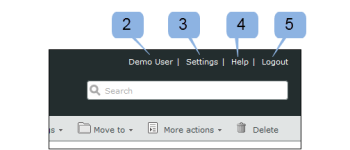
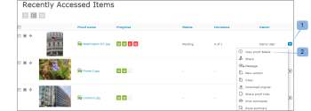

# O Painel em [!DNL Workfront Proof]

>[!IMPORTANT]
>
>Este artigo se refere à funcionalidade no produto independente [!DNL Workfront Proof]. Para obter informações sobre provas dentro de [!DNL Adobe Workfront], consulte [Prova](../../../review-and-approve-work/proofing/proofing.md).

O Painel é a primeira página que você vê ao fazer logon na sua conta do [!DNL Workfront Proof]. Ele resume a atividade na sua conta do [!DNL Workfront Proof] e fornece links rápidos para outras seções e funções no [!DNL Workfront Proof].

O painel contém o seguinte:

* Logótipo da organização (1)
* Navegação superior (2)
* Pesquisa (3)

* Menu Cabeçalho (4)
* Novo menu (5)
* Barra lateral (6)
* Seção de boas-vindas (7)
* Visão geral (8)
* Itens acessados recentemente (9)
* Atividade recente (10)

>[!NOTE]
>
>Os menus e links que você pode ver e usar no Painel dependerão do perfil do usuário e das permissões.

Você pode marcar sua conta para mostrar o logotipo, as cores, os links personalizados e muito mais da sua própria organização. Para obter mais informações, consulte [Marcar o [!DNL Workfront Proof] site](../../../workfront-proof/wp-acct-admin/branding/brand-wp-site.md).&quot;

Se você não marcar sua conta, o logotipo do [!DNL Workfront Proof] e as cores padrão aparecerão.

## Menu de cabeçalho

### O nome de usuário

O nome de usuário (2) escolhido aparecerá aqui. Ele pode ser alterado em Configurações pessoais.

### Configurações

Aqui (3) você pode acessar seu:

* Configurações pessoais
* Configurações da conta
* Faturamento

>[!NOTE]
>
>A visibilidade dos menus acima depende do seu perfil. Consulte Perfis e permissões de usuário para obter mais informações.

### Ajuda

Aqui (4) você pode acessar:

* Artigos de ajuda
* Filmes de demonstração

>[!NOTE]
>
>Com nossos planos Select e Premium, você pode configurar as opções da Ajuda para direcionar seus usuários para o seu próprio conteúdo. Consulte as Opções avançadas de marca para obter mais detalhes.

### Sair

Clique aqui para fazer logoff da sua conta.

## O novo menu

Para abrir o menu Novo,

1. Clique na seta suspensa (7).

   O menu **[!UICONTROL Novo]** tem as seguintes opções:

   * Nova prova (8)
   * Carregar arquivo (9)
   * Nova pasta (10)
   * Novo convidado (11)
   * Novo usuário (12)
   * Novo grupo (13)

## O menu Painel

O menu Dashboard contém os seguintes menus:

* Editar tags
* Mover para
* Mais ações
* Excluir

## Editar tags

O menu (1) [!UICONTROL Editar tags] permite:

* Aplicar uma tag a um ou mais itens
* Criar novas tags
* Gestão de tags (2)

## Mover para

Essa função permite mover provas e arquivos para uma de suas pastas. Para fazer isso:

1. Marque a caixa de seleção do(s) item(ns) relevante(s).
1. Clique em **[!UICONTROL Mover para]** (3) e escolha a pasta relevante (4).
1. Clique em **[!UICONTROL Salvar]** (5).

   

### Mais ações

No menu [!UICONTROL Mais ações] (6), você pode executar as seguintes ações:

* Bloquear (somente provas)
* Ativar
* Arquivar (somente provas)
* Desarquivar (somente provas)
* Alterar proprietário

### Excluir

Para excluir itens:

1. Marque a caixa de seleção à esquerda do(s) item(ns) e clique em **[!UICONTROL Excluir]** (7).

1. Na tela de confirmação exibida, verifique os detalhes e confirme clicando em **[!UICONTROL Sim]** (8).

### A Barra Lateral

A barra lateral tem links para as seguintes páginas:

* Painel (1)
* Visualizações (2)
* Fluxos de trabalho (3) (apenas planos Premium)
* Zona suspensa (4) (planos Select e Premium)
* Contatos (5)
* Grupos (6)
* Atividade (7)
* Lixeira (8)
* Minhas pastas (9) (você também pode acessar cada pasta individual na barra lateral)
* Pastas de outras organizações (10) (onde você pode encontrar itens que outras organizações compartilharam com você)
* Tags (11)

A Barra lateral é descrita com mais detalhes na página de ajuda Barra lateral.

### Seção de [!UICONTROL Boas-vindas]

A seção [!UICONTROL Boas-vindas] tem os seguintes links úteis:

* Assista aos nossos filmes de demonstração (1)
* Páginas de ajuda (2)
* Dados de contato do suporte (3)
* Link &quot;Não mostrar a seção de boas-vindas novamente&quot; (4)

### Visão geral

Nesta seção, você encontrará os links rápidos para:

* Criar uma nova prova Fazer upload de um arquivo
* Criar uma nova pasta
* Adicionar um novo usuário
* Alterar sua senha

A seção de visão geral também exibe informações pré-filtradas. São eles:

* Provas para gerenciar - número total de provas ativas de sua propriedade e delegadas a você
* Provas aguardando decisão - número total de provas ativas que exigem suas decisões

  

Aqui você pode ver imediatamente quantas provas exigem ação imediata de você ou de seus revisores:

* Total
* No prazo - provas que não têm prazo ou há mais de 24 horas até o prazo
* Em risco - provas com prazo final inferior a 24 horas
* Atrasado - provas com nem todas as ações concluídas e com prazo excedido

>[!NOTE]
>
>Os valores dos gráficos são clicáveis - você pode facilmente Ir para a lista detalhada dos itens.

### Itens acessados recentemente

A seção [!UICONTROL Itens acessados recentemente] mostra os itens que foram acessados recentemente por você. Isso inclui os itens que você possui, os itens que você tem permissões para ver de acordo com suas permissões de perfil e os itens que foram compartilhados com você. Esta seção incluirá apenas os itens que você abriu (por meio do Visualizador do [!DNL Workfront Proof] ou pela página de detalhes da Prova).

A seção [!UICONTROL Itens acessados recentemente] mostra as seguintes informações sobre provas e arquivos recentes:

* Nome
* Progresso
* Status
* Decisão
* Proprietário

Resumo (essas informações serão recolhidas por padrão. Clique no botão expandir/recolher à esquerda da prova relevante para abrir o resumo de prova)

Menu Ações

Consulte Layouts de página para as diferentes opções de layout disponíveis para esta seção.

>[!NOTE]
>
>Ao clicar no nome da prova na seção [!UICONTROL Itens acessados recentemente], você será direcionado para a prova no Visualizador de Provas.

Para acessar a página Detalhes da prova:

1. Clique no menu **[!UICONTROL Ações]** (1) disponível à direita do nome da prova.
1. Selecione **[!UICONTROL Exibir detalhes da prova]** (2) no menu.

### Atividade recente

Esta seção mostra os seguintes detalhes sobre atividades recentes em sua conta:

* Data e hora Nome da prova/arquivo
* Ação
* Detalhes

Você também pode ir para a página Detalhes de um item clicando abrindo o menu Ações do item e escolhendo Exibir detalhes. Para obter mais informações sobre atividades na sua conta, consulte Trilha de auditoria da atividade.

>[!NOTE]
>
>Clicar no nome da prova na seção [!UICONTROL Atividade recente] abrirá a prova no Visualizador de Provas.

Para acessar a página Detalhes da prova dessa prova:

1. Clique no menu **[!UICONTROL Ações]** (1).
1. Selecione **[!UICONTROL Exibir detalhes da prova]** (2) no menu suspenso.

   
