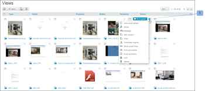

# Layout de página na guia Exibições no [!DNL Workfront Proof]

>[!IMPORTANT]
>
>Este artigo se refere à funcionalidade no produto independente [!DNL Workfront Proof]. Para obter informações sobre prova dentro do [!DNL Adobe Workfront], consulte [Prova](../../../review-and-approve-work/proofing/proofing.md).

É possível ajustar o layout da página no [!UICONTROL Visualizações] guia. As seguintes opções de layout estão disponíveis:

## Lista

* Mostra o nome da prova ou do arquivo mais as colunas de exibição padrão
* A variável [!UICONTROL ações de prova] está localizado no lado direito da linha (1)

  

## Lista de Miniaturas

* Mostra o ícone de imagem/arquivo de prova, o nome da prova ou do arquivo, além das colunas de exibição padrão
* A variável [!UICONTROL ações de prova] está localizado no lado direito da linha (1)
* Observe que esta é a exibição padrão padrão.

  

## Miniaturas

* Mostra apenas o ícone de imagem/arquivo de prova e o nome da prova/arquivo
* A variável [!UICONTROL ações de prova] está localizado no canto superior direito para cada prova (1)

  

## Alteração do layout da página

Para alterar o layout da página no painel ou na página de lixeira, escolha sua visualização preferencial clicando em um dos botões de visualização na parte superior da página:

Para alterar o layout de página em todas as outras páginas de exibições na sua conta, expanda o menu suspenso na parte superior da página e clique no layout de página preferido:

