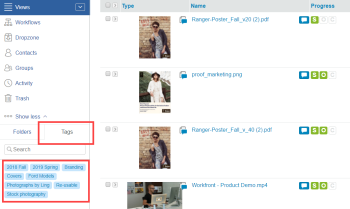

# Pesquisa [!DNL Workfront] Prova

>[!IMPORTANT]
>
>Este artigo se refere à funcionalidade no produto independente [!DNL Workfront Proof]. Para obter informações sobre prova dentro do [!DNL Adobe Workfront], consulte [Prova](../../../review-and-approve-work/proofing/proofing.md).

Você pode pesquisar os seguintes tipos de conteúdo na [!DNL Workfront Proof] site:

* Provas (incluindo provas arquivadas)
* Arquivos
* Pastas
* Tags
* Assunto da prova
* Mensagem de prova
* Campos personalizados
* Nome do criador
* Itens compartilhados com você

Para pesquisar o [!DNL Workfront Proof] site:

1. Digite o texto que deseja procurar e pressione **[!UICONTROL Enter]**.\
   Observe o seguinte sobre os resultados da pesquisa:

   * A ferramenta de pesquisa encontra itens que contêm todas as palavras-chave digitadas. Para minimizar os resultados da pesquisa e maximizar a precisão da pesquisa, soletre as palavras-chave corretamente e adicione espaços entre elas.
   * Os resultados da pesquisa são classificados por relevância.
   * Você pode reduzir os resultados da pesquisa adicionando mais palavras-chave ao campo de pesquisa (separadas por um espaço) e pesquisando novamente. A nova pesquisa é realizada somente nos itens já exibidos nos resultados da pesquisa.
   * Se você inserir o nome de uma versão de prova anterior no campo de pesquisa, a versão mais recente dessa prova será exibida nos resultados da pesquisa.
   * As pastas e subpastas principais são listadas separadamente.

1. (Opcional) Nos resultados da pesquisa exibidos, classifique por coluna clicando no cabeçalho na parte superior de uma coluna. (Opcional) Adicione filtragem aos resultados clicando no ícone [!UICONTROL pesquisa] ícone no final da linha de cabeçalho. 

Isso adiciona menus suspensos nos quais você pode selecionar filtros para restringir sua pesquisa.
1. 

1. (Opcional) Restrinja sua pesquisa abrindo o [!UICONTROL Tags] e clicando em uma tag na barra lateral de navegação à esquerda. Os itens associados a essa tag aparecem nos Resultados da pesquisa.\
   \
   O nome da tag aparece no campo de pesquisa no canto superior direito do Workfront Proof. Você pode refinar sua pesquisa selecionando tags adicionais ou digitando mais palavras-chave no campo de pesquisa. Você pode remover uma tag do campo de pesquisa clicando no ícone x ao lado do nome da tag.

Para obter informações sobre como pesquisar texto no conteúdo de prova, consulte [Pesquisar conteúdo em uma prova](../../../review-and-approve-work/proofing/reviewing-proofs-within-workfront/review-a-proof/search-in-a-proof.md).
