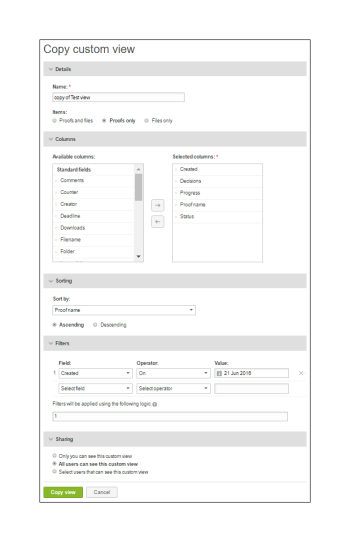

# Criar e gerenciar exibições personalizadas no [!DNL Workfront Proof]

>[!IMPORTANT]
>
>Este artigo se refere à funcionalidade no produto independente [!DNL Workfront Proof]. Para obter informações sobre prova dentro de [!DNL Adobe Workfront], consulte [Tofing](../../../review-and-approve-work/proofing/proofing.md).

Você pode criar exibições personalizadas de seus arquivos e provas para listar os itens que deseja que sejam exibidos. Também é possível exportar as informações na visualização Personalizada como um relatório (em CSV, valor separado por vírgulas, formato de arquivo).

>[!NOTE]
>
>As exibições personalizadas estão disponíveis somente nos planos Select e Premium . Entre em contato com a equipe de vendas para obter uma cotação.

## Criação de uma exibição personalizada

Ao criar uma exibição personalizada, você pode escolher:

* Se deseja incluir provas, arquivos ou ambos
* Quais colunas são exibidas
* Qual coluna classificar por
* A ordem de classificação da coluna (crescente ou decrescente)
* Quais tipos de filtros usar para determinar quais informações estão incluídas na exibição

Após a criação da exibição personalizada, ela estará disponível para uso imediato. O nome da nova exibição também é incluído no menu suspenso, sob o título Minhas exibições personalizadas (abaixo das Exibições padrão).

Para criar uma exibição personalizada:

1. Vá para o **[!UICONTROL Exibições]** página.
1. Para obter mais informações sobre exibições, consulte [Gerenciar itens na página de exibições em [!DNL Workfront Proof]](../../../workfront-proof/wp-work-proofsfiles/manage-your-work/manage-items-on-views-page.md).
1. Siga um destes procedimentos, dependendo de se deseja criar uma nova exibição personalizada do zero ou criar uma nova exibição personalizada com base em uma exibição padrão existente:

   * Para criar uma nova exibição personalizada com base em uma exibição padrão existente: No menu suspenso, selecione a exibição padrão existente que deseja usar como a base para a nova exibição personalizada. Clique no botão **[!UICONTROL Exibir configurações]** ícone e, em seguida, clique em **[!UICONTROL Copiar]** para uma nova exibição personalizada.

   * 

   * Para criar uma nova exibição personalizada do zero: Clique no botão **[!UICONTROL Nova exibição]** ícone .
   * 

1. No **[!UICONTROL Detalhes]** especifique as seguintes informações:

   * **[!UICONTROL Nome]** (obrigatório): O nome da nova exibição. Use um nome exclusivo para que os usuários possam encontrar facilmente a exibição personalizada no menu suspenso das Exibições.
   * **[!UICONTROL Itens]**: Selecione se deseja incluir provas e arquivo, somente provas ou arquivos na visualização. Por padrão, provas e arquivos são incluídos.

1. No **[!UICONTROL Colunas]** determine quais colunas você deseja incluir na exibição personalizada.

   1. Clique no ícone de seta para a direita.
   1. 

   1. Clique duas vezes no nome da coluna selecionada.
   1. Você deve selecionar pelo menos uma coluna e uma coluna pode ser adicionada apenas uma vez.
   1. Selecione uma coluna no **[!UICONTROL Colunas disponíveis]** área que você deseja incluir na nova visualização.
   1. As colunas são movidas do **[!UICONTROL Colunas disponíveis]** para **[!UICONTROL Colunas selecionadas]** lista.

   1. É possível selecionar entre as colunas padrão ou escolher campos Personalizados e Motivos de decisão para colunas na visualização personalizada. (Se você tiver configurado isso em sua conta, elas aparecerão na área da lista padrão de colunas Disponíveis .)
   1. Colunas padrão que podem ser incluídas

      <table style="table-layout:auto">
      <thead>

      </thead>
      <tbody>  
      <tr>   
      <td><strong>Nome do estágio ativo</strong></td>   
      <td>Nome do estágio ativo no fluxo de trabalho automatizado.</td>  
      </tr>  
      <tr>   
      <td><strong>Comentários</strong></td>   
      <td>O número de comentários recebidos.</td>
      </tr>  
      <tr>   
      <td><strong>Contador</strong></td>
      <td>Mostra um número da prova que foi carregada em sua conta (é necessário ter uma opção de contador de prova ativada nas Configurações da conta).</td>
      </tr>
      <tr>
      <td><strong>Criado</strong></td>
      <td>A data e a hora em que o item foi criado.</td>
      </tr>
      <tr>
      <td><strong>Criador</strong></td>
      <td>O usuário que criou o item.</td>
      </tr>
      <tr>
      <td><strong>[!UICONTROL Data adicionada à prova]</strong></td>
      <td>A data em que você foi adicionado à prova. </td>
      </tr>
      <tr>
      <td><strong>Prazo</strong></td>
      <td>O prazo para toda a prova.</td>
      </tr>
      <tr>
      <td><strong>Decisões</strong></td>
      <td>O número de decisões emitidas com base no número previsto (por exemplo, 0 de 1, 1 de 1, etc.)</td>
      </tr>
      <tr>
      <td><strong>[!UICONTROL Downloads]</strong></td>
      <td>O número de vezes em que o arquivo original foi baixado.</td>
      </tr>
      <tr>
      <td><strong>Nome do arquivo</strong></td>
      <td>O nome do arquivo ou da prova.</td>
      </tr>
      <tr>
      <td><strong>Pasta</strong></td>
      <td>A pasta que contém o item.</td>
      </tr>
      <tr>
      <td><strong>Última atividade</strong></td>
      <td>A data e a hora da última atividade no item.</td>
      </tr>
      <tr>
      <td><strong>Última decisão sobre</strong></td>
      <td>Data e hora da última decisão tomada.</td>
      </tr>
      <tr>
      <td><strong>Meu prazo</strong></td>
      <td>Seu próprio prazo nas provas, onde você é explicitamente adicionado como Revisor/Aprovador (se aplicado).</td>
      </tr>
      <tr>
      <td><strong>Proprietário</strong></td>
      <td>O proprietário do item.</td>
      </tr>
      <tr>
      <td><strong>País proprietário</strong></td>
      <td>O país registrado no sistema do proprietário da prova. </td>
      </tr>
      <tr>
      <td><strong>Prova principal</strong></td>
      <td>O nome da prova principal.</td>
      </tr>
      <tr>
      <td><strong>Progresso</strong></td>
      <td>
Barra de progresso. Exibe provas que ainda não foram Iniciadas, Abertas, Comentadas ou Decididas.

Esta informação não é classificada.
</td>
      </tr>
      <tr>
      <td><strong>Nome da prova</strong></td>
      <td>O nome da prova.</td>
      </tr>
      <tr>
      <td><strong>Tipo de prova</strong></td>
      <td>
O tipo de prova: Arquivo estático, página da Web estática, Web interativa (upload de .zip), página da Web interativa (https), vídeo, áudio e outros. 

As provas combinadas são identificadas como "Tipo de prova combinada". Tipo de arquivo da prova.
</td>
      </tr>
      <tr>
      <td><strong>Tamanho do arquivo (MB)</strong></td>
      <td>
Tamanho do arquivo da prova, pois está relacionado à cota de uso do disco.

Essas informações foram fornecidas para a versão atual da prova. Se não houver uma versão atual, ela será para a versão mais recente.
</td>
      </tr>
      <tr>
      <td>
 

<strong>Prazo de estágio ativo</strong>
</td>
      <td>Prazo dos estágios no fluxo de trabalho automatizado.</td>
      </tr>
      <tr>
      <td><strong>Nome da fase</strong></td>
      <td>Nome de cada estágio no fluxo de trabalho automatizado. Isso inclui estágios passados, estágios ativos e estágios futuros.</td>
      </tr>
      <tr>
      <td><strong>Estado</strong></td>
      <td>Ativo, Bloqueado, Rascunho ou Enviado.</td>
      </tr>
      <tr>
      <td><strong>Status</strong></td>
      <td>Pendente, Alterações necessárias, Aprovado com alterações, Aprovado ou Não relevante.</td>
      </tr>
      <tr>
      <td><strong>Tags</strong></td>
      <td>Qualquer tag anexada ao item.</td>
      </tr>
      <tr>
      <td><strong>Nomes de estágio futuros</strong></td>
      <td> Nome de cada estágio que ainda não foi iniciado no fluxo de trabalho automatizado. </td>
      </tr>
      <tr>
      <td><strong>Contador de versões</strong></td>
      <td> O número de versões do item. </td>
      </tr>
      <tr>
      <td><strong>Número da versão da prova</strong></td>
      <td><i>O número da versão da prova.</i></td>
      </tr> 
      </tbody>
      </table>

   1. (Opcional) Siga um destes procedimentos para mover a coluna para o **[!UICONTROL Colunas selecionadas]** para que seja incluída na nova visualização:

      * Reorganize as colunas na **[!UICONTROL Colunas selecionadas]** lista.
      * A ordem em que as colunas são mostradas na **[!UICONTROL Colunas selecionadas]** determina a ordem em que as colunas são exibidas na exibição personalizada.
      * As colunas são visíveis na variável **[!UICONTROL Colunas selecionadas]** na ordem em que você os adicionou do **[!UICONTROL Colunas disponíveis]** lista.

      * Para reorganizar uma coluna na **[!UICONTROL Colunas selecionadas]** , selecione o nome da coluna e arraste-a para cima ou para baixo na lista.

      * Remova uma coluna do **[!UICONTROL Colunas selecionadas]** , clicando no nome da coluna selecionada e clicando no botão **[!UICONTROL Left]** seta. Como alternativa, você pode clicar duas vezes no nome da coluna selecionada (a coluna é movida de volta para o **[!UICONTROL Colunas disponíveis]** listar).

      * Uma coluna só pode ser adicionada uma vez. Por exemplo, se você mover a coluna Comentários de [!UICONTROL Disponível] para [!UICONTROL Colunas selecionadas] da lista, o nome desta coluna desaparecerá [!UICONTROL Colunas disponíveis] lista.

1. No **[!UICONTROL Classificação]** especifique as seguintes informações:

   * **Classificar por:** Use o [!UICONTROL Classificação] se desejar definir uma ordem específica na qual os itens são listados na exibição personalizada. Se você não selecionar uma coluna para classificação, o padrão será Nenhuma coluna, ou seja, nenhuma coluna ou ordem de classificação especial.
   * Somente as colunas que você selecionou na [!UICONTROL Colunas] são incluídas na guia [!UICONTROL Classificar por coluna] lista suspensa.
   * **Crescente ou Decrescente:** Selecione se deseja classificar a coluna crescente ou decrescente por padrão.

1. Use o **[!UICONTROL Filtros]** para definir um ou mais critérios para selecionar itens a serem incluídos na visualização Personalizada. Os filtros são especialmente úteis se você quiser usar sua visualização personalizada como um relatório.
1. Para incluir todos os itens na exibição personalizada, pule o **[!UICONTROL Filtros]** seção.
1. Filtros disponíveis:

   * **Campo:** Selecione o Campo para esse filtro (Comentários é o campo padrão.) A lista Campo contém todos os campos Padrão (como no [!UICONTROL Colunas] ). A lista não está limitada às colunas selecionadas para exibição.
   * **Operador:** Os Operadores disponíveis para o filtro dependem do tipo de Campo selecionado. Selecione um Operador que mostra a relação entre o Campo e o campo de valor. Você preencherá essas informações posteriormente.
   * **Valor:** Selecione ou insira o valor escolhido neste Campo, de acordo com o campo e o Operador selecionado. Dependendo do Operador escolhido, pode haver um campo Valor ou dois ou nenhum. Consulte os exemplos abaixo.
   * **Os filtros são aplicados usando a seguinte lógica:** Os critérios de filtro entre campos diferentes usarão o operador AND. Vários critérios de filtro que usam o mesmo campo usarão o operador OU para o mesmo campo.

      Se quiser ver apenas provas com comentários zero, selecione os seguintes valores:

      * Campo: Comentários
      * Operador: Igual
      * Campo Valor: 0

      Se quiser ver apenas provas com dois ou mais comentários, selecione os seguintes valores:

      * Campo: Comentários
      * Operador: Maior ou igual a
      * Campo Valor: 2

      Se quiser ver apenas provas com 1 a 4 comentários, selecione os seguintes valores:

      * Campo: Comentários
      * Operador: Entre
      * Campo de valor (primeiro campo): 1
      * Campo Value (segundo campo): 4

         Você pode alterar um filtro adicionado à visualização Personalizada sem problemas ou removê-lo clicando no ícone de cruz ao lado do [!UICONTROL configuração] filtre se necessário.

         Como a lista Campo não está limitada às colunas selecionadas na variável [!UICONTROL Colunas] , tenha cuidado ao criar um filtro que inclui uma coluna não selecionada para exibição na visualização personalizada. Por exemplo, o filtro a seguir para a exibição selecionará todas as provas com um valor de contador Versão igual ou superior a 2:

         * Campo = Contador de versões
         * Operador = Maior ou igual a
         * Campo de valor = 2

            >[!NOTE]
            >
            >Você pode alterar um filtro adicionado à visualização Personalizada sem problemas ou removê-lo clicando no ícone de cruz ao lado do [!UICONTROL configuração] filtre se necessário.

1. No **[!UICONTROL Compartilhamento]** selecione quais usuários em sua conta poderão visualizar sua visualização Personalizada.
1. As exibições personalizadas são específicas do usuário que as cria. Por padrão, a nova exibição Personalizada fica visível somente para o criador; no entanto, você pode optar por compartilhar sua visualização personalizada escolhendo uma das seguintes opções:

   * **Somente você pode ver essa visualização personalizada** (padrão): Selecione essa opção se desejar que a exibição personalizada esteja disponível somente para você.
   * **Todos os usuários podem ver essa visualização personalizada**: Selecione essa opção para disponibilizar a exibição personalizada para todos os usuários em sua conta.
   * **Selecionar usuários que podem ver esta exibição personalizada**: Selecione essa opção para disponibilizar a exibição personalizada somente para usuários específicos.
   * Comece digitando o nome ou o endereço de email do usuário que você deseja que tenha acesso à exibição personalizada e clique no nome quando ele for exibido na lista suspensa.
   * Se você optar por não compartilhar sua visualização com outros usuários nesse ponto, poderá fazer isso posteriormente editando a visualização personalizada.

1. Clique em **[!UICONTROL Criar]**.
1. A exibição Personalizada é exibida e está disponível na seção [!DNL Views] página. Para obter mais informações sobre exibições, consulte [Gerenciar itens no [!DNL Views] Página em [!DNL Workfront Proof]](../../../workfront-proof/wp-work-proofsfiles/manage-your-work/manage-items-on-views-page.md).

## Editar exibições personalizadas

Você pode editar uma visualização personalizada facilmente. Para editar uma exibição personalizada:

1. Vá para o **[!UICONTROL Exibições]** página.\
   Para obter mais informações sobre exibições, consulte [Gerenciar itens na página de exibições em [!DNL Workfront Proof]](../../../workfront-proof/wp-work-proofsfiles/manage-your-work/manage-items-on-views-page.md).

1. Clique no botão [!UICONTROL Exibições] botão (1)
1. Selecione a exibição que deseja editar no menu suspenso.\
   

1. Clique no botão **[!UICONTROL Opções de Exibição]** e, em seguida, clique em **[!UICONTROL Editar exibição]**.\
   \
   A página Editar Exibição Personalizada é exibida.

1. Clique no botão [!UICONTROL Ações] menu. (3)\
   Esse botão só estará disponível se você incluir a coluna Nome da prova em sua visualização.
1. Selecionar [!UICONTROL Editar exibição] no menu . (4) \
   

1. A página Editar exibição personalizada é exibida.

>[!NOTE]
>
>Se você editar a visualização Personalizada, as colunas na lista Colunas selecionadas serão organizadas automaticamente em uma ordem alfabética. Você precisará reorganizá-los, se necessário, antes de atualizar a visualização.

## Copiando Exibições Personalizadas

A função de exibição Copiar permite fazer uma cópia facilmente de uma exibição personalizada existente. Isso é realmente útil, por exemplo, se você quiser configurar exibições separadas para todos os designers, com cada exibição igual, exceto para o proprietário da prova (designer).

Para copiar uma exibição personalizada:

1. Vá para o **[!UICONTROL Exibições]** página.\
   Para obter mais informações sobre exibições, consulte [Gerenciar itens na página de exibições em [!DNL Workfront Proof]](../../../workfront-proof/wp-work-proofsfiles/manage-your-work/manage-items-on-views-page.md).

1. Clique no botão **[!UICONTROL Exibições]** botão. (1)
1. Selecione a exibição Personalizada na lista. (2)
1. Clique no botão **[!UICONTROL Ações]** menu. (3)\
   Esse botão só estará disponível se você incluir a coluna Nome da prova em sua visualização.

1. Selecionar [!UICONTROL Copiar] no menu . (4)\
   

1. Na página de exibição personalizada Copiar, todas as configurações originais são preenchidas. Modifique a exibição Personalizada de acordo com sua escolha e clique no botão **[!UICONTROL Copiar exibição]** botão. Você será levado à sua nova visualização imediatamente.\
   

## Compartilhamento de exibições personalizadas

A função Share view permite compartilhar uma visualização com outros usuários em sua conta caso ainda não os tenha selecionado na seção Sharing da exibição. Quando você compartilha uma exibição personalizada com outros usuários, a exibição aparece em seus [!UICONTROL Minhas exibições personalizadas] seção do menu suspenso Exibições.

Para compartilhar uma exibição personalizada com outros usuários:

1. Vá para o **[!UICONTROL Exibições]** página.\
   Para obter mais informações sobre exibições, consulte [Gerenciar itens na página de exibições em [!DNL Workfront Proof]](../../../workfront-proof/wp-work-proofsfiles/manage-your-work/manage-items-on-views-page.md).

1. Clique no botão **[!UICONTROL Exibições]** botão (1)
1. Selecione sua Exibição personalizada na lista (2)
1. Clique no botão **[!UICONTROL Ações]** menu. (3)\
   Esse botão só estará disponível se você incluir a coluna Nome da prova em sua visualização.

1. Selecionar [!UICONTROL Compartilhar exibição] no menu (4)
1. A página Editar visualização personalizada aparecerá.
1. No [!UICONTROL Compartilhamento] Selecione os usuários com os quais deseja compartilhar a visualização e clique em **[!UICONTROL Atualizar exibição]**.

   

## Exportação de exibições personalizadas para arquivos CSV

Para exportar os dados de uma visualização personalizada para um arquivo CSV:

1. Vá para o **[!UICONTROL Exibições]** página.\
   Para obter mais informações sobre exibições, consulte [Gerenciar itens na página de exibições em [!DNL Workfront Proof]](../../../workfront-proof/wp-work-proofsfiles/manage-your-work/manage-items-on-views-page.md).

1. Clique no botão **[!UICONTROL Exibições]** botão. (1)
1. Selecione sua Exibição personalizada na lista. (2)
1. Clique no botão **[!UICONTROL Ações]** menu. (3)\
   Esse botão só estará disponível se você incluir a coluna Nome da prova em sua visualização.

1. Selecionar [!UICONTROL Exportar para CSV] no menu . (4)\
   \
   Em uma janela separada do navegador, &#39;Gerando relatório: 100%&#39; aparece mais o número de registros (o número de itens incluídos no relatório a partir da sua visualização personalizada)

1. (Condicional) Se uma mensagem de segurança for exibida indicando que o download do relatório está bloqueado no momento, clique em para permitir que o download continue.
1. Clique em **[!UICONTROL Salvar]** quando a janela Download de arquivo for exibida perguntando se você deseja abrir ou salvar o arquivo.
1. Selecione um local no computador e salve o arquivo.

## Exclusão de exibições personalizadas

É possível excluir facilmente uma visualização Personalizada. Para fazer isso:

1. Vá para o **[!UICONTROL Exibições]** página.\
   Para obter mais informações sobre exibições, consulte [Gerenciar itens na página de exibições em [!DNL Workfront Proof]](../../../workfront-proof/wp-work-proofsfiles/manage-your-work/manage-items-on-views-page.md).

1. Clique no botão **[!UICONTROL Exibições]** botão.
1. Selecione seu modo de exibição Personalizado na lista
1. Clique no botão **[!UICONTROL Ações]** menu. (3)\
   Esse botão só estará disponível se você incluir a coluna Nome da prova em sua visualização.

1. Selecionar [!UICONTROL Excluir] no menu . (4)\
   

1. Clique em **[!UICONTROL Excluir]** (5) para confirmar que você deseja excluir a exibição Personalizada atual\
   

1. A exibição padrão Todos os itens é exibida e a exibição personalizada excluída não é mais exibida na **[!UICONTROL Exibições]** menu suspenso.
