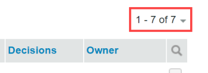

# Gerenciar itens no [!UICONTROL Exibições] Página em [!DNL Workfront Proof]

>[!IMPORTANT]
>
>Este artigo se refere à funcionalidade no produto independente [!DNL Workfront Proof]. Para obter informações sobre prova dentro de [!DNL Adobe Workfront], consulte [Tofing](../../../review-and-approve-work/proofing/proofing.md).

O [!UICONTROL Exibições] permite visualizar e trabalhar com todas as provas, arquivos e pastas em um único local.

## Exibição do [!UICONTROL Exibições] Página

1. Clique em **[!UICONTROL Exibições]** na barra lateral esquerda.
1. No menu suspenso (2), clique na exibição (3) que deseja visualizar.

## Alteração do [!UICONTROL Exibições] Layout da página

O padrão [!UICONTROL Exibições] O layout da página é a Lista de miniaturas. Nesse layout, é possível ver uma imagem em miniatura de cada prova, arquivo (se possível para gerar) e pastas (se definido), com outros detalhes incluídos em colunas separadas.

1. Clique no botão **[!UICONTROL Layout da página]** ícone (1) e escolha o layout desejado.

## Alteração do [!UICONTROL Exibições] Lista

Para alterar o que você vê no [!UICONTROL Exibições] lista:

1. Clique no botão **[!UICONTROL Alterar exibição]** botão.\
   O nome que aparece nesse botão depende da exibição selecionada na última vez em que foi usado.\
   

1. Clique em uma exibição diferente no menu suspenso:

   * **[!UICONTROL Todos os itens]**: Inclui todas as provas, arquivos e pastas que você tem permissão para ver. É o padrão ao abrir o [!UICONTROL Exibições] página. Você tem a opção de incluir/excluir provas arquivadas nessa visualização.
   * **[!UICONTROL Itens ativos]**: Todas as provas, arquivos e pastas ativos.
   * **[!UICONTROL Provas ativas]**: Todas as provas ativas (não arquivadas) que você tem permissão para ver.
   * **[!UICONTROL Provas bloqueadas]**: Somente provas bloqueadas.
   * **[!UICONTROL Provas arquivadas]**: Somente provas arquivadas (consulte [Arquivar em [!DNL Workfront Proof]](../../../workfront-proof/wp-work-proofsfiles/organize-your-work/archive.md)).

   * **[!UICONTROL Minhas provas]**: Mostra apenas provas para as quais você é o proprietário e que são delegadas a você. Para obter mais informações, consulte [Designando Proprietários Temporários de Prova em [!DNL Workfront Proof]](../../../workfront-proof/wp-getstarted/personal-settings/designate-temp-proof-owners.md).

   * **[!UICONTROL Provas que aguardam decisão]**: Mostra somente provas nas quais você precisa tomar uma decisão
   * **[!UICONTROL Provas atrasadas]**: Mostra apenas provas cujo prazo foi ultrapassado
   * **[!UICONTROL Arquivos]**: Mostra somente arquivos
   Em cada uma dessas exibições, as colunas a seguir são incluídas

   * **Tipo**: Ícone do item com o ícone de prova, arquivo ou pasta
   * **Nome**: Nome da prova, arquivo ou pasta
   * **Andamento**: S=Enviado, O=Aberto, C=Comentário, D=Decisão (consulte Barra de Progresso)
   * **Status**: [!UICONTROL Pendente, Alterações necessárias, Aprovado]
   * **Decisões**: Número de decisões tomadas e número necessário
   * **Proprietário**: Nome da pessoa que possui a prova\

      Minhas provas, Provas aguardando decisão e exibições de provas atrasadas têm uma coluna adicional chamada Meu prazo. Essa coluna exibe seus próprios prazos nas provas em que você é explicitamente adicionado como Revisor/Aprovador.

      >[!NOTE]
      >
      >Se você sair da página Exibições e retornar a ela mais tarde na mesma sessão, sua última exibição selecionada será exibida.

      Também é possível criar suas próprias exibições. Consulte [Criar e gerenciar exibições personalizadas no [!DNL Workfront Proof]](../../../workfront-proof/wp-work-proofsfiles/manage-your-work/create-and-manage-custom-views.md) para obter mais informações.

## Filtrar itens

Você pode filtrar as informações listadas em uma visualização.

1. Clique no botão **Mostrar filtros** ícone na parte superior direita da página (1).\
   

1. A barra de filtro (2) é exibida e cada categoria tem um menu suspenso de filtragem (3) para selecionar o valor preferido. O valor padrão para cada categoria é Todos.
1. A barra de filtro não é exibida em exibições personalizadas criadas por você. Para essas exibições, você pode aplicar e editar filtros na [!UICONTROL Filtros] guia . Para obter mais informações, consulte [Criar e gerenciar exibições personalizadas no [!DNL Workfront Proof]](../../../workfront-proof/wp-work-proofsfiles/manage-your-work/create-and-manage-custom-views.md).
1. Para aplicar todos os filtros escolhidos, clique no botão [!UICONTROL Filtro] ícone (4) no final da barra de filtragem.\
   

Os valores de Filtro selecionados permanecem em vigor até que você os altere. Se quiser ver e acessar a lista completa de itens novamente, altere todos os valores de filtro de volta para o padrão, que é **[!UICONTROL Todos]**.

>[!NOTE]
>
>Se você definir opções de filtragem e ocultar a barra de filtragem clicando no botão [!UICONTROL Ocultar filtros] ícone (5), a barra será exibida automaticamente novamente se você alterar as exibições. Se você ocultar a barra de filtragem enquanto todos os filtros estiverem definidos como a opção padrão all , a barra de filtragem permanecerá oculta ao alterar as exibições.

## Classificar itens

Quando você cria uma nova prova (ou versão) ou carrega um novo arquivo, ela aparece na parte superior da [!UICONTROL Todos os itens] lista. O item mais antigo aparece na parte inferior da lista.

Para exibir a lista em uma ordem de classificação diferente:

1. Siga um destes procedimentos:

   * Clique em um dos cabeçalhos de coluna na lista: Tipo, Nome, Status, Decisões ou Proprietário.\

      Por exemplo, se você quiser ver as provas/arquivos em ordem alfabética, clique no cabeçalho Nome uma vez (1) para classificar a lista por nome em ordem crescente (A - Z).\
      Você pode clicar no cabeçalho Nome da prova novamente (2) para inverter a ordem e exibir as provas em ordem decrescente (Z - A).

   * Clique na seta para baixo no canto superior direito da [!UICONTROL Exibições] página para classificar pela data de criação (mais recente ou mais antiga) ou por Tipo, Nome, Status, Decisões ou Proprietário.\

      \
      Se a coluna for classificada em ordem crescente, o cabeçalho da coluna mostrará uma seta para cima ao lado do nome da coluna. Para reverter a ordem (para decrescente), clique no cabeçalho da coluna relevante (isso mostrará uma seta para baixo ao lado do nome da coluna).

   * As alterações feitas na ordem de classificação dos itens duram somente enquanto você permanece na página Todos os itens . Se você sair da página Todos os itens e retornar posteriormente, os itens serão listados novamente na ordem cronológica inversa padrão.

## Exibindo um resumo de prova

Para exibir informações mais detalhadas sobre uma prova:

1. Clique na seta à esquerda da imagem de prova.\
   A seta aponta para baixo e o Resumo da prova é exibido abaixo das informações básicas sobre a prova. O resumo da prova mostra:

   * **Resumo da prova**: Status geral da prova
   * **Fase**: Indica o prazo de prova e o número de decisões tomadas e obrigatórias
   * **Revisores**: O nome, a função e o progresso de cada revisor serão listados
   * **Versões**: Versão da prova que está sendo exibida e o número total de versões disponíveis
   * **Pasta**: Pasta na qual a prova está localizada
   * **Estado**: Ativo, Bloqueado, Rascunho ou Enviado

1. (Opcional) Se você tiver direitos de edição na prova e a prova tiver etapas, clique no **[!UICONTROL Mais]** (três pontos) à direita do palco para acessar as seguintes opções:

   * **[!UICONTROL Mensagem tudo]**: Envie um email para todos os revisores no palco.
   * **[!UICONTROL Compartilhar]**: Adicionar novos revisores
   * **[!UICONTROL Excluir estágio]**

1. (Opcional) Clique em um relatório de revisor **[!UICONTROL Mais]** (três pontos) à direita do nome para executar um dos seguintes procedimentos:

   * Envie uma mensagem de lembrete ao revisor.
   * Edite as configurações do Revisor na prova.\

      Na caixa Editar revisor que é exibida, é possível alterar não apenas a função e os alertas de email, mas também o Nome de exibição do Revisor. Observe que o Nome de exibição pode ser alterado somente na prova específica, não nos detalhes do revisor na página Contatos. Consulte [Contatos](https://support.workfront.com/hc/en-us/sections/115000920808-Contacts) para obter mais informações.

   * Selecione o revisor para ser o Criador de decisões principal na prova.
   * Exclua o revisor da prova.
   * Você também pode alterar a Função e os alertas de email de um revisor adicionado à prova.

## Inclusão e exclusão de provas arquivadas

O [!UICONTROL Todos os itens] a visualização por padrão exibe todas as provas, arquivos e pastas ativos e bloqueados. Também fornece a opção de incluir ou excluir provas arquivadas na exibição.\
Para incluir as provas arquivadas:

1. Ao escolher uma exibição, clique em **[!UICONTROL Incluir provas arquivadas]**.\
   \
   As provas arquivadas serão exibidas com um ícone arquivado para diferenciá-las de outras provas.\
   

## Abrir um item de uma exibição de lista

1. Siga um destes procedimentos:

   * Para exibir detalhes sobre uma prova, arquivo ou pasta, clique em seu nome.
   * Para abrir uma prova no visualizador de prova, clique em **[!UICONTROL Ir para prova]**.\

      Para obter informações sobre o visualizador de prova, consulte [Revisar uma prova](../../../review-and-approve-work/proofing/reviewing-proofs-within-workfront/review-a-proof/review-a-proof.md).

## Execução de ações em vários itens

Para selecionar vários itens:

1. Clique na caixa de seleção acima da lista.\
   

1. Nas opções extras exibidas acima da lista de Exibições, siga um destes procedimentos para os arquivos selecionados:

   * Clique em **[!UICONTROL Tags]** para adicionar uma tag a esses itens.
   * Clique em **[!UICONTROL Mover para]** para mover os itens selecionados para uma pasta diferente (ou mover os itens para fora da pasta se você selecionar (Nenhuma pasta selecionada).
   * Clique em **[!UICONTROL Compartilhar itens selecionados]** para compartilhar todos esses itens com revisores adicionais.\

      

   * Clique em **[!UICONTROL Excluir]** para mover os itens selecionados para a Lixeira.\

      

   * Clique no botão **[!UICONTROL Mais]** para ver as ações adicionais disponíveis.

   * As ações serão aplicadas apenas àquelas dos itens selecionados que têm a opção específica disponível. Por exemplo, se você selecionar arquivos e provas e escolher [!UICONTROL Bloquear], somente as provas serão bloqueadas (porque não é possível bloquear arquivos)

## Mover um item para uma pasta

Se você tiver os direitos de edição para fazer isso, poderá mover provas, arquivos e pastas para pastas específicas na [!UICONTROL Exibições] página.

1. Abra a árvore de pastas na barra lateral clicando na seta à esquerda da pasta mais alta.
1. Siga um destes procedimentos:

   * Para mover um item, clique e segure-o, arrastando-o e soltando-o na pasta onde deseja colocá-lo.
   * Para mover vários itens ao mesmo tempo, você pode marcar as caixas de seleção à esquerda dos itens e clicar em **[!UICONTROL Mover para]**acima da lista, selecione a pasta onde deseja colocá-los ou crie uma nova pasta para eles.
