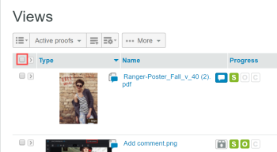

# Gerenciar Itens na Página [!UICONTROL Exibições] em [!DNL Workfront Proof]

>[!IMPORTANT]
>
>Este artigo se refere à funcionalidade no produto independente [!DNL Workfront Proof]. Para obter informações sobre provas dentro de [!DNL Adobe Workfront], consulte [Prova](../../../review-and-approve-work/proofing/proofing.md).

A página [!UICONTROL Exibições] permite que você veja e trabalhe com todas as suas provas, arquivos e pastas em um único local.

## Exibindo a Página [!UICONTROL Exibições]

1. Clique em **[!UICONTROL Exibições]** na barra lateral esquerda.
1. No menu suspenso (2), clique na exibição (3) que deseja visualizar.

## Alterando o layout da página [!UICONTROL Exibições]

O layout de página padrão [!UICONTROL Exibições] é a lista de Miniaturas. Nesse layout, você pode ver uma imagem em miniatura de cada prova, arquivo (se possível de ser gerado) e pastas (se definido), com outros detalhes incluídos em colunas separadas.

1. Clique no ícone (1) do **[!UICONTROL Layout da página]** e escolha o layout desejado.

## Alterando a lista de [!UICONTROL Exibições]

Para alterar o que você vê na lista [!UICONTROL Exibições]:

1. Clique no botão **[!UICONTROL Alterar exibição]**.\
   O nome exibido nesse botão depende da exibição selecionada na última vez em que você o usou.\
   

1. Clique em uma visualização diferente no menu suspenso:

   * **[!UICONTROL Todos os itens]**: inclui todas as provas, arquivos e pastas que você tem permissão para ver. É o padrão quando você abre a página [!UICONTROL Exibições]. Você tem a opção de incluir/excluir provas arquivadas nessa visualização.
   * **[!UICONTROL Itens ativos]**: todas as provas, arquivos e pastas ativos.
   * **[!UICONTROL Provas ativas]**: todas as provas ativas (não arquivadas) que você tem permissão para ver.
   * **[!UICONTROL Provas bloqueadas]**: somente provas bloqueadas.
   * **[!UICONTROL Provas arquivadas]**: somente provas arquivadas (consulte [Arquivar em [!DNL Workfront Proof]](../../../workfront-proof/wp-work-proofsfiles/organize-your-work/archive.md)).

   * **[!UICONTROL Minhas provas]**: mostra somente provas das quais você é o proprietário e que estão delegadas a você. Para obter mais informações, consulte [Designação de proprietários de prova temporários em [!DNL Workfront Proof]](../../../workfront-proof/wp-getstarted/personal-settings/designate-temp-proof-owners.md).

   * **[!UICONTROL Provas aguardando decisão]**: mostra somente provas nas quais você precisa tomar uma decisão
   * **[!UICONTROL Provas atrasadas]**: mostra somente provas cujo prazo final já passou
   * **[!UICONTROL Arquivos]**: mostra somente arquivos

   Em cada uma dessas exibições, as seguintes colunas são incluídas

   * **Tipo**: ícone do item com o ícone de prova, arquivo ou pasta
   * **Nome**: nome da prova, arquivo ou pasta
   * **Progresso**: S=Enviado, O=Aberto, C=Comentário, D=Decisão (consulte Barra de Progresso)
   * **Status**: [!UICONTROL Pendente, Alterações necessárias, Aprovado]
   * **Decisões**: Número de decisões tomadas e número necessário
   * **Proprietário**: nome da pessoa que é proprietária da prova\

     Minhas provas, Provas aguardando decisão e Visualizações de provas atrasadas têm uma coluna adicional chamada Meu prazo. Essa coluna exibe seus próprios prazos nas provas em que você é adicionado explicitamente como Revisor/Aprovador.

     >[!NOTE]
     >
     >Se você navegar para fora da página Exibições e retornar a ela posteriormente na mesma sessão, a última exibição selecionada será exibida.

     Você também pode criar suas próprias visualizações. Consulte [Criar e Gerenciar Exibições Personalizadas [!DNL Workfront Proof]](../../../workfront-proof/wp-work-proofsfiles/manage-your-work/create-and-manage-custom-views.md) para obter mais informações.

## Filtrar itens

Você pode filtrar as informações listadas em uma exibição.

1. Clique no ícone **Mostrar filtros** na parte superior direita da página (1).\
   

1. A barra de filtro (2) é exibida e cada categoria tem um menu suspenso de filtragem (3) para selecionar seu valor preferido. O valor padrão para cada categoria é Todos.
1. A barra de filtros não é exibida em visualizações personalizadas criadas por você. Para essas exibições, você pode aplicar e editar filtros na guia [!UICONTROL Filtros]. Para obter mais informações, consulte [Criar e Gerenciar Exibições Personalizadas [!DNL Workfront Proof]](../../../workfront-proof/wp-work-proofsfiles/manage-your-work/create-and-manage-custom-views.md).
1. Para aplicar todos os filtros escolhidos, clique no ícone [!UICONTROL Filtro] (4) ao final da barra de filtragem.\
   

Os valores de Filtro selecionados permanecem em vigor até que você os altere. Se quiser ver e acessar a lista completa de itens novamente, altere todos os valores de filtro de volta para o padrão, que é **[!UICONTROL Todos]**.

>[!NOTE]
>
>Se você definir opções de filtragem e, em seguida, ocultar a barra de filtragem clicando no ícone [!UICONTROL Ocultar filtros] (5), a barra será exibida automaticamente novamente se você alterar os modos de exibição. Se você ocultar a barra de filtragem enquanto todos os filtros estiverem definidos com a opção all padrão, a barra de filtragem permanecerá oculta ao alterar as exibições.

## Classificação de itens

Ao criar uma nova prova (ou versão) ou carregar um novo arquivo, ela aparece na parte superior da lista [!UICONTROL Todos os itens]. O item mais antigo aparece na parte inferior da lista.

Para exibir a lista em uma ordem de classificação diferente:

1. Siga um destes procedimentos:

   * Clique em um dos cabeçalhos de coluna na lista: Tipo, Nome, Status, Decisões ou Proprietário.\

     Por exemplo, se você quiser ver as provas/arquivos em ordem alfabética, clique no cabeçalho Nome uma vez (1) para classificar a lista pelo nome em ordem crescente (A - Z).\
      Você pode clicar no cabeçalho Nome da prova novamente (2) para inverter a ordem e exibir as provas em ordem decrescente (Z - A).

   * Clique na seta para baixo no canto superior direito da página [!UICONTROL Exibições] para classificar por data de criação (Mais recente ou Mais antiga) ou por Tipo, Nome, Status, Decisões ou Proprietário.\

     \
      Se a coluna estiver classificada em ordem crescente, o cabeçalho da coluna mostrará uma seta para cima ao lado do nome da coluna. Para inverter a ordem (para decrescente) clique no cabeçalho da coluna relevante (isso mostrará uma seta para baixo ao lado do nome da coluna).

   * As alterações feitas na ordem de classificação dos itens duram apenas enquanto você permanece na página Todos os itens. Se você navegar para fora da página Todos os itens e retornar a ela posteriormente, os itens serão listados novamente na ordem cronológica inversa padrão.

## Exibição de um resumo de prova

Para exibir informações mais detalhadas sobre uma prova:

1. Clique na seta à esquerda da imagem de prova.\
   A seta aponta para baixo e o Resumo de prova é exibido abaixo das informações básicas sobre a prova. O resumo da prova mostra:

   * **Resumo de provas**: status geral da prova
   * **Estágio**: indica o prazo de prova e o número de decisões tomadas e necessárias
   * **Revisores**: o nome, a função e o progresso de cada revisor serão listados
   * **Versões**: a versão da prova que está sendo exibida e o número total de versões disponíveis
   * **Pasta**: pasta na qual a prova está localizada
   * **Estado**: ativo, bloqueado, rascunho ou enviado

1. (Opcional) Se você tiver direitos de edição na prova e a prova tiver estágios, clique no menu **[!UICONTROL Mais]** (três pontos) à direita do estágio para acessar as seguintes opções:

   * **[!UICONTROL Mensagem para todos]**: envie um email para todos os revisores no estágio.
   * **[!UICONTROL Compartilhar]**: adicionar novos revisores
   * **[!UICONTROL Excluir estágio]**

1. (Opcional) Clique no menu **[!UICONTROL Mais]** (três pontos) de um revisor à direita do nome para executar um dos seguintes procedimentos:

   * Envie ao revisor uma mensagem de lembrete.
   * Edite as configurações do Revisor na prova.\

     Na caixa Edit reviewer (Editar revisor) que é exibida, é possível alterar não apenas a função e os alertas de email, mas também o Display Name (Nome de exibição) do Reviewer (Revisor). Observe que o Nome de exibição pode ser alterado somente na prova específica, não nos detalhes do revisor na página Contatos. Consulte [Contatos](https://support.workfront.com/hc/en-us/sections/115000920808-Contacts) para obter mais informações.

   * Selecione o revisor para ser o Tomador de decisão principal na prova.
   * Exclua o revisor da prova.
   * Você também pode alterar os alertas de Função e Email para um revisor adicionado à prova.

## Incluir e excluir provas arquivadas

Por padrão, o modo de exibição [!UICONTROL Todos os itens] exibe todas as provas, arquivos e pastas ativos e bloqueados. Também fornece a opção de incluir ou excluir provas arquivadas na visualização.\
Para incluir as provas arquivadas:

1. Ao escolher uma exibição, clique em **[!UICONTROL Incluir provas arquivadas]**.\
   \
   As provas arquivadas serão exibidas com um ícone arquivado para diferenciá-las de outras provas.\
   

## Abrindo um Item em uma Exibição de Lista

1. Siga um destes procedimentos:

   * Para exibir detalhes sobre uma prova, arquivo ou pasta, clique no nome.
   * Para abrir uma prova no visualizador de provas, clique em **[!UICONTROL Ir para Prova]**.\

     Para obter informações sobre o visualizador de provas, consulte [Revisar uma prova](../../../review-and-approve-work/proofing/reviewing-proofs-within-workfront/review-a-proof/review-a-proof.md).

## Executando Ações em Vários Itens

Para selecionar vários itens:

1. Clique na caixa de seleção acima da lista.\
   

1. Nas opções extras que aparecem acima da lista de Visualizações, execute um dos procedimentos a seguir em relação aos arquivos selecionados:

   * Clique em **[!UICONTROL Marcas]** para adicionar uma marca a esses itens.
   * Clique em **[!UICONTROL Mover para]** para mover os itens selecionados para uma pasta diferente (ou mover os itens para fora da pasta se você selecionar (Nenhuma pasta selecionada).
   * Clique em **[!UICONTROL Compartilhar itens selecionados]** para compartilhar todos esses itens com revisores adicionais.\

     

   * Clique em **[!UICONTROL Excluir]** para mover os itens selecionados para a Lixeira.\

     

   * Clique no menu **[!UICONTROL Mais]** para ver ações adicionais disponíveis.

   * As ações serão aplicadas apenas àqueles dos itens selecionados que tenham a opção específica disponível. Por exemplo, se você selecionar arquivos e provas e escolher [!UICONTROL Bloquear], somente as provas serão bloqueadas (porque não é possível bloquear arquivos)

## Mover um item para uma pasta

Se você tiver os direitos de edição necessários, poderá mover provas, arquivos e pastas para pastas específicas na página [!UICONTROL Exibições].

1. Abra a árvore de pastas na barra lateral clicando na seta à esquerda da pasta localizada na extremidade superior.
1. Siga um destes procedimentos:

   * Para mover um item, clique nele e segure-o, arrastando-o e soltando-o na pasta onde deseja colocá-lo.
   * Para mover vários itens ao mesmo tempo, marque as caixas de seleção à esquerda dos itens e clique em **[!UICONTROL Mover para]**&#x200B;acima da lista, selecione a pasta onde deseja colocá-los ou crie uma nova pasta para eles.
