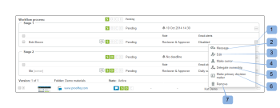

# Exibir o progresso e o status de uma prova em [!DNL Workfront Proof]

>[!IMPORTANT]
>
>Este artigo se refere à funcionalidade no produto independente [!DNL Workfront Proof]. Para obter informações sobre prova dentro de [!DNL Adobe Workfront], consulte [Tofing](../../../review-and-approve-work/proofing/proofing.md).

## Noções básicas sobre o progresso da prova

O progresso da prova indica o trabalho feito em uma prova a partir do momento em que você envia a prova para os revisores no momento em que tomam uma decisão sobre a prova.

* [Ícones de progresso](#progress-icons)
* [Níveis de progresso da prova](#levels-of-proof-progress)

### Ícones de progresso {#progress-icons}

Os ícones de progresso, S, O, C e D são exibidos na barra de progresso e indicam o progresso da prova.

Elas indicam as seguintes informações sobre uma prova:

<table style="table-layout:auto"> 
 <col> 
 <col> 
 <thead> 
  <tr> 
   <td> 
<strong>Ícone de progresso</strong> 
 </td> 
   <td> 
<strong>Descrição</strong> 
 </td> 
  </tr> 
 </thead> 
 <tbody> 
  <tr> 
   <td> 
  
 </td> 
   <td> 
<strong>Enviado</strong>. A prova foi enviada aos revisores.
 </td> 
  </tr> 
  <tr> 
   <td> 
  
 
 
 </td> 
   <td> 
<strong>Aberto</strong>. Um revisor abriu a página Detalhes da prova ou abriu a própria prova no visualizador de prova.
 </td> 
  </tr> 
  <tr> 
   <td> 
  
 </td> 
   <td> 
<strong>Comentários</strong>. Revisores (usuários que podem fazer comentários) fizeram comentários sobre a prova.
 
Se nenhum revisor for designado para a prova, esse ícone não será exibido.
 </td> 
  </tr> 
  <tr> 
   <td> 
  
 </td> 
   <td> 
<strong>Decisão</strong>. Um revisor tomou uma decisão sobre a prova.
 
Se nenhum aprovador (tomador de decisão) for designado para a prova, esse ícone não será exibido. 
 </td> 
  </tr> 
 </tbody> 
</table>

Esses ícones podem aparecer nas seguintes cores para indicar determinadas informações sobre o progresso da prova:

* **Verde**. Completo.
* **Branco**. Não concluído.
* **Laranja**. Não completo e o prazo é inferior a 24 horas.
* **Vermelho**. Não completar e ultrapassar o prazo.

### Níveis de progresso da prova {#levels-of-proof-progress}

A Workfront Proof usa os ícones de progresso para rastrear o progresso de uma prova em cada um dos seguintes níveis:

* Para cada revisor, com base na atividade dessa pessoa na prova.
* Para cada estágio, com base no progresso, o revisor no palco que está mais atrasado no processo de prova. Para obter mais informações, consulte [Visão geral das etapas do fluxo de trabalho automatizado](../../../review-and-approve-work/proofing/proofing-overview/stages.md).
* Para a prova, com base no progresso do estágio (grupo de revisores) que está mais atrasado no processo de prova.

Para obter um exemplo de como [!DNL Workfront Proof] determina o progresso usando o revisor ou o estágio mais atrasado, suponha que três revisores em uma prova precisem tomar uma decisão. Se dois deles tomaram a sua decisão, mas o terceiro não, a barra de progresso da prova não mostra o D em verde por causa da decisão pendente.

Se a variável [!UICONTROL Criador de decisão principal] for selecionada em uma prova e o principal responsável pela decisão enviar uma decisão, a ID na barra de progresso da prova ficará verde para todos os revisores porque nenhuma outra decisão é necessária.

Da mesma forma, se a variável [!UICONTROL Somente uma decisão é necessária] for selecionada em uma prova e qualquer revisor enviar uma decisão, a ID na barra de progresso da prova ficará verde para todos os revisores, pois nenhuma outra decisão é necessária.

## Compreender o status da prova

O status da prova exibe o status das decisões necessárias para a prova.

\
As opções de status padrão são:

* Pendente
* Aprovado
* Aprovado com alterações
* Alterações necessárias
* Não relevante

Se decisões personalizadas forem definidas na sua conta, as opções de status refletirão as configurações de decisão personalizadas.

O status da prova é determinado pelo participante no &quot;pior dos casos&quot;. Por exemplo, suponha que haja três decisões na prova: dois têm o status de **Aceite** e um tem o status de **Rejeitada**. A decisão do &quot;pior caso&quot; de rejeição sobrepõe-se às outras decisões e o estatuto global da prova é apresentado como **Rejeitada**.

## Exibindo o Progresso e o Status {#viewing-progress-and-status}

Você pode visualizar o progresso e o status de provas, estágios e revisores em cada estágio.

* [Resumo da prova](#proof-summary)
* [Menu Ações de Estágio](#stage-actions-menu)
* [No [!UICONTROL Resumo] , você também pode acessar os menus de ações do revisor, desde que tenha direitos de edição na prova. Para obter mais informações, consulte Permissões de prova em Perfis de prova no Workfront Proof e Gerenciar funções de prova no Workfront Proof. O [!UICONTROL Ações do revisor] O menu (1) é exibido quando você passa o mouse sobre os detalhes do Revisor e permite:](#in-the-summary-section-you-can-also-access-the-reviewer-actions-menus-provided-you-have-edit-rights-on-the-proof-for-more-information-see-proof-permissions-profiles-in-workfront-proof-and-manage-proof-roles-in-workfront-proof-the-reviewer-actions-menu-1-appears-when-you-hover-over-the-reviewer-s-details-and-allows-you-to)
* [Menu de Ações de Prova](#proof-actions-menu)

### Resumo da prova {#proof-summary}

Cada prova na pasta tem um resumo expansível que permite visualizar e editar rapidamente os detalhes da prova.

Para expandir ou recolher o resumo:

1. Clique na seta à esquerda da prova no Painel ou em qualquer exibição de lista.

O resumo inclui o seguinte:

* Fluxo de trabalho (2)
* Versão (3)
* Pasta (4)
* Estado (5)\
   

No resumo, você pode exibir e editar os seguintes detalhes da prova:

* Progressos realizados na prova (1)
* Evolução de cada fase (2)
* Prazo fixado para a fase (3)
* Detalhes do revisor:

   * Número de comentários e respostas feitos por cada revisor (4)
   * Progresso de cada revisor (5)
   * Decisão (se uma decisão tiver incluído uma assinatura eletrônica, será mostrado um ícone ao lado da decisão indicando isso). (6)
   * Papel na prova (7)
   * Configurações de alerta de email (8)

>[!NOTE]
>
>Sua capacidade de editar os detalhes da prova depende de seus direitos na prova (consulte [Perfis de prova de permissões em [!DNL Workfront Proof]](../../../workfront-proof/wp-acct-admin/account-settings/proof-perm-profiles-in-wp.md) e [Gerenciar funções de prova em [!DNL Workfront Proof]](../../../workfront-proof/wp-work-proofsfiles/share-proofs-and-files/manage-proof-roles.md)).

### [!UICONTROL Ações de preparo] Menu  {#stage-actions-menu}

Cada estágio do fluxo de trabalho tem um menu separado, que permite executar ações em massa relacionadas aos revisores nessa etapa.

O [!UICONTROL Ações de preparo] O menu é exibido quando você passa o mouse sobre a seção Estágio (1) e permite

* [!UICONTROL Mensagem tudo] (2)
* [!UICONTROL Compartilhar] (3)
* [!UICONTROL Excluir estágio] (4)

>[!NOTE]
>
>A disponibilidade dessas opções depende dos seus direitos na prova (consulte [Perfis de prova de permissões em [!DNL Workfront Proof]](../../../workfront-proof/wp-acct-admin/account-settings/proof-perm-profiles-in-wp.md) e [Gerenciar funções de prova em [!DNL Workfront Proof]](../../../workfront-proof/wp-work-proofsfiles/share-proofs-and-files/manage-proof-roles.md)).

Na seção Summary , também é possível acessar os menus de ações do revisor, desde que você tenha direitos de edição na prova. Para obter mais informações, consulte [Perfis de prova de permissões em [!DNL Workfront Proof]](../../../workfront-proof/wp-acct-admin/account-settings/proof-perm-profiles-in-wp.md) e [Gerenciar funções de prova em [!DNL Workfront Proof]](../../../workfront-proof/wp-work-proofsfiles/share-proofs-and-files/manage-proof-roles.md). O menu Reviewer actions (1) é exibido quando você passa o mouse sobre os detalhes do Reviewer e permite:

* Enviar uma mensagem ao revisor (2)
* Editar detalhes do revisor (3) - permite editar o nome de exibição, a função de prova e o alerta de email desse revisor
* Torná-los o proprietário da prova (4)
* Torná-los o principal decisor (5)
* Remover da prova (6)

>[!NOTE]
>
>A visibilidade dessas opções depende dos seus direitos na prova (consulte [Perfis de prova de permissões em [!DNL Workfront Proof]](../../../workfront-proof/wp-acct-admin/account-settings/proof-perm-profiles-in-wp.md) e [Gerenciar funções de prova em [!DNL Workfront Proof]](../../../workfront-proof/wp-work-proofsfiles/share-proofs-and-files/manage-proof-roles.md)).

### Menu de Ações de Prova {#proof-actions-menu}

Cada prova também tem um menu (1) que permite executar as ações abaixo:

* Você pode acessar a página Detalhes da prova (2)
* Compartilhar a prova com outras pessoas (3)
* Enviar uma mensagem aos revisores (4)
* Criar uma nova versão da prova (5)
* Copiar a prova (6)
* Baixe o arquivo original (7)
* Compartilhar links de prova (8)
* Imprimir comentários (9)
* Solicitar um resumo do Excel da prova (10)
* Bloquear a prova (11)
* Excluir a prova (12)

>[!NOTE]
>
>A disponibilidade dessas opções depende dos seus direitos na prova (consulte [Perfis de prova de permissões em [!DNL Workfront Proof]](../../../workfront-proof/wp-acct-admin/account-settings/proof-perm-profiles-in-wp.md) e [Gerenciar funções de prova em [!DNL Workfront Proof]](../../../workfront-proof/wp-work-proofsfiles/share-proofs-and-files/manage-proof-roles.md)).

Para obter informações sobre a exibição do progresso e status da prova em [!DNL Workfront], consulte [Exibindo o Progresso e o Status](#viewing-progress-and-status).

Para obter informações sobre o progresso e o status da exibição no Desktop Proofing Viewer, consulte [Revisar um fluxo de trabalho no visualizador de prova](../../../workfront-proof/wp-work-proofsfiles/review-proofs-wpv/review-workflow.md).
