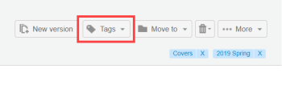

# Criar e Gerenciar Marcas em [!DNL Workfront Proof]

>[!IMPORTANT]
>
>Este artigo se refere à funcionalidade no produto independente [!DNL Workfront] Proof. Para obter informações sobre provas dentro de [!DNL Adobe Workfront], consulte [Prova](../../../review-and-approve-work/proofing/proofing.md).

Você pode criar e editar tags e aplicá-las às suas provas e arquivos. Isso é ótimo para quando você tem muitos itens [!DNL Workfront Proof] diferentes, como projetos, divisões e clientes, e você deseja identificá-los e encontrá-los facilmente.

É possível aplicar tags a provas novas ou existentes, novos arquivos, novas versões e cópias em qualquer uma das páginas de exibição em lista.

>[!TIP]
>
>Pode ser útil usar várias tags quando mais de uma categoria se aplica a um item. Você pode aplicar um número ilimitado de tags a qualquer item.

Sua configuração de perfil e permissão afeta a funcionalidade de tag disponível para você:

* Administradores de faturamento, administradores e supervisores podem usar todas as funções descritas nesta página.
* Os gerentes podem criar e editar tags somente para seus itens.
* Os observadores não podem aplicar ou editar tags em itens, mas podem exibir tags aplicadas a itens por outros usuários e podem exibir a guia Tags nas configurações Pessoais.

Para obter mais informações sobre esses perfis e permissões, consulte [Perfis de permissões de prova em [!DNL Workfront Proof]](../../../workfront-proof/wp-acct-admin/account-settings/proof-perm-profiles-in-wp.md).

## Criar, editar ou excluir uma tag na sua conta

1. Clique em **[!UICONTROL Configurações]** > **[!UICONTROL Configurações pessoais]**.

1. Abra a guia **[!UICONTROL Marcas]** na parte superior da página **[!UICONTROL Configurações pessoais]**.\
   Siga um destes procedimentos:

   * Para criar uma marca, clique em **[!UICONTROL Nova marca]**, digite um nome para a marca e pressione **[!UICONTROL Enter]**.\

     Os nomes das tags devem incluir pelo menos um caractere alfanumérico e no máximo 30 caracteres.\
      Para editar uma marca existente, clique no nome da marca, digite o novo texto e pressione **[!UICONTROL Enter]**.

   * Para excluir uma tag, clique no ícone da lixeira no final da linha na qual a tag está listada.

## Exibindo Informações Sobre Tags

1. Clique em **[!UICONTROL Configurações]** > **[!UICONTROL Configurações pessoais]**.

1. Abra a guia **[!UICONTROL Marcas]** na parte superior da página **[!UICONTROL Configurações pessoais]**.\
   A guia **[!UICONTROL Marcas]** fornece as seguintes informações sobre suas marcas:

   * **Nome**
   * **Total de itens** aos quais a marca foi aplicada
   * **Itens aos quais você tem permissão para ver** aos quais a marca foi aplicada

1. (Opcional) Se quiser exibir todos os itens que tiveram uma marca específica aplicada a eles, clique no número ao lado dessa marca em **Itens que você tem permissão para ver**.\
   A página Resultados da pesquisa exibida lista todos os itens que você tem permissão para ver aos quais a tag é aplicada.

## Criação de tags para um ou mais itens

1. Em uma exibição de lista ou no Painel, selecione o item ou itens para os quais deseja criar ou gerenciar tags.
1. Clique em **[!UICONTROL Marcas]** > **[!UICONTROL Nova marca]** logo acima da lista, digite um nome para a marca e clique em **[!UICONTROL Criar]**.

1. Selecione a nova tag e clique em **[!UICONTROL Adicionar tag(s)]**.

## Gerenciamento de tags para um ou mais itens

1. Em uma exibição de lista ou no Painel, selecione o item ou itens para os quais deseja criar ou gerenciar tags.
1. Clique em **[!UICONTROL Marcas]** > **[!UICONTROL Gerenciar Marcas]** logo acima da lista.

1. Na guia [!UICONTROL Marcas] exibida, gerencie suas marcas conforme descrito acima em [Criando, Editando ou Excluindo uma Guia.](https://support.workfront.com/knowledge/articles/115004379508/en-us?brand_id=662728&amp;return_to=%2Fhc%2Fen-us%2Farticles%2F115004379508#CreatingEditingDeletingTag)\
   Uma tag é aplicada a todos os itens selecionados quando a caixa de seleção ao lado da tag está em cinza escuro. Se estiver cinza claro, somente alguns dos itens em um lote selecionado serão marcados com ele. Se quiser remover uma marca de todos os itens selecionados, certifique-se de que a opção ao lado da marca está em branco.\
   

## Gerenciamento de tags a partir de detalhes da prova ou detalhes do arquivo

As tags aplicadas a uma prova ou a um arquivo são exibidas nas páginas Detalhes da prova e Detalhes do arquivo, respectivamente. Nesta página, você pode visualizar, alterar e remover tags. Para obter mais informações, consulte [Gerenciar detalhes da prova em [!DNL Workfront Proof]](../../../workfront-proof/wp-work-proofsfiles/manage-your-work/manage-proof-details.md) e [Gerenciar arquivos em [!DNL Workfront Proof]](../../../workfront-proof/wp-work-proofsfiles/manage-your-work/manage-files.md).

1. Abra a página Detalhes da Prova para obter uma prova, conforme descrito em [Gerenciar Detalhes da Prova em [!DNL Workfront Proof]](../../../workfront-proof/wp-work-proofsfiles/manage-your-work/manage-proof-details.md).\
   Ou\
   Abra a página Detalhes do Arquivo de um arquivo, conforme descrito em [Gerenciar Arquivos em [!DNL Workfront Proof]](../../../workfront-proof/wp-work-proofsfiles/manage-your-work/manage-files.md).\
   As tags aplicadas ao item aparecem perto do canto superior direito.\
   

1. (Opcional) Para remover tags da prova ou do arquivo, clique no x ao lado dele.
1. No canto superior direito, clique em **[!UICONTROL Marcas]**.\
   

1. Na caixa exibida, selecione as marcas que deseja aplicar ao item (ou desmarque as marcas que deseja remover) e clique em **[!UICONTROL Adicionar marcas]**.

## Procurando um item usando um nome de tag

Você pode pesquisar um item usando o nome de uma tag que você sabe que é aplicada ao item.Se você compartilhar um item com alguém, essa pessoa poderá pesquisar esse item da mesma maneira.Para ver uma lista de todos os itens que tiveram a tag aplicada a eles:

1. Em qualquer exibição de lista ou no Painel, abra a guia **[!UICONTROL Marcas]** na barra lateral esquerda e clique na marca na lista de marcas exibidas.\
   \
   O nome da marca aparece no campo de pesquisa no canto superior direito de [!DNL Workfront Proof]. Você pode refinar sua pesquisa selecionando tags adicionais ou digitando mais palavras-chave no campo de pesquisa. Você pode remover uma tag do campo de pesquisa clicando no ícone x ao lado do nome da tag.
