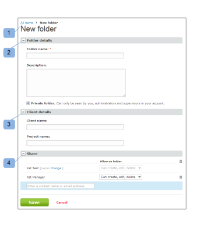

# Criar pastas em [!DNL Workfront Proof]

>[!IMPORTANT]
>
>Este artigo se refere à funcionalidade no produto independente [!DNL Workfront Proof]. Para obter informações sobre prova dentro de [!DNL Adobe Workfront], consulte [Tofing](../../../review-and-approve-work/proofing/proofing.md).

## Criação de uma nova pasta de nível superior {#creating-a-new-top-level-folder}

1. Na barra lateral, clique na seta suspensa (1) ao lado da tela verde **[!UICONTROL Nova prova]** botão.
1. Selecionar **[!UICONTROL Nova pasta]**. (2)\
   O [!UICONTROL Nova pasta] será exibida.

1. Continue com [Configuração da nova pasta](#configuring-the-new-folder).\
   

## Criação de uma nova subpasta {#creating-a-new-sub-folder}

Você pode criar subpastas de uma das seguintes maneiras:

* [Criação de uma subpasta na página Detalhes da pasta](#creating-a-sub-folder-from-the-folder-details-page)
* [Criação de uma subpasta na página Pastas da conta](#creating-a-sub-folder-from-the-account-folders-page)

>[!NOTE]
>
>Ao criar uma nova subpasta, a lista de compartilhamento é herdada da pasta pai.

### Criação de uma subpasta no [!UICONTROL Detalhes da pasta] página {#creating-a-sub-folder-from-the-folder-details-page}

Para obter informações sobre o [!UICONTROL Detalhes da pasta] página, consulte [Gerenciar pastas e seu conteúdo na prova do Workfront](../../../workfront-proof/wp-work-proofsfiles/organize-your-work/manage-folders-and-contents.md).

Para criar uma subpasta do [!UICONTROL Detalhes da pasta] página:

1. Na barra lateral, clique no nome da pasta na [!UICONTROL Minhas pastas] lista (1) para acessar a página de detalhes da pasta

1. Clique no novo botão de subpasta (2) na parte superior da página.\
   Uma nova pasta aparece na lista de itens na pasta.
1. Digite um nome para a nova subpasta. (3)
1. Press **[!UICONTROL Enter]**.\
   Ou\
   Clique fora do campo de nome da pasta.

1. (Opcional) Edite os detalhes da nova subpasta na página Detalhes da pasta .
1. Continue com [Configuração da nova pasta](#configuring-the-new-folder).

### Criação de uma subpasta na página Pastas da conta {#creating-a-sub-folder-from-the-account-folders-page}

1. Clique em [Nome da sua conta] na Barra lateral para acessar a página Pastas da conta (1)\
   

1. Encontre a pasta que deseja adicionar uma subpasta e abra o [!UICONTROL ações] menu (2)
1. Selecionar [!UICONTROL Nova subpasta] no menu (3)\
   O [!UICONTROL Nova pasta] será exibida.
1. Continue com [Configuração da nova pasta](#configuring-the-new-folder).

## Configuração da nova pasta {#configuring-the-new-folder}

Depois de começar a criar uma nova pasta (conforme descrito em [Criação de uma nova pasta de nível superior](#creating-a-new-top-level-folder) ou [Criação de uma nova subpasta](#creating-a-new-sub-folder)), você pode definir as opções de configuração conforme descrito nesta seção.

* [Navegação de navegação estrutural](#breadcrumb-navigation) (1)
* [Detalhes da pasta](#folder-details) (2)
* [Detalhes do cliente](#client-details) (3)
* [Compartilhar](#share) (4)

### Navegação de navegação estrutural {#breadcrumb-navigation}

A navegação estrutural mostra se você está criando uma pasta de nível superior ou uma subpasta) (1)

### Detalhes da pasta {#folder-details}

Nesta seção, você pode adicionar (e verificar) as seguintes informações à pasta que está criando:

* Nome da pasta - este campo é obrigatório (1)
* Clicar no [!UICONTROL Consulte a lista] o link (2) exibirá uma pop-up com uma lista de pessoas com as quais essa pasta é compartilhada - essas informações são particularmente úteis quando você está criando subpastas, pois as subpastas serão compartilhadas automaticamente com as mesmas pessoas que a pasta pai
* Descrição (3) - aqui você pode adicionar uma breve descrição da pasta, que estará visível na página Detalhes da pasta
* Tornar a pasta privada (4) - marcar a caixa tornará essa pasta privada (tão visível apenas para as pessoas com as quais você compartilha explicitamente a pasta e os usuários na sua conta com os perfis de [Perfis de prova de permissões em [!DNL Workfront Proof]](../../../workfront-proof/wp-acct-admin/account-settings/proof-perm-profiles-in-wp.md), [Perfis de prova de permissões em [!DNL Workfront Proof]](../../../workfront-proof/wp-acct-admin/account-settings/proof-perm-profiles-in-wp.md) ou [Perfis de prova de permissões em [!DNL Workfront Proof]](../../../workfront-proof/wp-acct-admin/account-settings/proof-perm-profiles-in-wp.md) ). Consulte [Entender as permissões da pasta em [!DNL Workfront Proof]](../../../workfront-proof/wp-work-proofsfiles/organize-your-work/folder-permissions.md) para saber mais sobre pastas privadas e públicas na Workfront Proof.

### Detalhes do cliente {#client-details}

Nesta seção, você pode preencher os detalhes do seu cliente - isso permitirá classificar a página Minhas pastas por nome de cliente/projeto:

* Nome do cliente (1)
* Nome do projeto (2)

### Compartilhar {#share}

No [!UICONTROL Compartilhar] seção que você pode:

* Atribuir um novo proprietário da pasta (1) - o criador da pasta permanecerá listado na pasta e não poderá ser removido. No entanto, você pode fazer com que outro usuário na sua conta seja o proprietário, o que lhe dará direitos de edição na pasta.
* Compartilhar a pasta com outras [!DNL Workfront Proof] usuários digitando em seus endereços de email (2) - observe que as pastas só podem ser compartilhadas com pessoas que têm seus próprios endereços [!DNL Workfront Proof] logons.
* Defina as permissões para as pessoas com as quais você compartilha a pasta (3). Isso é útil para compartilhar pastas privadas com usuários de sua conta - é possível decidir se os usuários com a variável [Perfis de prova de permissões em [!DNL Workfront Proof]](../../../workfront-proof/wp-acct-admin/account-settings/proof-perm-profiles-in-wp.md) deve ter permissão para criar, editar e excluir itens na pasta.
* Remova um usuário da lista de compartilhamento de pastas clicando no ícone de lixeira (4) à direita do nome do usuário.
* Remova todos da lista de compartilhamento de pastas clicando no ícone de lixeira superior (5) - observe que não será possível remover o criador ou o proprietário da pasta.

Consulte também [Compartilhar pastas em [!DNL Workfront Proof]](../../../workfront-proof/wp-work-proofsfiles/organize-your-work/share-folders.md).

