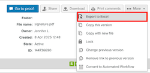

# Imprimir e Exportar Comentários em [!DNL Workfront Proof]

>[!IMPORTANT]
>
>Este artigo se refere à funcionalidade no produto independente [!DNL Workfront Proof]. Para obter informações sobre provas dentro de [!DNL Adobe Workfront], consulte [Prova](../../../review-and-approve-work/proofing/proofing.md).

## Impressão de comentários

O resumo de Comentários pode ser acessado diretamente das seguintes áreas:

* [O visualizador de prova](#the-proof-viewer)
* [A página de detalhes da prova](#the-proof-details-page)
* [O  [!DNL Proof] Menu Ações](#the-proof-actions-menu)

### O visualizador de prova {#the-proof-viewer}

Você pode imprimir o resumo de Comentários da prova, incluindo as miniaturas ou a imagem em tela cheia da prova clicando no ícone **[!UICONTROL Imprimir]** no Visualizador de Provas.

Para acessar o Visualizador de provas, clique no botão **Ir para prova** da página Detalhes da prova.

### A página de detalhes da prova {#the-proof-details-page}

Você pode imprimir o resumo do comentário da prova clicando no ícone **[!UICONTROL Imprimir]** na página Detalhes da prova.

Para acessar a página Detalhes da prova de uma prova específica, clique no nome da prova na exibição em lista.

### O Menu de Ações [!DNL Proof] {#the-proof-actions-menu}

Você pode imprimir o resumo do comentário da prova clicando no ícone **[!UICONTROL Imprimir]** no menu [!UICONTROL Ações de prova].

Para acessar a página [!UICONTROL Resumo dos comentários] a partir de uma exibição de lista:

1. Clique no menu **[!UICONTROL Ações]**.
1. Selecione **[!UICONTROL Imprimir comentários]**.

   

   Na página de resumo de Comentários, selecione uma das seguintes opções de impressão:

   * Visualização em miniatura (1)
   * Exibição de página inteira (2)
   * Imprima a página (3)
   * Exportar a prova com comentários para um arquivo PDF (4)
   * Exportar comentários de prova para um arquivo [!DNL Excel] (5)

### Exibição de miniatura

A exibição de Miniatura mostra cada comentário em ordem com o thread completo para cada comentário. Também é possível classificar comentários e ver a miniatura de cada comentário com marcações adicionadas.

Para imprimir o modo de exibição de miniatura, clique no ícone **[!UICONTROL Impressora]** no canto superior direito da página e selecione uma das seguintes opções:

* Classificar por ID de comentário ou página (1)
* Miniatura de cada comentário com marcações adicionadas (2)

### Exibição de página inteira

A exibição de página inteira mostra cada página em ordem com os comentários nessa página e um marcador indicando onde o comentário está localizado.

Para imprimir a exibição de página inteira, clique no ícone **[!UICONTROL Impressora]** no canto superior direito da página.

## Exportando um Resumo [!DNL Excel]

Para exportar o resumo [!DNL Excel] do menu de ações de Prova:

1. Clique no ícone **Ações** à direita da prova e selecione **[!UICONTROL [!DNL Excel]resumo]**.
   

Para baixar o resumo [!DNL Excel] na página de detalhes da Prova:

1. Clique no botão **Mais** e selecione **Exportar para o Excel**.

   

## Exportar para o PDF

Quando exportar para um arquivo PDF, todos os comentários aparecerão no leitor do PDF. Se um comentário tiver várias marcações associadas a ele, ele será exibido várias vezes na lista de comentários (uma vez para cada marcação).

>[!IMPORTANT]
>
>A função Exportar para o PDF está disponível somente para arquivos estáticos.

Para exportar uma prova com suas marcações e comentários para o PDF:

1. No lado esquerdo da tela, clique em **[!UICONTROL Exibições]**.
1. Clique no botão **[!UICONTROL Mais]** alinhado com a prova específica e selecione **[!UICONTROL Imprimir comentários]**.

1. No canto superior direito da página, clique no botão **Exportar para o PDF**. O PDF começa a baixar e será enviado por email para você assim que for concluído.
