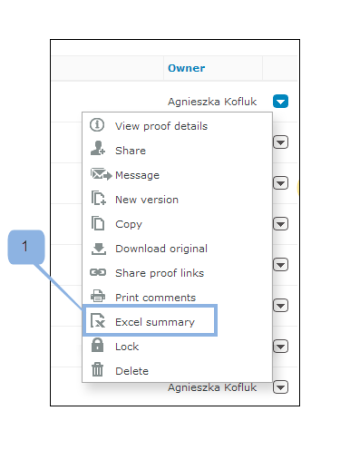

# Imprimir e exportar comentários no [!DNL Workfront Proof]

>[!IMPORTANT]
>
>Este artigo se refere à funcionalidade no produto independente [!DNL Workfront Proof]. Para obter informações sobre prova dentro do [!DNL Adobe Workfront], consulte [Prova](../../../review-and-approve-work/proofing/proofing.md).

## Impressão de comentários

O resumo de Comentários pode ser acessado diretamente das seguintes áreas:

* [O visualizador de prova](#the-proof-viewer)
* [A página de detalhes da prova](#the-proof-details-page)
* [A variável [!DNL Proof] Menu de ações](#the-proof-actions-menu)

### O visualizador de prova {#the-proof-viewer}

É possível imprimir o resumo dos Comentários da prova, incluindo as miniaturas ou a imagem em tela cheia da prova, clicando no ícone **[!UICONTROL Imprimir]** no Visualizador de prova. (1)

### A página de detalhes da prova {#the-proof-details-page}

Você pode imprimir o Resumo de comentário da prova clicando no **[!UICONTROL Imprimir]** ícone na página Detalhes da prova. (2)

### A variável [!DNL Proof] Menu de ações {#the-proof-actions-menu}

Você pode imprimir o Resumo de comentário da prova clicando no **[!UICONTROL Imprimir]** ícone no [!UICONTROL Ações de prova] menu.

Para acessar o [!UICONTROL Resumo de comentários] página de uma exibição de lista:

1. Clique no link **[!UICONTROL Ações]** menu. (3)
1. Selecionar **[!UICONTROL Imprimir comentários]**. (4)

\
Na página de resumo de comentários, você tem as seguintes opções de impressão para escolher:

* Visualização em miniatura (1)
* Exibição de página inteira (2)
* Imprima a página (3)
* Exportar a prova com comentários para um arquivo PDF (4)
* Exporte os comentários da prova para um [!DNL Excel] ficheiro (5)

### Exibição de miniatura

A exibição de Miniatura mostra cada comentário em ordem, junto com o thread completo para cada comentário. Também é possível classificar comentários e ver a miniatura de cada comentário com marcações adicionadas.

Para imprimir a exibição em miniatura, clique no **[!UICONTROL Impressora]** no canto superior direito da página e selecione uma das seguintes opções:

* Classificar por ID de comentário ou página (1)
* Miniatura de cada comentário com marcações adicionadas (2)

### Exibição de página inteira

A exibição de página inteira mostra cada página em ordem, juntamente com os comentários nessa página e um marcador indicando onde a marcação para o comentário está localizada na página.

Para imprimir a exibição de página inteira, clique no link **[!UICONTROL Impressora]** no canto superior direito da página.

## Exportação de um [!DNL Excel] Resumo

Para baixar o [!DNL Excel] resumo:

1. Abra o menu de ações da prova à direita da prova e clique em **[!UICONTROL [!DNL Excel]resumo]**. (1)\
   

Para baixar o [!DNL Excel] resumo da página Detalhes da prova:

1. Clique no link Exportar para **[!DNL Excel]** ícone. (2)
1. 

## Exportar para o PDF

Para exportar uma prova para o PDF, juntamente com todas as marcações e comentários, siga estas etapas:

1. Ir para **[!UICONTROL Visualizações]** no lado esquerdo da tela.
1. Clique em **[!UICONTROL Mais]** ícone em linha com uma prova e clique em **[!UICONTROL Imprimir comentários]**.

1. Clique no ícone Exportar para o PDF no canto superior direito da página.

   Quando o PDF estiver pronto, você receberá um email com um link de download.

Todos os comentários serão exibidos no leitor de PDF. Se um comentário tiver várias marcações associadas a ele, ele será exibido várias vezes na lista de comentários (uma vez para cada marcação).

>[!IMPORTANT]
>
>A função Exportar para PDF está disponível apenas para arquivos estáticos.
