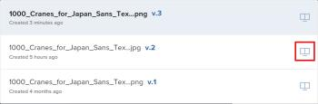
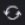

# Comparar provas no visualizador de provas

>[!IMPORTANT]
>
>Este artigo se refere à funcionalidade no produto independente [!DNL Workfront Proof]. Para obter informações sobre provas dentro de [!DNL Adobe Workfront], consulte [Prova](../../../review-and-approve-work/proofing/proofing.md).

Você pode exibir comparações lado a lado de duas provas. Essas podem ser duas versões da mesma prova ou duas provas completamente separadas.

## Comparar versões de prova {#compare-proof-versions}

1. Abra a prova que tenha várias versões que você deseja comparar.
1. No canto superior esquerdo do visualizador de provas exibido, clique no nome da prova. Em seguida, na lista de versões exibida, clique no ícone **Comparar** ao lado da versão que você deseja abrir e comparar.

   

   As provas são exibidas lado a lado, com a versão mais recente no lado esquerdo.

   <!--
   
Separate breadcrumbs above each proof allow you to view and go to the work item associated with the proof:

   -->

   <!--
   
  

   -->

1. Continuar com [Usar as ferramentas de comparação](#use-the-compare-tools).

## Comparar provas separadas {#compare-separate-proofs}

Você pode comparar duas provas separadas.

* [Comparar provas separadas em [!DNL Workfront]](#compare-separate-proofs-in-workfront)
* [Comparar provas separadas em [!DNL Workfront Proof]](#compare-separate-proofs-in-workfront-proof)

### Comparar provas separadas em [!DNL Workfront] {#compare-separate-proofs-in-workfront}

Para obter informações sobre como comparar provas separadas da lista de documentos no [!DNL Workfront], consulte a seção [Comparar duas provas diferentes](../../../review-and-approve-work/proofing/reviewing-proofs-within-workfront/review-a-proof/compare-proofs.md#comparing-two-proofs-from-a-document-list) no artigo [Comparar provas](../../../review-and-approve-work/proofing/reviewing-proofs-within-workfront/review-a-proof/compare-proofs.md).

### Comparar provas separadas em [!DNL Workfront Proof] {#compare-separate-proofs-in-workfront-proof}

>[!NOTE]
>
>As provas comparadas devem estar localizadas na mesma pasta e no mesmo nível de hierarquia na estrutura de pastas. Para obter mais informações sobre como usar pastas para agrupar provas que você deseja comparar, consulte [Trabalhar com várias provas no visualizador de provas](../../../workfront-proof/wp-work-proofsfiles/review-proofs-wpv/work-with-multiple-proofs.md)

1. Abra uma das provas que deseja comparar no visualizador de provas.
1. Clique no ícone **[!UICONTROL Comparar Modo]**.

   \
   A área de visualização é dividida ao meio e a prova é exibida à esquerda e à direita do visualizador de provas.

   

1. Clique no ícone de [!UICONTROL pasta] acima da prova, no lado esquerdo ou direito, para listar as outras provas na mesma pasta.

   

1. Na lista, clique no nome da prova que deseja comparar com a prova atualmente aberta no visualizador de provas.

   

   Ambas as provas são exibidas.

1. Continuar com [Usar as ferramentas de comparação](#use-the-compare-tools).

## Usar as ferramentas de comparação {#use-the-compare-tools}

O revisor de provas fornece várias ferramentas para comparar provas de forma eficaz e eficiente.

* [Comparar provas automaticamente](#auto-compare-proofs)
* [Comparar provas em uma sobreposição](#compare-proofs-in-an-overlay)
* [Comparação de navegação simultânea](#simultaneous-navigation-comparison)

### Comparar provas automaticamente {#auto-compare-proofs}

A comparação automática faz uma comparação pixel por pixel entre duas provas estáticas ou de vídeo. Quaisquer diferenças detectadas são realçadas em vermelho na prova à esquerda.

A comparação automática não está disponível ao comparar provas interativas.

Para comparar duas provas automaticamente:

1. Comece a comparar provas de uma das seguintes maneiras:

   * Compare duas versões da mesma prova (consulte [Comparar versões de prova](#compare-proof-versions) neste artigo).
   * Compare duas provas separadas (consulte [Comparar provas separadas](#compare-separate-proofs) neste artigo).

1. Clique no ícone **[!UICONTROL Comparação automática]**.

   

   Quaisquer diferenças entre as duas provas são destacadas em vermelho na prova à esquerda.

1. (Opcional) Clique no ícone **[!UICONTROL Alternar]** para alterar o lado ativo de forma que as diferenças sejam exibidas na prova do lado direito. Por padrão, as diferenças são mostradas na prova no lado esquerdo.

   

1. (Opcional) Clique no ícone **[!UICONTROL Cor]** para alterar a cor e a opacidade usadas quando destacar as diferenças.

   

### Comparar provas em uma sobreposição {#compare-proofs-in-an-overlay}

A comparação de sobreposição permite exibir diferenças entre duas provas estáticas ao exibir as duas provas como uma única prova, ao mesmo tempo em que fornece um divisor vertical no centro da prova. À medida que você desloca a prova pelo divisor vertical, as diferenças são exibidas.

>[!NOTE]
>
>A comparação de sobreposição não está disponível ao comparar provas de vídeo ou interativas.

Para habilitar a comparação de sobreposição:

1. Comece a comparar provas de uma das seguintes maneiras:

   * Compare duas versões da mesma prova (consulte [Comparar versões de prova](#compare-proof-versions) neste artigo).
   * Compare duas provas separadas (consulte [Comparar provas separadas](#compare-separate-proofs) neste artigo).

1. Clique no ícone **[!UICONTROL Sobreposição]**.

   

   As duas provas são exibidas como uma única prova, com um divisor vertical no centro da prova.

1. Siga um destes procedimentos:

   * Desloque a prova pelo divisor vertical. Ao se deslocar, você verá a prova à esquerda no lado esquerdo do divisor vertical, enquanto a prova à direita é exibida no lado direito.
   * Mova o divisor vertical para a esquerda e para a direita. Ao mover o divisor, você verá a prova à esquerda no lado esquerdo do divisor vertical, enquanto a prova à direita é exibida no lado direito.

### Comparação de navegação simultânea {#simultaneous-navigation-comparison}

A navegação simultânea é ativada por padrão ao comparar provas. Ela está disponível ao comparar uma prova estática e uma prova estática, ou ao comparar uma prova de vídeo e uma prova de vídeo. Não está disponível ao comparar uma prova estática e uma prova de vídeo.

**Provas estáticas:** quando habilitada em provas estáticas, a navegação simultânea bloqueia o nível de zoom e a posição das duas provas ao deslocar ou rolar. Quando uma prova contém várias páginas e a navegação simultânea está ativada, alterar as páginas em uma prova resulta na alteração da página na outra prova.

**Provas de vídeo:** quando habilitada nas provas de vídeo, a navegação simultânea lembra a diferença de tempo nas linhas do tempo das duas provas.

Para ativar a navegação simultânea se ela ainda não estiver ativada:

1. Comece a comparar provas de uma das seguintes maneiras:

   * Compare duas versões da mesma prova (consulte [Comparar versões de prova](#compare-proof-versions) neste artigo).
   * Compare duas provas separadas (consulte [Comparar provas separadas](#compare-separate-proofs) neste artigo).

1. Clique no ícone **[!UICONTROL Navegação Simultânea]**.

   

1. (Opcional) Clique no ícone **[!UICONTROL Redefinir]** a qualquer momento para redefinir o nível de zoom e a posição (para prova estática) ou a linha do tempo (para provas em vídeo).

   

## Sair do modo de comparação

1. Feche a prova que não deseja mais ver clicando no ícone (x) no canto superior esquerdo da prova.

   

   A prova que você não fechar permanecerá aberta no visualizador de provas.
