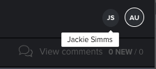

# Revisar uma prova simultaneamente com vários revisores

>[!IMPORTANT]
>
>Este artigo se refere à funcionalidade no produto independente [!DNL Workfront Proof]. Para obter informações sobre provas dentro de [!DNL Adobe Workfront], consulte [Prova](../../../review-and-approve-work/proofing/proofing.md).

Vários revisores podem revisar uma prova ao mesmo tempo. Ao revisar uma prova, é possível ver quem mais está revisando a mesma prova no momento.

É possível ver indicadores de presença quando outros revisores têm a mesma prova aberta, independentemente de adicionarem ou não comentários à prova. Se adicionarem comentários, eles serão exibidos enquanto você estiver revisando a prova; não é necessário atualizar o visualizador de provas para visualizá-los.

1. Exiba os indicadores de presença no canto superior direito do visualizador de provas.

   Se você estiver usando o [!DNL Workfront Proof] (não a funcionalidade de prova integrada ao [!DNL Workfront]), os indicadores de presença conterão a imagem de perfil [!DNL Workfront Proof] do usuário ou, se não houver uma imagem de perfil, a primeira e a última iniciais do usuário.

   As imagens de perfil em [!DNL Workfront] não aparecem no visualizador de provas.

1. (Opcional) Passe o mouse sobre um indicador de presença para visualizar o nome do usuário.

   
