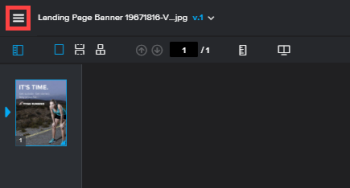

# Visualizar atividade em uma prova no Visualizador de provas

>[!IMPORTANT]
>
>Este artigo se refere à funcionalidade no produto independente [!DNL Workfront Proof]. Para obter informações sobre provas dentro de [!DNL Adobe Workfront], consulte [Prova](../../../review-and-approve-work/proofing/proofing.md).

Você pode visualizar a atividade recente de uma determinada prova. Isso inclui todas as atividades e decisões tomadas por qualquer usuário atribuído à prova.

1. Se a barra de ferramentas esquerda não for exibida, clique no ícone **[!UICONTROL Menu]** no canto superior esquerdo do visualizador de revisões.

   

1. Na barra de ferramentas à esquerda do revisor de provas, clique no botão **[!UICONTROL Detalhes da Prova]**.

   

1. Na página **[!UICONTROL Detalhes da prova]** que aparece, com **[!UICONTROL Detalhes da prova]** selecionados, exiba os detalhes, o status e o progresso da prova.

1. Para obter informações sobre o estado da prova, consulte [Entender o estado da prova em [!DNL Workfront Proof]](../../../workfront-proof/wp-work-proofsfiles/manage-your-work/proof-state.md).

1. Para obter informações sobre o andamento da prova, consulte [Exibir o andamento e o status de uma prova em [!DNL Workfront Proof]](../../../workfront-proof/wp-work-proofsfiles/manage-your-work/view-progress-and-status-of-proof.md).
1. Clique em **[!UICONTROL Atividade de prova]** para exibir as seguintes informações:

   * **Data**: a hora e a data em que a ação ocorreu.
   * **Ação**: a ação que ocorreu na prova.
   * **Detalhes**: o usuário que executou a ação.
