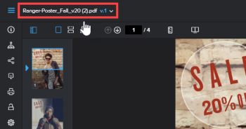

# Visualizar versões de prova anteriores no visualizador de provas para web

>[!IMPORTANT]
>
>Este artigo se refere à funcionalidade no produto independente [!DNL Workfront Proof]. Para obter informações sobre provas dentro de [!DNL Adobe Workfront], consulte [Prova](../../../review-and-approve-work/proofing/proofing.md).

>[!NOTE]
>
>As informações descritas nesta seção estão disponíveis somente com o Visualizador de provas da Web e somente ao revisar provas de vídeo ou estáticas (não interativas).

É possível exibir uma versão anterior de uma prova, se existir. As versões anteriores são bloqueadas por padrão. Não é possível adicionar comentários ou alterar uma decisão em uma versão bloqueada.

Para exibir uma versão anterior:

1. Abra a prova.
1. No canto superior esquerdo do visualizador de provas, clique no nome da prova.

   

1. Na lista exibida, clique na versão que deseja exibir.
1. (Opcional) Para desbloquear a versão se você quiser que os usuários possam adicionar comentários ou alterar uma decisão, se você tiver direitos para isso, clique no ícone **[!UICONTROL Desbloquear]** no painel esquerdo e, em seguida, clique em **[!UICONTROL Sim, desbloquear]**.
