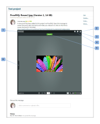

# Incorporar uma miniprova

>[!IMPORTANT]
>
>Este artigo se refere à funcionalidade no produto independente [!DNL Workfront Proof]. Para obter informações sobre provas dentro de [!DNL Adobe Workfront], consulte [Prova](../../../review-and-approve-work/proofing/proofing.md).

O Miniproof é um widget que permite incorporar uma prova em uma página da Web, blog ou wiki. O Miniproof mostra a prova e todos os comentários e marcações existentes. Você pode usá-la para trabalhar na prova como se estivesse em [!DNL Workfront Proof].

Este é um exemplo de um Miniproof incorporado em um projeto do Basecamp:

* Designação da prova (1)
* Tela cheia (2) - abrirá a prova no Visualizador de prova (fora do ambiente em que o Miniproof foi incorporado)
* Links de ajuda (3)
* Menu Ações (4)
* Exibir comentários na barra lateral (5)

Para incorporar um Miniproof em uma página da Web, blog ou wiki:

1. Vá para a página **[!UICONTROL Detalhes da prova]** de uma prova (consulte &quot;A Página de Detalhes da Prova&quot; em [Gerenciar Detalhes da Prova em [!DNL Workfront Proof]](../../../workfront-proof/wp-work-proofsfiles/manage-your-work/manage-proof-details.md)).

1. Clique em **[!UICONTROL Mais opções de compartilhamento]** para expandir essa seção.
1. Ao lado de **[!UICONTROL Incorporar código]**, verifique se **[!UICONTROL Habilitar]** está selecionado.

1. Clique em **[!UICONTROL Copiar código]** para copiar o código incorporado para a área de transferência.
1. Cole o código no site, blog ou wiki em que deseja incorporar o Miniproof.
