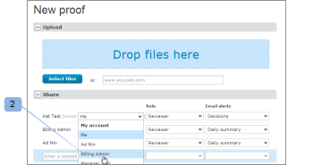

# Gerenciar funções de prova em [!DNL Workfront Proof]

>[!IMPORTANT]
>
>Este artigo se refere à funcionalidade no produto independente [!DNL Workfront Proof]. Para obter informações sobre prova dentro de [!DNL Adobe Workfront], consulte [Tofing](../../../review-and-approve-work/proofing/proofing.md).

As funções de prova permitem que você conceda permissões a usuários limitados pelo perfil de permissão configurado em seu perfil de usuário. (Para obter mais informações sobre perfis de permissão, consulte [Perfis de prova de permissões em [!DNL Workfront Proof]](../../../workfront-proof/wp-acct-admin/account-settings/proof-perm-profiles-in-wp.md).)

As funções de prova são diferentes dos perfis de conta. O perfil da conta está relacionado ao nível de permissão geral que você tem em sua conta e afetará os direitos que você tem em todas as provas em sua conta, mesmo aquelas que não foram compartilhadas explicitamente com você.

Para obter mais informações, consulte [Perfis de prova de permissões em [!DNL Workfront Proof]](../../../workfront-proof/wp-acct-admin/account-settings/proof-perm-profiles-in-wp.md).

## Sobre funções de prova

As seguintes funções de prova são concedidas aos usuários para uma prova individual no momento em que o usuário é convidado a revisar a prova:

* [Somente leitura](#read-only)
* [Oliveira](#reviewer)
* [Aprovador](#approver)
* [Revisor e Aprovador](#reviewer-approver)
* [Autor](#author)
* [Moderador](#moderator)

A função de prova define quais ações um revisor pode realizar em relação a essa prova específica.

Por exemplo, se você for um Revisor, será solicitado a revisar a prova adicionando marcações e comentários. Se você for um Revisor e Aprovador, você será solicitado a revisar e também tomar uma decisão sobre a prova.

Certas funções de prova dão direitos de edição a um revisor na prova (mesmo se o perfil da conta não o fizer) e permitem usar alguns recursos adicionais, como adicionar ações em comentários, criar novas versões e adicionar mais revisores à prova.

Para obter mais informações, consulte os seguintes artigos:

* [Usar ações em comentários de prova](../../../review-and-approve-work/proofing/reviewing-proofs-within-workfront/comment-on-a-proof/use-actions-on-comments-in-viewer.md)
* [Compartilhar uma prova em [!DNL Workfront Proof]](../../../workfront-proof/wp-work-proofsfiles/share-proofs-and-files/share-proof.md)

### Somente leitura

{#read-only}

 Pode exibir uma prova

 Não é possível adicionar marcações

 Não é possível adicionar comentários

 Não é possível tomar uma decisão

 Não é possível excluir comentários feitos por outras pessoas

 Não tem direitos de edição na prova

>[!NOTE]
>
>Se uma pasta for compartilhada com um usuário de [!DNL Workfront Proof], eles receberão automaticamente direitos de somente leitura a todos os itens existentes e subsequentemente adicionados à pasta.

Para obter mais informações, consulte [Compartilhar pastas em [!DNL Workfront Proof]](../../../workfront-proof/wp-work-proofsfiles/organize-your-work/share-folders.md).

### Oliveira {#reviewer}

 Pode exibir uma prova

 Pode adicionar marcações

 Pode adicionar comentários

![[!DNL cleaner].png](assets/cleaner.png) Pode editar comentários se não houver respostas

 Não é possível tomar uma decisão

 Não é possível editar ou excluir comentários feitos por outras pessoas

 Não tem direitos de edição na prova

### Aprovador {#approver}

 Pode exibir uma prova

 Pode tomar uma decisão

 Não é possível adicionar marcações

 Não é possível adicionar comentários

 Não é possível editar ou excluir comentários feitos por outras pessoas

 Não tem direitos de edição na prova

### Revisor e Aprovador {#reviewer-approver}

 Pode exibir uma prova

 Pode adicionar marcações

 Pode adicionar comentários

![[!DNL cleaner].png](assets/cleaner.png) Pode editar comentários se não houver respostas

 Pode tomar uma decisão

 Não é possível editar ou excluir comentários feitos por outras pessoas

 Não tem direitos de edição na prova

### Autor {#author}

 Pode adicionar marcações

 Pode adicionar comentários

![[!DNL cleaner].png](assets/cleaner.png) Pode editar comentários se não houver respostas

 Pode tomar uma decisão

 Pode enviar novas versões

 Pode criar uma cópia da prova

 Pode compartilhar a prova com outras pessoas

 Pode aplicar ações em comentários

 Pode resolver comentários

 Não é possível editar ou excluir comentários feitos por outras pessoas

>[!NOTE]
>
>Essa função só pode ser atribuída a usuários de [!DNL Workfront Proof]

### Moderador {#moderator}

 Pode adicionar marcações

 Pode adicionar comentários

![[!DNL cleaner].png](assets/cleaner.png) Pode editar comentários se não houver respostas

 Pode tomar uma decisão

 Pode enviar novas versões

 Pode adicionar novos revisores

 Pode aplicar ações em comentários

 Pode resolver comentários

 Pode excluir comentários e respostas na prova (feita por eles mesmos ou por outros)

* A exclusão do primeiro comentário em um encadeamento de comentário excluirá todo o encadeamento
* A exclusão de respostas no encadeamento de comentários excluirá somente essa resposta

 Não é possível editar comentários feitos por outras pessoas

Essa função permite que a pessoa gerencie e modere os comentários de prova, dando a ela a oportunidade de manter apenas comentários relevantes na prova e remover comentários não relevantes.

>[!NOTE]
>
>Essa função só pode ser atribuída a usuários de [!DNL Workfront Proof].

## Atribuindo Funções de Prova

Você pode atribuir funções de prova ao criar novas provas, criar novas versões de provas existentes ou em provas existentes.

* [Novas provas](#new-proofs)
* [Novas versões](#new-versions)
* [Provas existentes](#existing-proofs)

### Novas provas {#new-proofs}

As funções de prova podem ser atribuídas aos revisores na [!UICONTROL Nova prova] durante o processo de criação de prova (1).

### Novas versões {#new-versions}

Ao criar uma nova versão de uma prova, os revisores da versão anterior serão exibidos automaticamente (com a mesma função da versão anterior).

É possível editar as funções de prova aplicadas aos revisores ao criar a nova versão (1).

### Provas existentes {#existing-proofs}

Se você quiser alterar a função de uma pessoa em uma prova existente, poderá fazer isso na [!UICONTROL Detalhes da prova] editando sua função em linha na seção do fluxo de trabalho (1):

## Verificar funções no Visualizador de Prova

Você pode verificar a função de um revisor diretamente do Visualizador de prova (1) e editá-lo (2), se necessário.

## Funções de prova padrão

Você pode definir sua função de prova padrão no [!DNL Proofing Defaults] nas configurações Pessoais. Isso significa que, quando você é adicionado a uma prova, a função de prova padrão será preenchida automaticamente. Observe que essa função pode ser alterada no nível da prova por um usuário com direitos de edição em uma prova.

>[!NOTE]
>
>Somente usuários com perfis de Administrador ou Administrador de faturamento podem alterar os padrões de prova para outros usuários em suas contas.

Para obter mais informações, consulte [Configurações pessoais em [!DNL Workfront Proof]](../../../workfront-proof/wp-getstarted/personal-settings/personal-settings.md).

## Criadores e Proprietários

Os criadores e os proprietários têm direitos de edição totais na prova.

* [Criadores](#creators)
* [Proprietários](#owners)

### Criadores {#creators}

O criador de prova é a pessoa que carrega a prova na primeira instância. O criador de prova será exibido automaticamente na lista de pessoas para a prova (em sua função padrão).

No [!UICONTROL Nova prova] você pode atribuir uma função de prova diferente ao criador de prova (diferente da função padrão).

O criador de prova não pode ser alterado ou removido de uma prova.

### Proprietários {#owners}

Por padrão, o Criador também é o Proprietário da prova; no entanto, o Criador pode tornar outra pessoa o Proprietário da prova ao criar inicialmente a prova (no [!UICONTROL Nova prova] página).

Para alterar o Proprietário na página Nova prova:

1. Clique no link change (Alteração) exibido ao lado do nome do Criador.
1. Selecione o novo Proprietário no menu suspenso. (2)

Depois que a prova for criada, ainda será possível alterar o proprietário. Qualquer pessoa com direitos de edição na prova poderá alterar a propriedade da prova para outro usuário por meio do [!UICONTROL Detalhes da prova] página (veja abaixo).

A capacidade de alterar o Proprietário de uma prova é particularmente útil do ponto de vista de gerenciamento de workflow. Ele permite que o responsável pelo projeto assuma a propriedade de provas, dando-lhe direitos de edição nas provas e a capacidade de visualizá-las no [!UICONTROL Minhas provas] exibir.

Para alterar o Proprietário da prova por meio do [!UICONTROL Detalhes da prova] página:

* Clique no menu Ações ao lado do nome da pessoa que você deseja tornar o Proprietário
* Selecionar [!UICONTROL Criar proprietário] no menu suspenso.
* Como alternativa, você pode clicar no link [!UICONTROL Proprietário] ao lado da imagem de prova e escolha o novo Proprietário na lista suspensa exibida.

Feito isso, a palavra &quot;Proprietário&quot; será exibida ao lado do nome dessa pessoa.

>[!NOTE]
>
>Somente um usuário da mesma conta ou de uma conta de parceiro pode ser tornado proprietário de uma prova. Um usuário em uma conta de parceiro pode ser proprietário de uma prova somente quando:
>
>* Existe uma relação de parceiro existente configurada entre as contas. Para obter mais informações, consulte [Contas de parceiros em [!DNL Workfront Proof]](../../../workfront-proof/wp-acct-admin/partner-accounts/partner-accounts.md).
>* Não há campos personalizados no [!UICONTROL Nova prova] página.
>* A prova não foi atribuída a uma pasta.
>* Nenhuma tag foi aplicada à prova.
>

Delegar temporariamente a propriedade de prova dentro de [!DNL Workfront Proof], consulte [Designando Proprietários Temporários de Prova em [!DNL Workfront Proof]](../../../workfront-proof/wp-getstarted/personal-settings/designate-temp-proof-owners.md).
